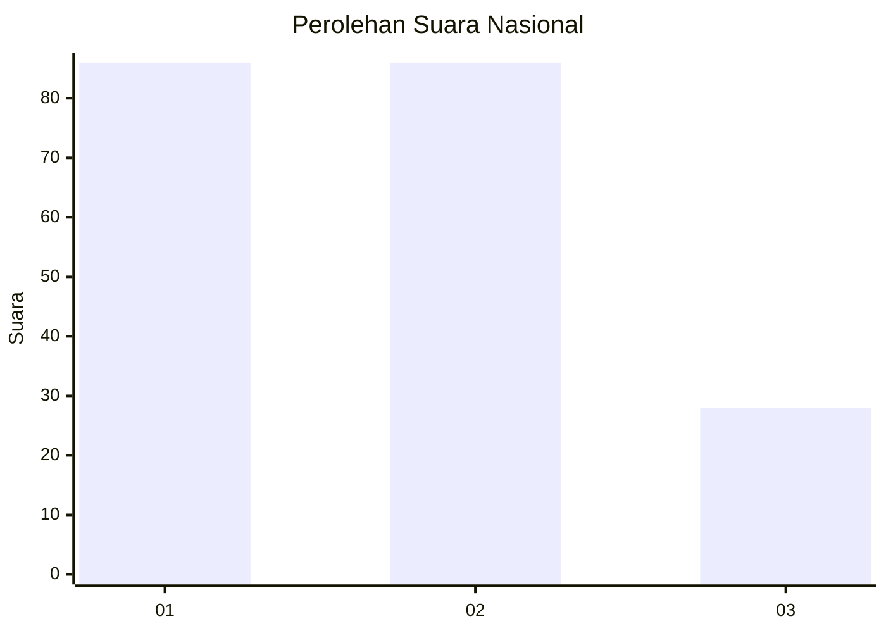
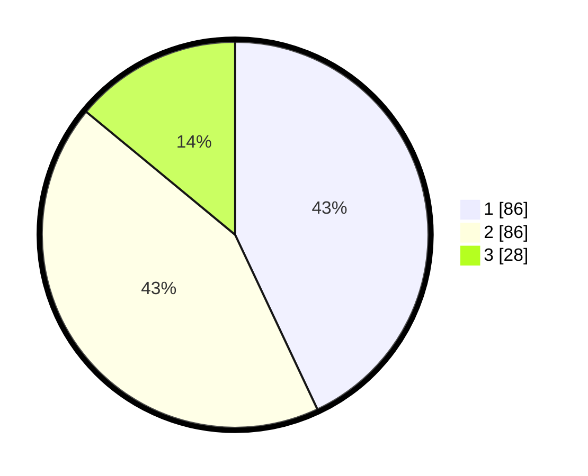

# Hasil

## Grafik

## Tabel

| No.    | Nama Paslon    | Suara | Suara (raw) | Persentase |
|:------ |:-------------- | -----:| -----------:| ----------:|
| 100025 | ANIES MUHAIMIN | 86    | [86][p-1]   | 43,00      |
| 100026 | PRABOWO GIBRAN | 86    | [86][p-2]   | 43,00      |
| 100027 | GANJAR MAHFUD  | 28    | [28][p-3]   | 14,00      |

[p-1]: https://github.com/gigit-pemilu/pemilu-2024/blob/main/pilpres/hitung-suara/sub/31-dki-jakarta/sub/74-jakarta-selatan/sub/09-jagakarsa/sub/1002-srengseng-sawah/sub/194-tps/sub/paslon-1.txt
[p-2]: https://github.com/gigit-pemilu/pemilu-2024/blob/main/pilpres/hitung-suara/sub/31-dki-jakarta/sub/74-jakarta-selatan/sub/09-jagakarsa/sub/1002-srengseng-sawah/sub/194-tps/sub/paslon-2.txt
[p-3]: https://github.com/gigit-pemilu/pemilu-2024/blob/main/pilpres/hitung-suara/sub/31-dki-jakarta/sub/74-jakarta-selatan/sub/09-jagakarsa/sub/1002-srengseng-sawah/sub/194-tps/sub/paslon-3.txt

## Foto C Plano

https://sirekap-obj-formc.kpu.go.id/d717/pemilu/ppwp/31/74/09/10/02/3174091002194-20240214-194555--d99a1a50-5f24-42f2-9804-abb406bc0023.jpg

https://sirekap-obj-formc.kpu.go.id/d717/pemilu/ppwp/31/74/09/10/02/3174091002194-20240214-194755--4547e99d-25a2-42ba-84ac-e2302ea49cda.jpg

https://sirekap-obj-formc.kpu.go.id/d717/pemilu/ppwp/31/74/09/10/02/3174091002194-20240214-195019--c4f793c3-82a8-4fcd-9e93-af4923d416d1.jpg

## Metadata

| Key        | Value               |
| ---------- | ------------------- |
| Time Stamp | 2024-02-24 22:31:28 |

