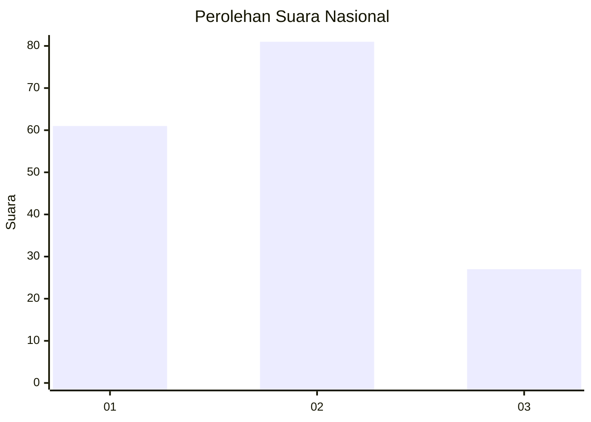
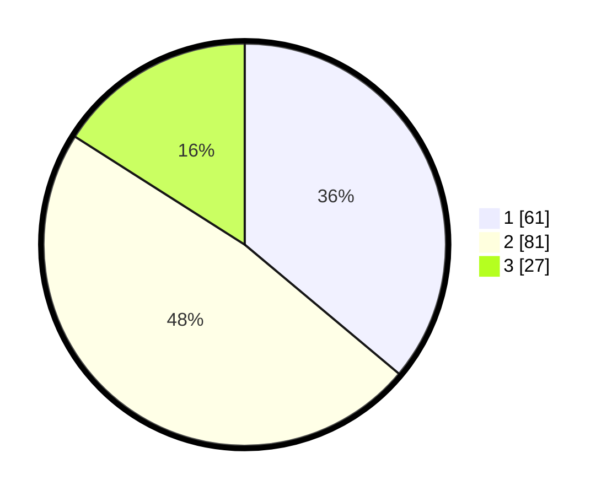

# Hasil

## Grafik

## Tabel

| No.    | Nama Paslon    | Suara | Suara (raw) | Persentase |
|:------ |:-------------- | -----:| -----------:| ----------:|
| 100025 | ANIES MUHAIMIN | 61    | [61][p-1]   | 36,09      |
| 100026 | PRABOWO GIBRAN | 81    | [81][p-2]   | 47,93      |
| 100027 | GANJAR MAHFUD  | 27    | [27][p-3]   | 15,98      |

[p-1]: https://github.com/gigit-pemilu/pemilu-2024/blob/main/pilpres/hitung-suara/sub/31-dki-jakarta/sub/74-jakarta-selatan/sub/09-jagakarsa/sub/1002-srengseng-sawah/sub/197-tps/sub/paslon-1.txt
[p-2]: https://github.com/gigit-pemilu/pemilu-2024/blob/main/pilpres/hitung-suara/sub/31-dki-jakarta/sub/74-jakarta-selatan/sub/09-jagakarsa/sub/1002-srengseng-sawah/sub/197-tps/sub/paslon-2.txt
[p-3]: https://github.com/gigit-pemilu/pemilu-2024/blob/main/pilpres/hitung-suara/sub/31-dki-jakarta/sub/74-jakarta-selatan/sub/09-jagakarsa/sub/1002-srengseng-sawah/sub/197-tps/sub/paslon-3.txt

## Foto C Plano

https://sirekap-obj-formc.kpu.go.id/4f2e/pemilu/ppwp/31/74/09/10/02/3174091002197-20240214-222756--a0e8e1da-a6ba-4331-ad14-a779026ec978.jpg

https://sirekap-obj-formc.kpu.go.id/4f2e/pemilu/ppwp/31/74/09/10/02/3174091002197-20240214-222943--c8ef126c-0ea0-4803-8628-c895bf880d3e.jpg

https://sirekap-obj-formc.kpu.go.id/4f2e/pemilu/ppwp/31/74/09/10/02/3174091002197-20240214-223121--97dcc887-b067-49a7-9ead-115adf8caab8.jpg

## Metadata

| Key        | Value               |
| ---------- | ------------------- |
| Time Stamp | 2024-02-24 22:31:28 |

