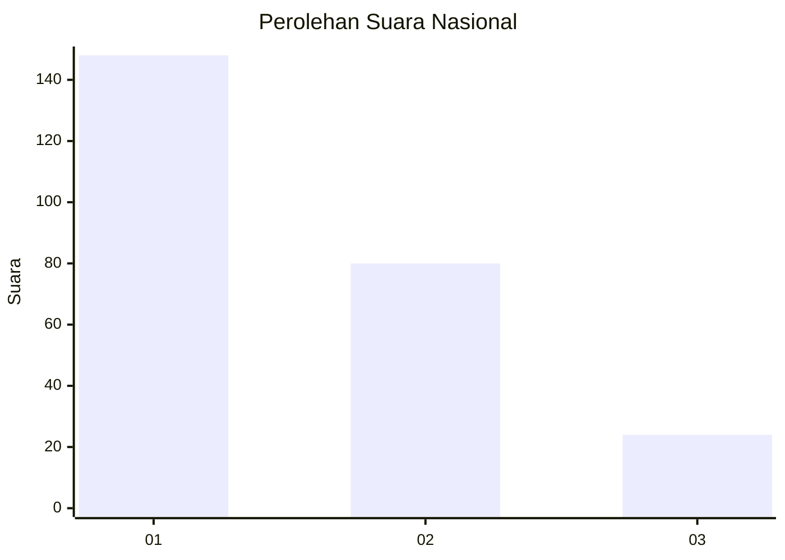
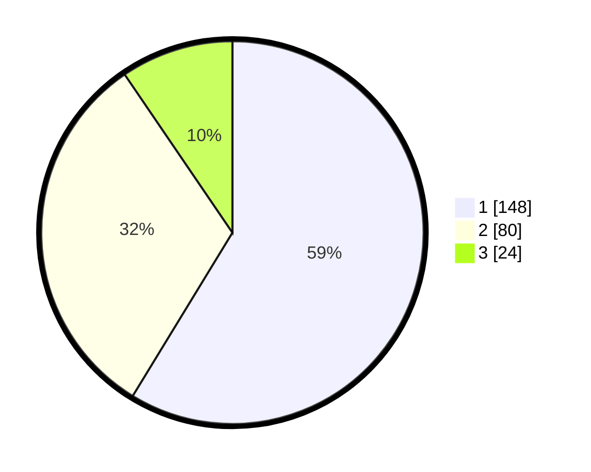

# Hasil

## Grafik

## Tabel

| No.    | Nama Paslon    | Suara | Suara (raw) | Persentase |
|:------ |:-------------- | -----:| -----------:| ----------:|
| 100025 | ANIES MUHAIMIN | 148   | [148][p-1]  | 58,73      |
| 100026 | PRABOWO GIBRAN | 80    | [80][p-2]   | 31,75      |
| 100027 | GANJAR MAHFUD  | 24    | [24][p-3]   | 9,52       |

[p-1]: https://github.com/gigit-pemilu/pemilu-2024/blob/main/pilpres/hitung-suara/sub/31-dki-jakarta/sub/74-jakarta-selatan/sub/09-jagakarsa/sub/1003-ciganjur/sub/006-tps/sub/paslon-1.txt
[p-2]: https://github.com/gigit-pemilu/pemilu-2024/blob/main/pilpres/hitung-suara/sub/31-dki-jakarta/sub/74-jakarta-selatan/sub/09-jagakarsa/sub/1003-ciganjur/sub/006-tps/sub/paslon-2.txt
[p-3]: https://github.com/gigit-pemilu/pemilu-2024/blob/main/pilpres/hitung-suara/sub/31-dki-jakarta/sub/74-jakarta-selatan/sub/09-jagakarsa/sub/1003-ciganjur/sub/006-tps/sub/paslon-3.txt

## Foto C Plano

https://sirekap-obj-formc.kpu.go.id/c376/pemilu/ppwp/31/74/09/10/03/3174091003006-20240214-225501--f4ab56f4-7b9d-4b4f-931b-66ffe259c35f.jpg

https://sirekap-obj-formc.kpu.go.id/c376/pemilu/ppwp/31/74/09/10/03/3174091003006-20240214-225850--69f11beb-1fd0-4b0a-8e71-fb3beb13e0d3.jpg

https://sirekap-obj-formc.kpu.go.id/c376/pemilu/ppwp/31/74/09/10/03/3174091003006-20240214-215439--cb6deb32-3a64-4b5c-b845-882984466a90.jpg

## Metadata

| Key        | Value               |
| ---------- | ------------------- |
| Time Stamp | 2024-02-24 22:31:28 |

