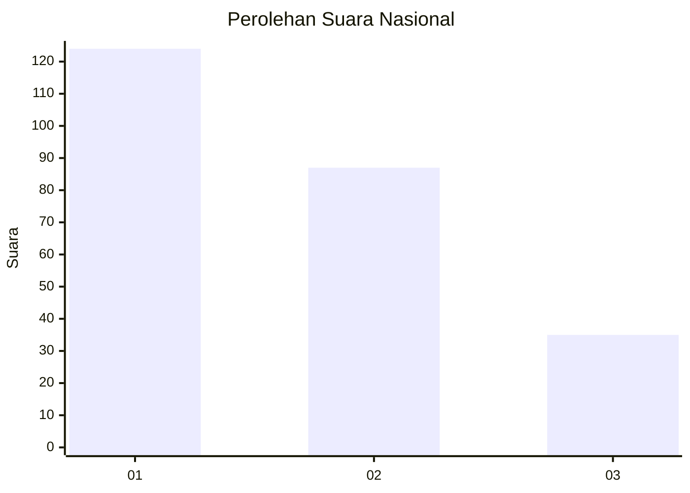
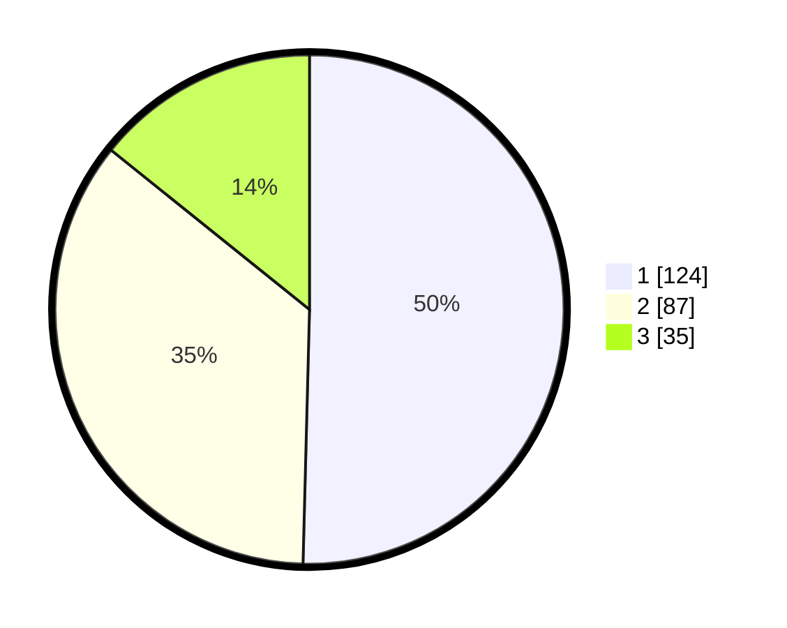

# Hasil

## Grafik

## Tabel

| No.    | Nama Paslon    | Suara | Suara (raw) | Persentase |
|:------ |:-------------- | -----:| -----------:| ----------:|
| 100025 | ANIES MUHAIMIN | 124   | [124][p-1]  | 50,41      |
| 100026 | PRABOWO GIBRAN | 87    | [87][p-2]   | 35,37      |
| 100027 | GANJAR MAHFUD  | 35    | [35][p-3]   | 14,23      |

[p-1]: https://github.com/gigit-pemilu/pemilu-2024/blob/main/pilpres/hitung-suara/sub/31-dki-jakarta/sub/74-jakarta-selatan/sub/09-jagakarsa/sub/1003-ciganjur/sub/018-tps/sub/paslon-1.txt
[p-2]: https://github.com/gigit-pemilu/pemilu-2024/blob/main/pilpres/hitung-suara/sub/31-dki-jakarta/sub/74-jakarta-selatan/sub/09-jagakarsa/sub/1003-ciganjur/sub/018-tps/sub/paslon-2.txt
[p-3]: https://github.com/gigit-pemilu/pemilu-2024/blob/main/pilpres/hitung-suara/sub/31-dki-jakarta/sub/74-jakarta-selatan/sub/09-jagakarsa/sub/1003-ciganjur/sub/018-tps/sub/paslon-3.txt

## Foto C Plano

https://sirekap-obj-formc.kpu.go.id/359a/pemilu/ppwp/31/74/09/10/03/3174091003018-20240214-211215--fd62fe31-34b3-4294-b964-3969580bc770.jpg

https://sirekap-obj-formc.kpu.go.id/359a/pemilu/ppwp/31/74/09/10/03/3174091003018-20240214-212006--f5e6fb1a-b21c-4148-8c5d-3b465a74f18b.jpg

https://sirekap-obj-formc.kpu.go.id/359a/pemilu/ppwp/31/74/09/10/03/3174091003018-20240214-212533--5c8eb949-329b-4b67-888c-f937e8355231.jpg

## Metadata

| Key        | Value               |
| ---------- | ------------------- |
| Time Stamp | 2024-03-01 14:00:00 |

