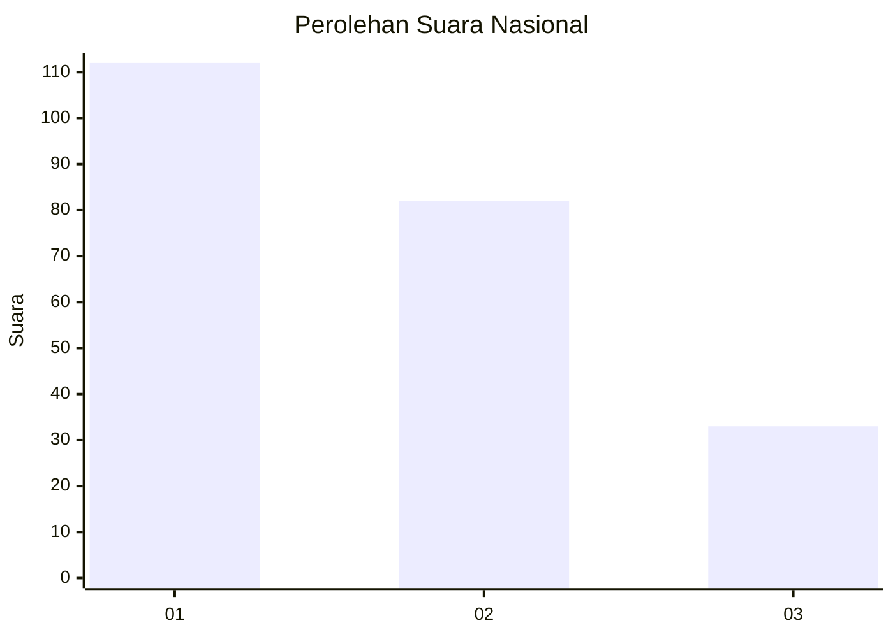
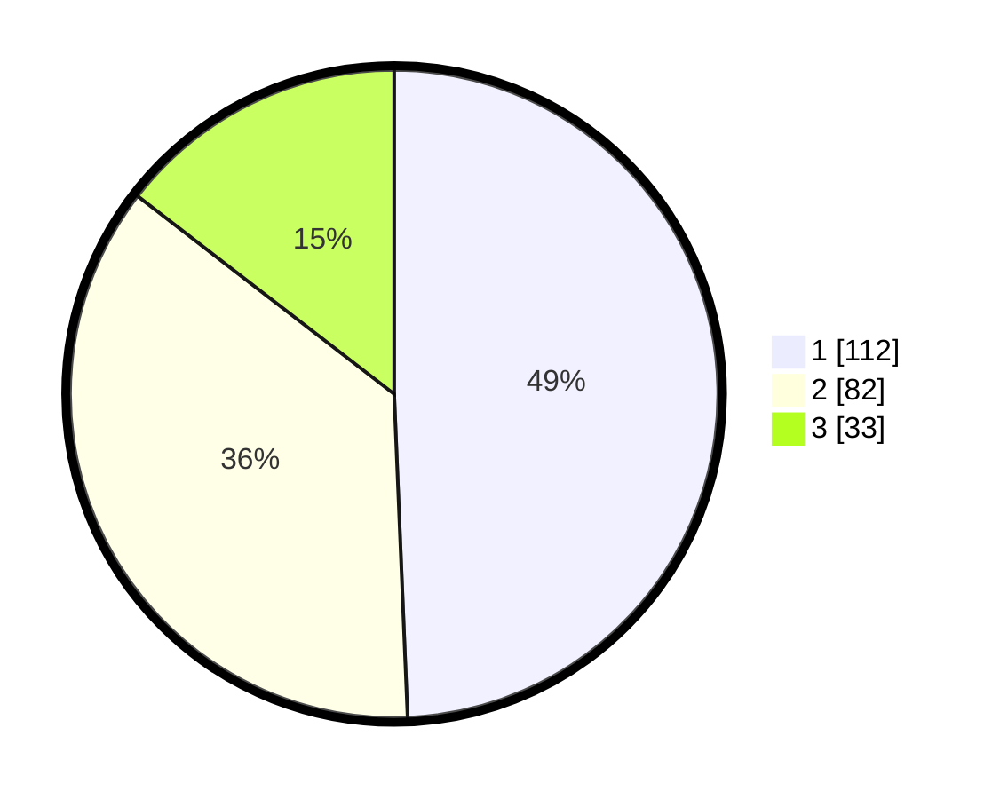

# Hasil

## Grafik

## Tabel

| No.    | Nama Paslon    | Suara | Suara (raw) | Persentase |
|:------ |:-------------- | -----:| -----------:| ----------:|
| 100025 | ANIES MUHAIMIN | 112   | [112][p-1]  | 49,34      |
| 100026 | PRABOWO GIBRAN | 82    | [82][p-2]   | 36,12      |
| 100027 | GANJAR MAHFUD  | 33    | [33][p-3]   | 14,54      |

[p-1]: https://github.com/gigit-pemilu/pemilu-2024/blob/main/pilpres/hitung-suara/sub/31-dki-jakarta/sub/74-jakarta-selatan/sub/09-jagakarsa/sub/1003-ciganjur/sub/028-tps/sub/paslon-1.txt
[p-2]: https://github.com/gigit-pemilu/pemilu-2024/blob/main/pilpres/hitung-suara/sub/31-dki-jakarta/sub/74-jakarta-selatan/sub/09-jagakarsa/sub/1003-ciganjur/sub/028-tps/sub/paslon-2.txt
[p-3]: https://github.com/gigit-pemilu/pemilu-2024/blob/main/pilpres/hitung-suara/sub/31-dki-jakarta/sub/74-jakarta-selatan/sub/09-jagakarsa/sub/1003-ciganjur/sub/028-tps/sub/paslon-3.txt

## Foto C Plano

https://sirekap-obj-formc.kpu.go.id/db39/pemilu/ppwp/31/74/09/10/03/3174091003028-20240214-230358--dc21e41e-9009-431e-9c10-90d2c0864bcb.jpg

https://sirekap-obj-formc.kpu.go.id/db39/pemilu/ppwp/31/74/09/10/03/3174091003028-20240214-230346--466a8c36-8143-4120-b401-8e6a66b40aa7.jpg

https://sirekap-obj-formc.kpu.go.id/db39/pemilu/ppwp/31/74/09/10/03/3174091003028-20240214-230826--c961dea9-95f9-4e0b-8c15-b3ebf839e526.jpg

## Metadata

| Key        | Value               |
| ---------- | ------------------- |
| Time Stamp | 2024-02-24 22:31:28 |

