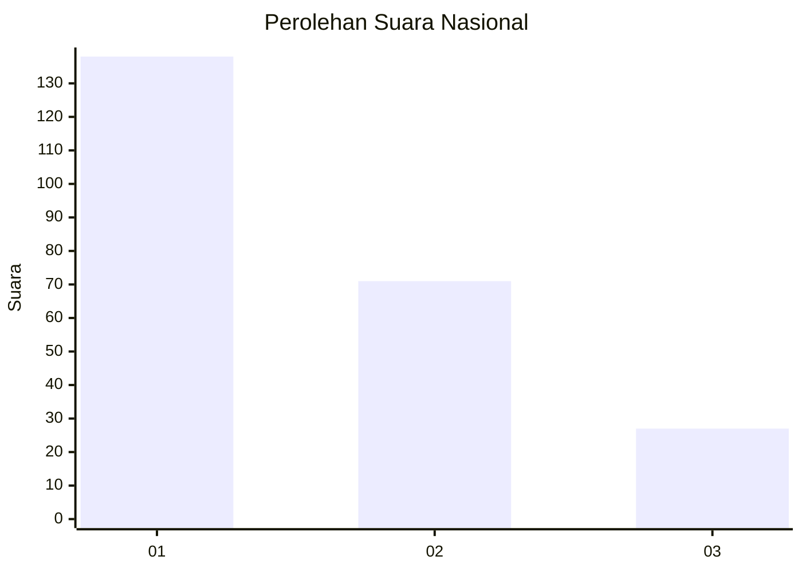
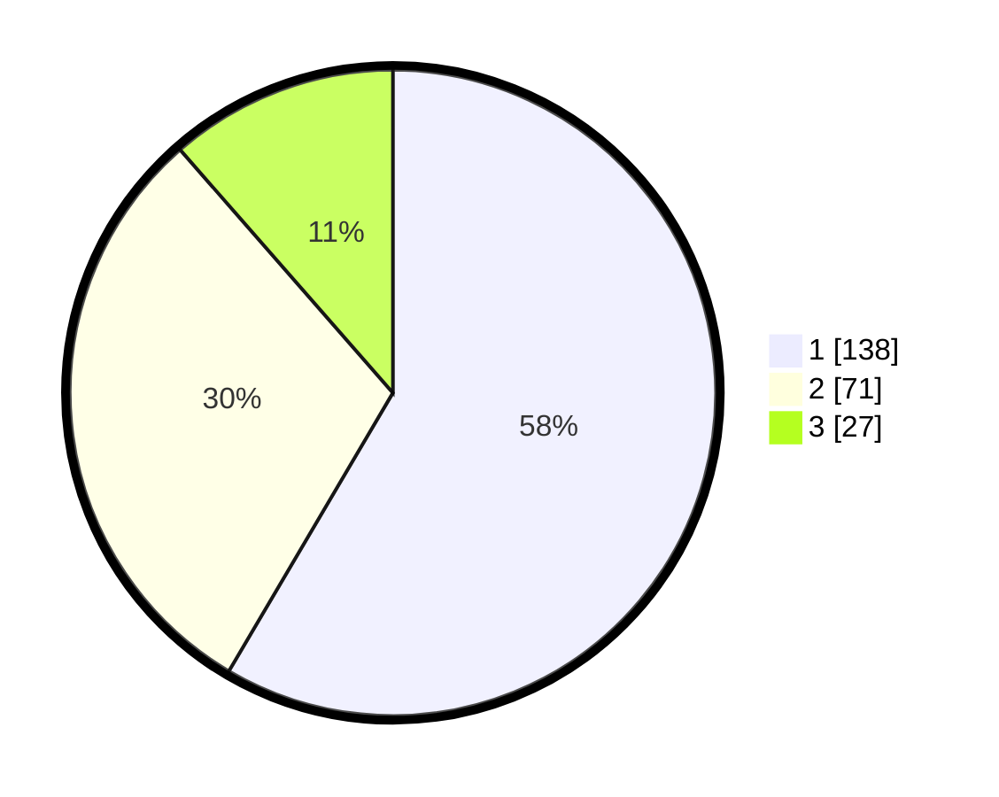

# Hasil

## Grafik

## Tabel

| No.    | Nama Paslon    | Suara | Suara (raw) | Persentase |
|:------ |:-------------- | -----:| -----------:| ----------:|
| 100025 | ANIES MUHAIMIN | 138   | [138][p-1]  | 58,47      |
| 100026 | PRABOWO GIBRAN | 71    | [71][p-2]   | 30,08      |
| 100027 | GANJAR MAHFUD  | 27    | [27][p-3]   | 11,44      |

[p-1]: https://github.com/gigit-pemilu/pemilu-2024/blob/main/pilpres/hitung-suara/sub/31-dki-jakarta/sub/74-jakarta-selatan/sub/09-jagakarsa/sub/1003-ciganjur/sub/030-tps/sub/paslon-1.txt
[p-2]: https://github.com/gigit-pemilu/pemilu-2024/blob/main/pilpres/hitung-suara/sub/31-dki-jakarta/sub/74-jakarta-selatan/sub/09-jagakarsa/sub/1003-ciganjur/sub/030-tps/sub/paslon-2.txt
[p-3]: https://github.com/gigit-pemilu/pemilu-2024/blob/main/pilpres/hitung-suara/sub/31-dki-jakarta/sub/74-jakarta-selatan/sub/09-jagakarsa/sub/1003-ciganjur/sub/030-tps/sub/paslon-3.txt

## Foto C Plano

https://sirekap-obj-formc.kpu.go.id/878c/pemilu/ppwp/31/74/09/10/03/3174091003030-20240215-012402--23c6bfbf-a8eb-4c27-a510-0d46bffce37b.jpg

https://sirekap-obj-formc.kpu.go.id/878c/pemilu/ppwp/31/74/09/10/03/3174091003030-20240215-021258--c0a6c34b-8c1d-45f0-82f7-d02e37ef1f07.jpg

https://sirekap-obj-formc.kpu.go.id/878c/pemilu/ppwp/31/74/09/10/03/3174091003030-20240215-021313--eb568d61-dc58-4c65-bc32-9273f8505633.jpg

## Metadata

| Key        | Value               |
| ---------- | ------------------- |
| Time Stamp | 2024-02-24 22:31:28 |

