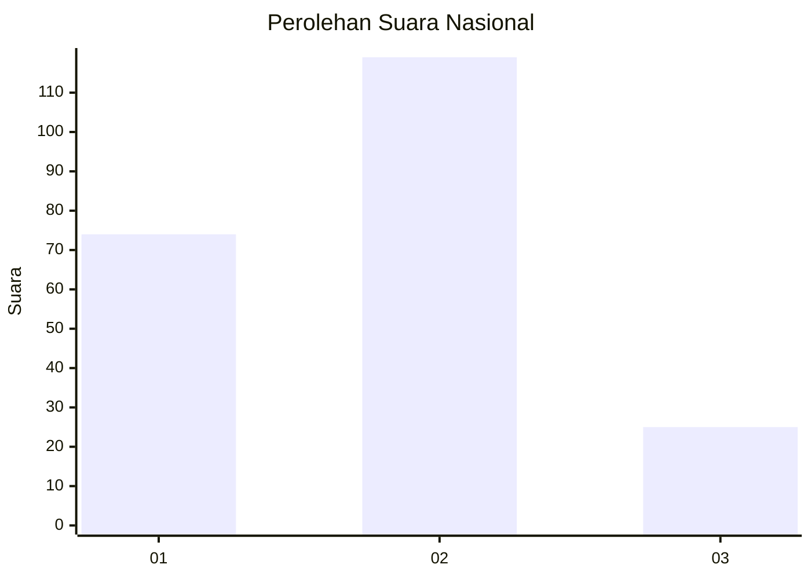
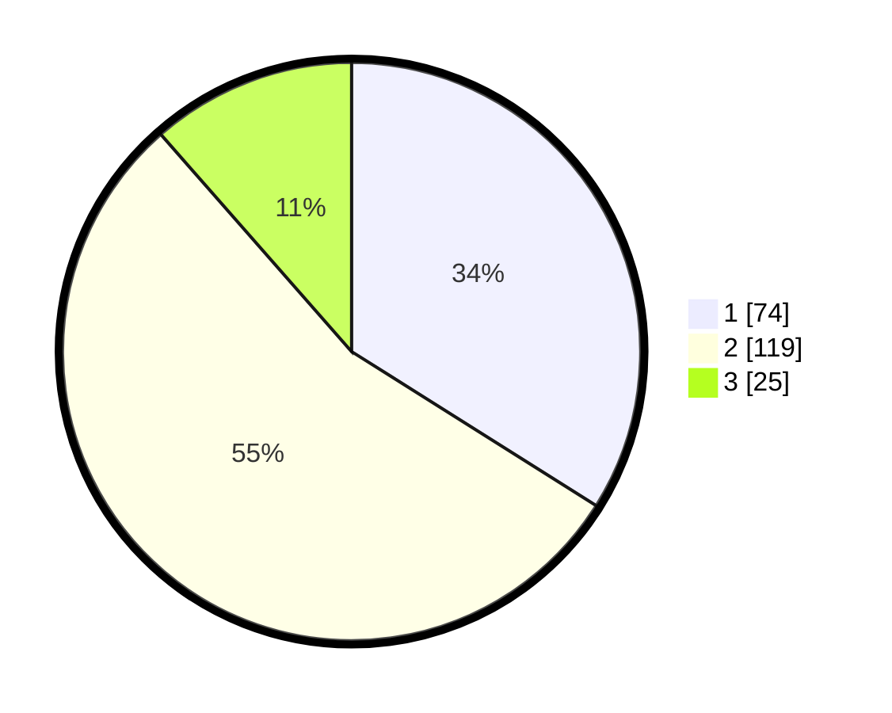

# Hasil

## Grafik

## Tabel

| No.    | Nama Paslon    | Suara | Suara (raw) | Persentase |
|:------ |:-------------- | -----:| -----------:| ----------:|
| 100025 | ANIES MUHAIMIN | 74    | [74][p-1]   | 33,94      |
| 100026 | PRABOWO GIBRAN | 119   | [119][p-2]  | 54,59      |
| 100027 | GANJAR MAHFUD  | 25    | [25][p-3]   | 11,47      |

[p-1]: https://github.com/gigit-pemilu/pemilu-2024/blob/main/pilpres/hitung-suara/sub/31-dki-jakarta/sub/74-jakarta-selatan/sub/09-jagakarsa/sub/1003-ciganjur/sub/032-tps/sub/paslon-1.txt
[p-2]: https://github.com/gigit-pemilu/pemilu-2024/blob/main/pilpres/hitung-suara/sub/31-dki-jakarta/sub/74-jakarta-selatan/sub/09-jagakarsa/sub/1003-ciganjur/sub/032-tps/sub/paslon-2.txt
[p-3]: https://github.com/gigit-pemilu/pemilu-2024/blob/main/pilpres/hitung-suara/sub/31-dki-jakarta/sub/74-jakarta-selatan/sub/09-jagakarsa/sub/1003-ciganjur/sub/032-tps/sub/paslon-3.txt

## Foto C Plano

https://sirekap-obj-formc.kpu.go.id/b9f5/pemilu/ppwp/31/74/09/10/03/3174091003032-20240215-015459--b217f920-4d46-456c-8e15-8272ae140745.jpg

https://sirekap-obj-formc.kpu.go.id/b9f5/pemilu/ppwp/31/74/09/10/03/3174091003032-20240215-015531--4df63cc1-770b-4466-b065-6079b189ca17.jpg

https://sirekap-obj-formc.kpu.go.id/b9f5/pemilu/ppwp/31/74/09/10/03/3174091003032-20240215-015543--9c41ae7f-1023-4e81-90f2-fdcd8104fe94.jpg

## Metadata

| Key        | Value               |
| ---------- | ------------------- |
| Time Stamp | 2024-02-24 22:31:28 |

