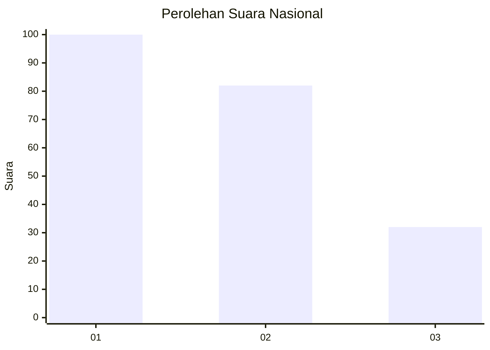
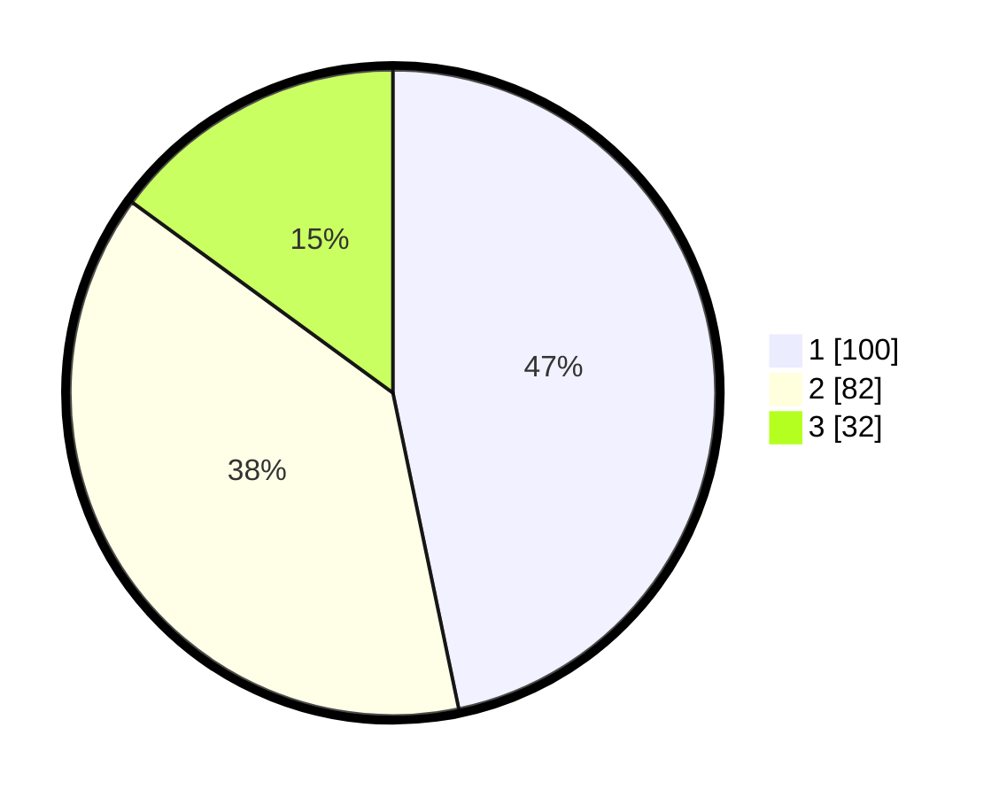

# Hasil

## Grafik

## Tabel

| No.    | Nama Paslon    | Suara | Suara (raw) | Persentase |
|:------ |:-------------- | -----:| -----------:| ----------:|
| 100025 | ANIES MUHAIMIN | 100   | [100][p-1]  | 46,73      |
| 100026 | PRABOWO GIBRAN | 82    | [82][p-2]   | 38,32      |
| 100027 | GANJAR MAHFUD  | 32    | [32][p-3]   | 14,95      |

[p-1]: https://github.com/gigit-pemilu/pemilu-2024/blob/main/pilpres/hitung-suara/sub/31-dki-jakarta/sub/74-jakarta-selatan/sub/09-jagakarsa/sub/1003-ciganjur/sub/035-tps/sub/paslon-1.txt
[p-2]: https://github.com/gigit-pemilu/pemilu-2024/blob/main/pilpres/hitung-suara/sub/31-dki-jakarta/sub/74-jakarta-selatan/sub/09-jagakarsa/sub/1003-ciganjur/sub/035-tps/sub/paslon-2.txt
[p-3]: https://github.com/gigit-pemilu/pemilu-2024/blob/main/pilpres/hitung-suara/sub/31-dki-jakarta/sub/74-jakarta-selatan/sub/09-jagakarsa/sub/1003-ciganjur/sub/035-tps/sub/paslon-3.txt

## Foto C Plano

https://sirekap-obj-formc.kpu.go.id/a64f/pemilu/ppwp/31/74/09/10/03/3174091003035-20240214-191206--8fec2e97-69d8-438e-879e-b1a24fe62957.jpg

https://sirekap-obj-formc.kpu.go.id/a64f/pemilu/ppwp/31/74/09/10/03/3174091003035-20240214-191310--5984a0db-c9e6-4fce-9c44-d2417a0c52db.jpg

https://sirekap-obj-formc.kpu.go.id/a64f/pemilu/ppwp/31/74/09/10/03/3174091003035-20240214-191410--74d4063a-c0be-47dd-acd3-32bb50b8e862.jpg

## Metadata

| Key        | Value               |
| ---------- | ------------------- |
| Time Stamp | 2024-02-24 22:31:28 |

