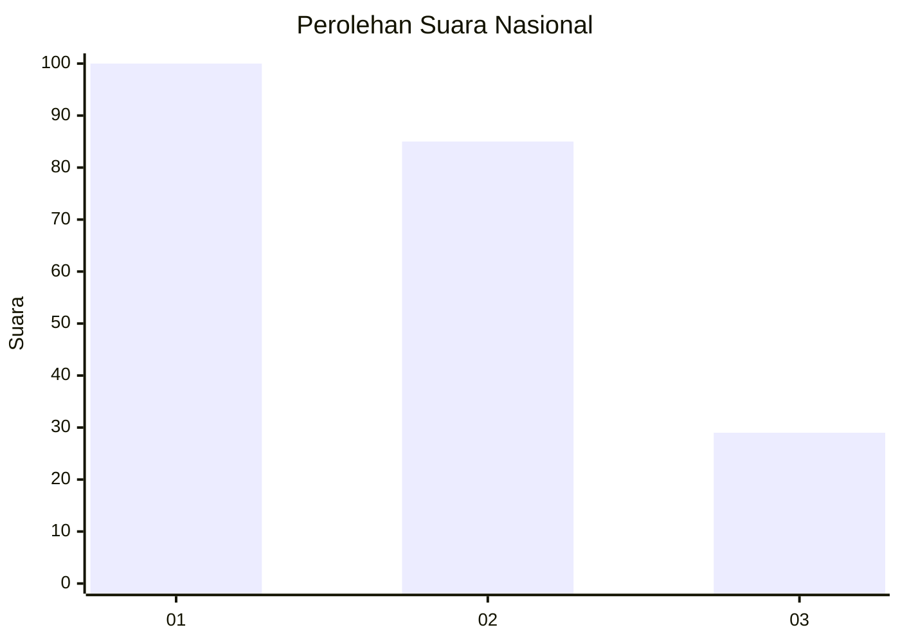
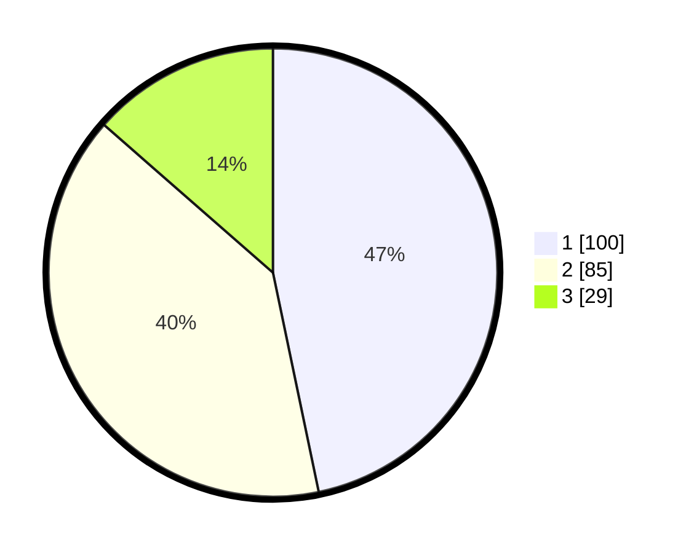

# Hasil

## Grafik

## Tabel

| No.    | Nama Paslon    | Suara | Suara (raw) | Persentase |
|:------ |:-------------- | -----:| -----------:| ----------:|
| 100025 | ANIES MUHAIMIN | 100   | [100][p-1]  | 46,73      |
| 100026 | PRABOWO GIBRAN | 85    | [85][p-2]   | 39,72      |
| 100027 | GANJAR MAHFUD  | 29    | [29][p-3]   | 13,55      |

[p-1]: https://github.com/gigit-pemilu/pemilu-2024/blob/main/pilpres/hitung-suara/sub/31-dki-jakarta/sub/74-jakarta-selatan/sub/09-jagakarsa/sub/1003-ciganjur/sub/036-tps/sub/paslon-1.txt
[p-2]: https://github.com/gigit-pemilu/pemilu-2024/blob/main/pilpres/hitung-suara/sub/31-dki-jakarta/sub/74-jakarta-selatan/sub/09-jagakarsa/sub/1003-ciganjur/sub/036-tps/sub/paslon-2.txt
[p-3]: https://github.com/gigit-pemilu/pemilu-2024/blob/main/pilpres/hitung-suara/sub/31-dki-jakarta/sub/74-jakarta-selatan/sub/09-jagakarsa/sub/1003-ciganjur/sub/036-tps/sub/paslon-3.txt

## Foto C Plano

https://sirekap-obj-formc.kpu.go.id/0822/pemilu/ppwp/31/74/09/10/03/3174091003036-20240214-232949--346f9953-806a-4d4e-a0f5-69e71cccc114.jpg

https://sirekap-obj-formc.kpu.go.id/0822/pemilu/ppwp/31/74/09/10/03/3174091003036-20240214-233055--9c3a7167-d8a0-4475-94ff-4d1c1e4bcaad.jpg

https://sirekap-obj-formc.kpu.go.id/0822/pemilu/ppwp/31/74/09/10/03/3174091003036-20240214-233316--320270c2-d245-4ee5-a147-9d664498c4ac.jpg

## Metadata

| Key        | Value               |
| ---------- | ------------------- |
| Time Stamp | 2024-02-24 22:31:28 |

