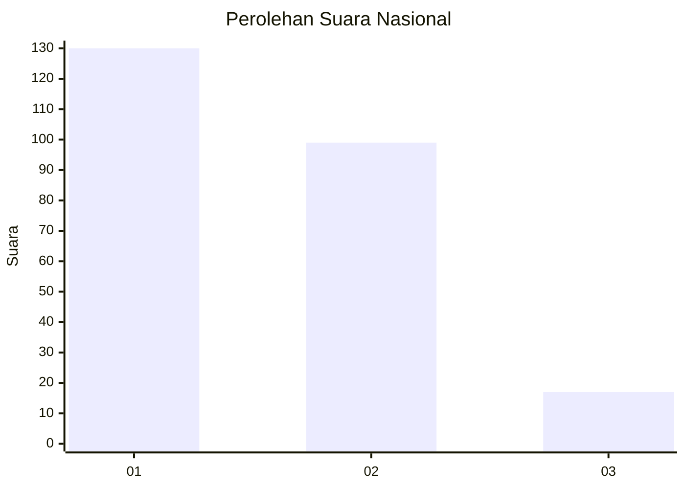
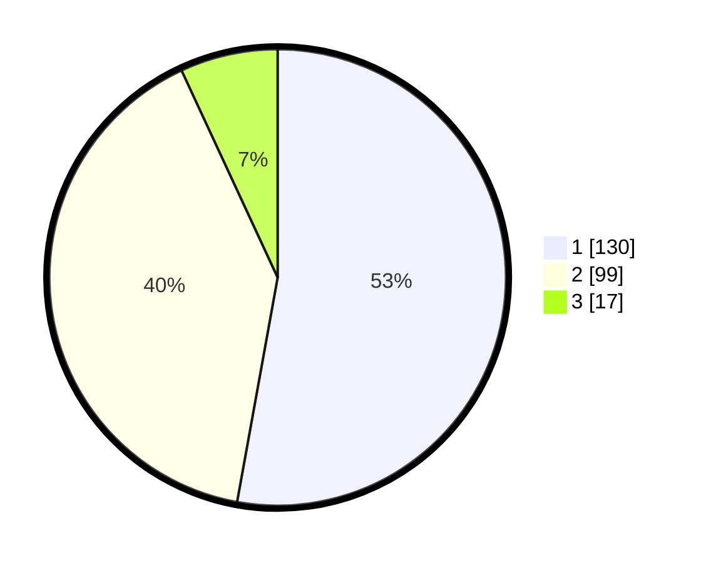

# Hasil

## Grafik

## Tabel

| No.    | Nama Paslon    | Suara | Suara (raw) | Persentase |
|:------ |:-------------- | -----:| -----------:| ----------:|
| 100025 | ANIES MUHAIMIN | 130   | [130][p-1]  | 52,85      |
| 100026 | PRABOWO GIBRAN | 99    | [99][p-2]   | 40,24      |
| 100027 | GANJAR MAHFUD  | 17    | [17][p-3]   | 6,91       |

[p-1]: https://github.com/gigit-pemilu/pemilu-2024/blob/main/pilpres/hitung-suara/sub/31-dki-jakarta/sub/74-jakarta-selatan/sub/09-jagakarsa/sub/1003-ciganjur/sub/038-tps/sub/paslon-1.txt
[p-2]: https://github.com/gigit-pemilu/pemilu-2024/blob/main/pilpres/hitung-suara/sub/31-dki-jakarta/sub/74-jakarta-selatan/sub/09-jagakarsa/sub/1003-ciganjur/sub/038-tps/sub/paslon-2.txt
[p-3]: https://github.com/gigit-pemilu/pemilu-2024/blob/main/pilpres/hitung-suara/sub/31-dki-jakarta/sub/74-jakarta-selatan/sub/09-jagakarsa/sub/1003-ciganjur/sub/038-tps/sub/paslon-3.txt

## Foto C Plano

https://sirekap-obj-formc.kpu.go.id/f2e8/pemilu/ppwp/31/74/09/10/03/3174091003038-20240215-010337--b87a2f9e-7c90-4946-998f-ae579820f65a.jpg

https://sirekap-obj-formc.kpu.go.id/f2e8/pemilu/ppwp/31/74/09/10/03/3174091003038-20240215-010417--cc05e26d-2778-4981-8ba4-e6fc5605f244.jpg

https://sirekap-obj-formc.kpu.go.id/f2e8/pemilu/ppwp/31/74/09/10/03/3174091003038-20240215-010534--0be5fffb-8587-4536-ab58-7fc105b29f71.jpg

## Metadata

| Key        | Value               |
| ---------- | ------------------- |
| Time Stamp | 2024-02-24 22:31:28 |

