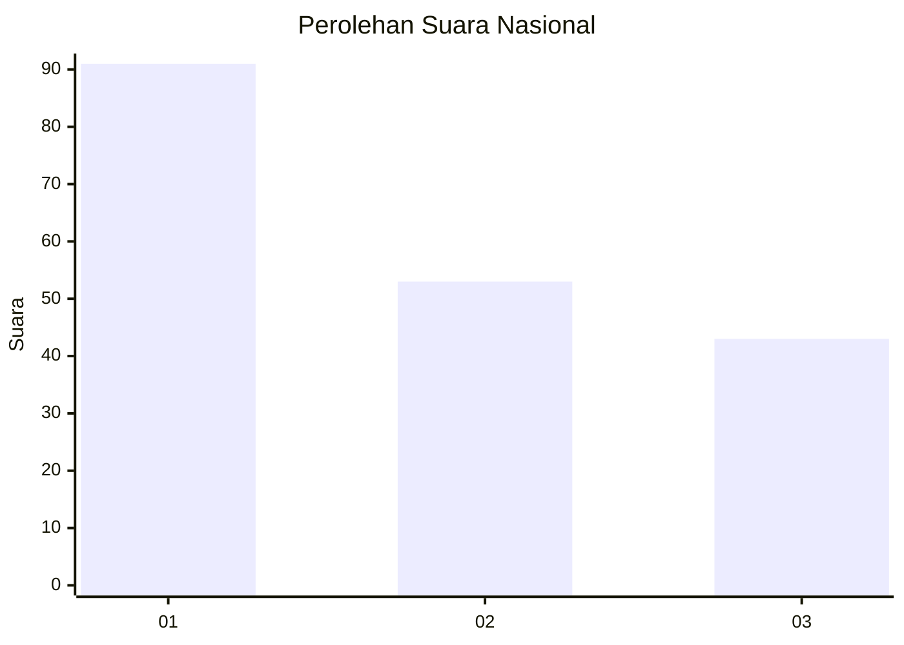
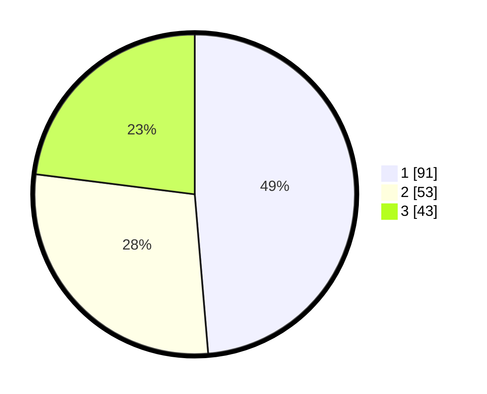

# Hasil

## Grafik

## Tabel

| No.    | Nama Paslon    | Suara | Suara (raw) | Persentase |
|:------ |:-------------- | -----:| -----------:| ----------:|
| 100025 | ANIES MUHAIMIN | 91    | [91][p-1]   | 48,66      |
| 100026 | PRABOWO GIBRAN | 53    | [53][p-2]   | 28,34      |
| 100027 | GANJAR MAHFUD  | 43    | [43][p-3]   | 22,99      |

[p-1]: https://github.com/gigit-pemilu/pemilu-2024/blob/main/pilpres/hitung-suara/sub/31-dki-jakarta/sub/74-jakarta-selatan/sub/09-jagakarsa/sub/1003-ciganjur/sub/050-tps/sub/paslon-1.txt
[p-2]: https://github.com/gigit-pemilu/pemilu-2024/blob/main/pilpres/hitung-suara/sub/31-dki-jakarta/sub/74-jakarta-selatan/sub/09-jagakarsa/sub/1003-ciganjur/sub/050-tps/sub/paslon-2.txt
[p-3]: https://github.com/gigit-pemilu/pemilu-2024/blob/main/pilpres/hitung-suara/sub/31-dki-jakarta/sub/74-jakarta-selatan/sub/09-jagakarsa/sub/1003-ciganjur/sub/050-tps/sub/paslon-3.txt

## Foto C Plano

https://sirekap-obj-formc.kpu.go.id/d7c3/pemilu/ppwp/31/74/09/10/03/3174091003050-20240214-190945--ef1a1c72-a8a0-4f94-b91c-14c8fbfd2009.jpg

https://sirekap-obj-formc.kpu.go.id/d7c3/pemilu/ppwp/31/74/09/10/03/3174091003050-20240214-191033--b790714d-2573-4f72-8381-cebb56226764.jpg

https://sirekap-obj-formc.kpu.go.id/d7c3/pemilu/ppwp/31/74/09/10/03/3174091003050-20240214-190746--912c84e3-d579-416a-9616-b1caab6aa398.jpg

## Metadata

| Key        | Value               |
| ---------- | ------------------- |
| Time Stamp | 2024-02-21 17:00:00 |

