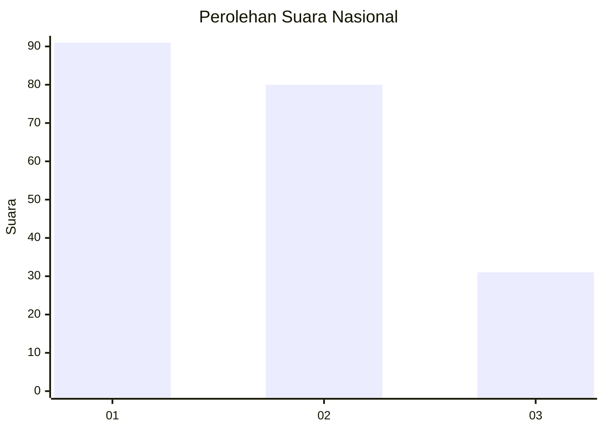
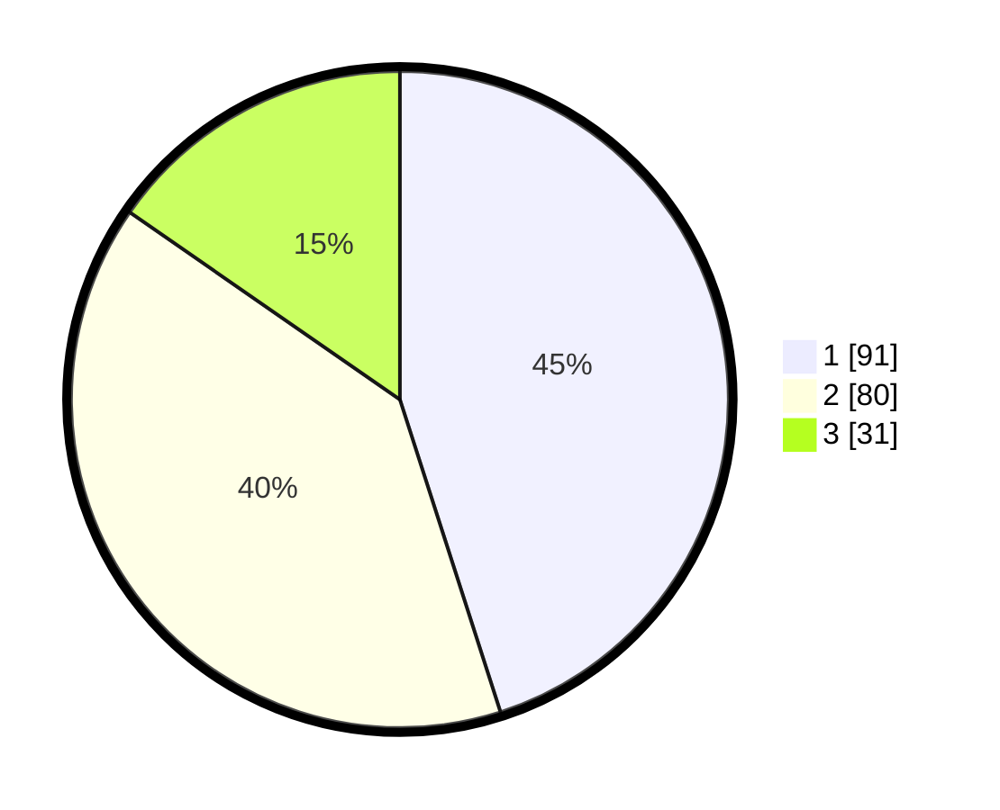

# Hasil

## Grafik

## Tabel

| No.    | Nama Paslon    | Suara | Suara (raw) | Persentase |
|:------ |:-------------- | -----:| -----------:| ----------:|
| 100025 | ANIES MUHAIMIN | 91    | [91][p-1]   | 45,05      |
| 100026 | PRABOWO GIBRAN | 80    | [80][p-2]   | 39,60      |
| 100027 | GANJAR MAHFUD  | 31    | [31][p-3]   | 15,35      |

[p-1]: https://github.com/gigit-pemilu/pemilu-2024/blob/main/pilpres/hitung-suara/sub/31-dki-jakarta/sub/74-jakarta-selatan/sub/09-jagakarsa/sub/1003-ciganjur/sub/057-tps/sub/paslon-1.txt
[p-2]: https://github.com/gigit-pemilu/pemilu-2024/blob/main/pilpres/hitung-suara/sub/31-dki-jakarta/sub/74-jakarta-selatan/sub/09-jagakarsa/sub/1003-ciganjur/sub/057-tps/sub/paslon-2.txt
[p-3]: https://github.com/gigit-pemilu/pemilu-2024/blob/main/pilpres/hitung-suara/sub/31-dki-jakarta/sub/74-jakarta-selatan/sub/09-jagakarsa/sub/1003-ciganjur/sub/057-tps/sub/paslon-3.txt

## Foto C Plano

https://sirekap-obj-formc.kpu.go.id/280a/pemilu/ppwp/31/74/09/10/03/3174091003057-20240214-210250--7d25a87c-dd42-4004-a632-5f5bc11cfdb9.jpg

https://sirekap-obj-formc.kpu.go.id/280a/pemilu/ppwp/31/74/09/10/03/3174091003057-20240214-204954--4bc4e623-2d35-4b8e-a36e-3c0de75f4158.jpg

https://sirekap-obj-formc.kpu.go.id/280a/pemilu/ppwp/31/74/09/10/03/3174091003057-20240214-205020--fa7120aa-9347-4a9a-ab7e-a7960a9e46c7.jpg

## Metadata

| Key        | Value               |
| ---------- | ------------------- |
| Time Stamp | 2024-02-24 22:31:28 |

