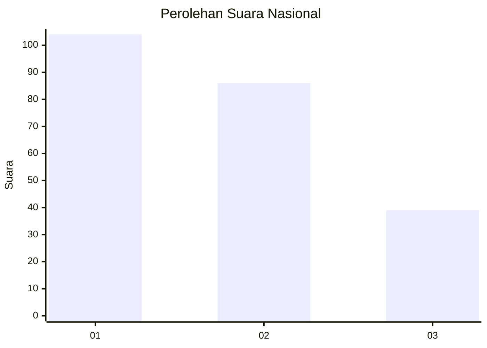
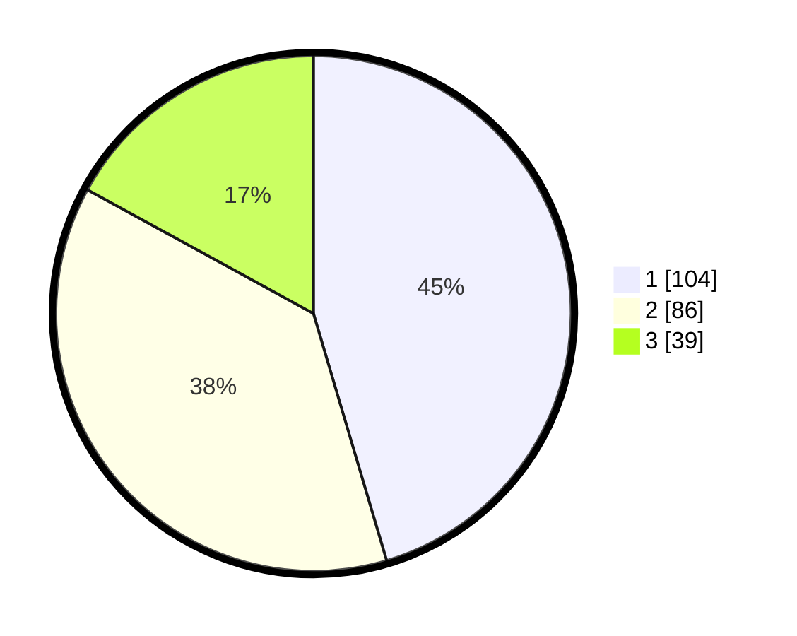

# Hasil

## Grafik

## Tabel

| No.    | Nama Paslon    | Suara | Suara (raw) | Persentase |
|:------ |:-------------- | -----:| -----------:| ----------:|
| 100025 | ANIES MUHAIMIN | 104   | [104][p-1]  | 45,41      |
| 100026 | PRABOWO GIBRAN | 86    | [86][p-2]   | 37,55      |
| 100027 | GANJAR MAHFUD  | 39    | [39][p-3]   | 17,03      |

[p-1]: https://github.com/gigit-pemilu/pemilu-2024/blob/main/pilpres/hitung-suara/sub/31-dki-jakarta/sub/74-jakarta-selatan/sub/09-jagakarsa/sub/1003-ciganjur/sub/061-tps/sub/paslon-1.txt
[p-2]: https://github.com/gigit-pemilu/pemilu-2024/blob/main/pilpres/hitung-suara/sub/31-dki-jakarta/sub/74-jakarta-selatan/sub/09-jagakarsa/sub/1003-ciganjur/sub/061-tps/sub/paslon-2.txt
[p-3]: https://github.com/gigit-pemilu/pemilu-2024/blob/main/pilpres/hitung-suara/sub/31-dki-jakarta/sub/74-jakarta-selatan/sub/09-jagakarsa/sub/1003-ciganjur/sub/061-tps/sub/paslon-3.txt

## Foto C Plano

https://sirekap-obj-formc.kpu.go.id/515c/pemilu/ppwp/31/74/09/10/03/3174091003061-20240214-221859--c1f648f9-f29e-4339-af09-af8b78ff54d2.jpg

https://sirekap-obj-formc.kpu.go.id/515c/pemilu/ppwp/31/74/09/10/03/3174091003061-20240214-221939--24d7fdd6-cadc-4129-97e9-1986de4692b1.jpg

https://sirekap-obj-formc.kpu.go.id/515c/pemilu/ppwp/31/74/09/10/03/3174091003061-20240214-215314--724bf6cf-bedd-4ff8-b093-2d399f6f7bbc.jpg

## Metadata

| Key        | Value               |
| ---------- | ------------------- |
| Time Stamp | 2024-02-24 22:31:28 |

