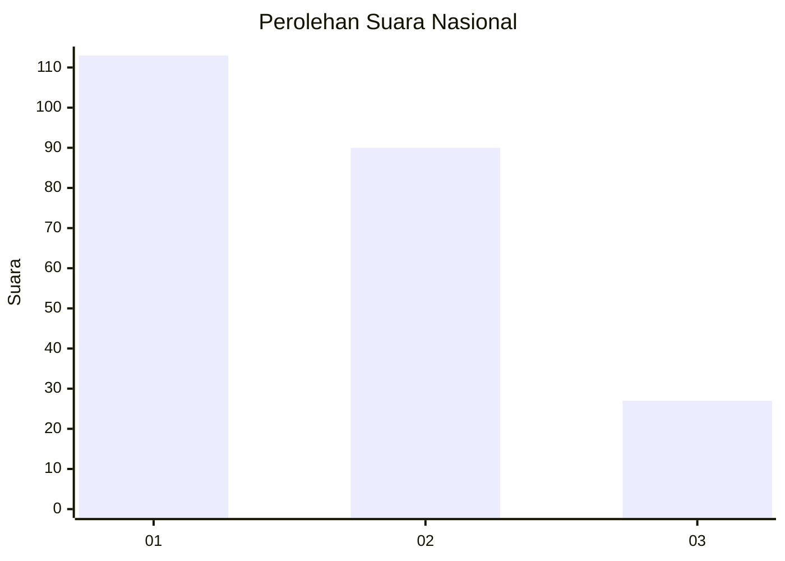
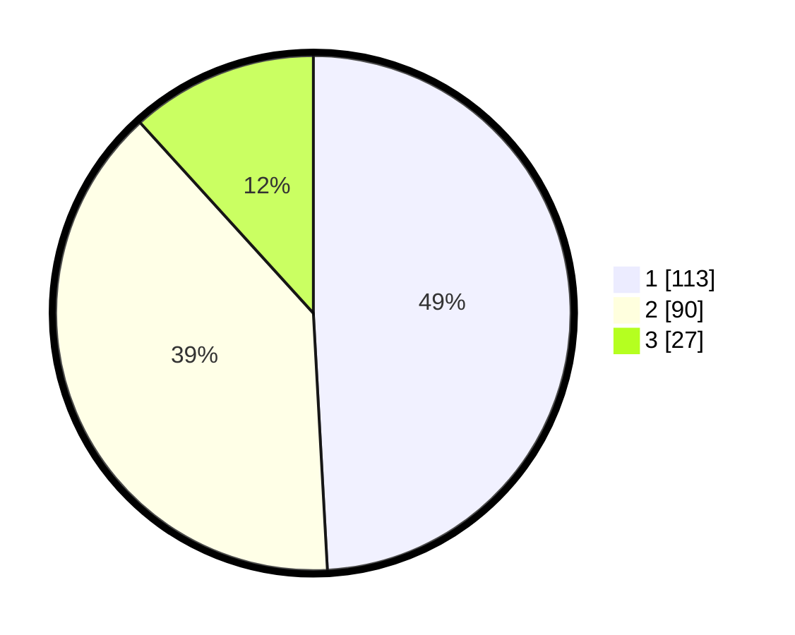

# Hasil

## Grafik

## Tabel

| No.    | Nama Paslon    | Suara | Suara (raw) | Persentase |
|:------ |:-------------- | -----:| -----------:| ----------:|
| 100025 | ANIES MUHAIMIN | 113   | [113][p-1]  | 49,13      |
| 100026 | PRABOWO GIBRAN | 90    | [90][p-2]   | 39,13      |
| 100027 | GANJAR MAHFUD  | 27    | [27][p-3]   | 11,74      |

[p-1]: https://github.com/gigit-pemilu/pemilu-2024/blob/main/pilpres/hitung-suara/sub/31-dki-jakarta/sub/74-jakarta-selatan/sub/09-jagakarsa/sub/1003-ciganjur/sub/063-tps/sub/paslon-1.txt
[p-2]: https://github.com/gigit-pemilu/pemilu-2024/blob/main/pilpres/hitung-suara/sub/31-dki-jakarta/sub/74-jakarta-selatan/sub/09-jagakarsa/sub/1003-ciganjur/sub/063-tps/sub/paslon-2.txt
[p-3]: https://github.com/gigit-pemilu/pemilu-2024/blob/main/pilpres/hitung-suara/sub/31-dki-jakarta/sub/74-jakarta-selatan/sub/09-jagakarsa/sub/1003-ciganjur/sub/063-tps/sub/paslon-3.txt

## Foto C Plano

https://sirekap-obj-formc.kpu.go.id/665f/pemilu/ppwp/31/74/09/10/03/3174091003063-20240215-003117--57248016-7e7b-4ca5-88ba-669fa7589aae.jpg

https://sirekap-obj-formc.kpu.go.id/665f/pemilu/ppwp/31/74/09/10/03/3174091003063-20240215-003214--9fdaa127-288a-4e73-8718-4defb34bff7d.jpg

https://sirekap-obj-formc.kpu.go.id/665f/pemilu/ppwp/31/74/09/10/03/3174091003063-20240215-003325--d079e5fd-c268-4632-9b56-05d85735c085.jpg

## Metadata

| Key        | Value               |
| ---------- | ------------------- |
| Time Stamp | 2024-02-24 22:31:28 |

