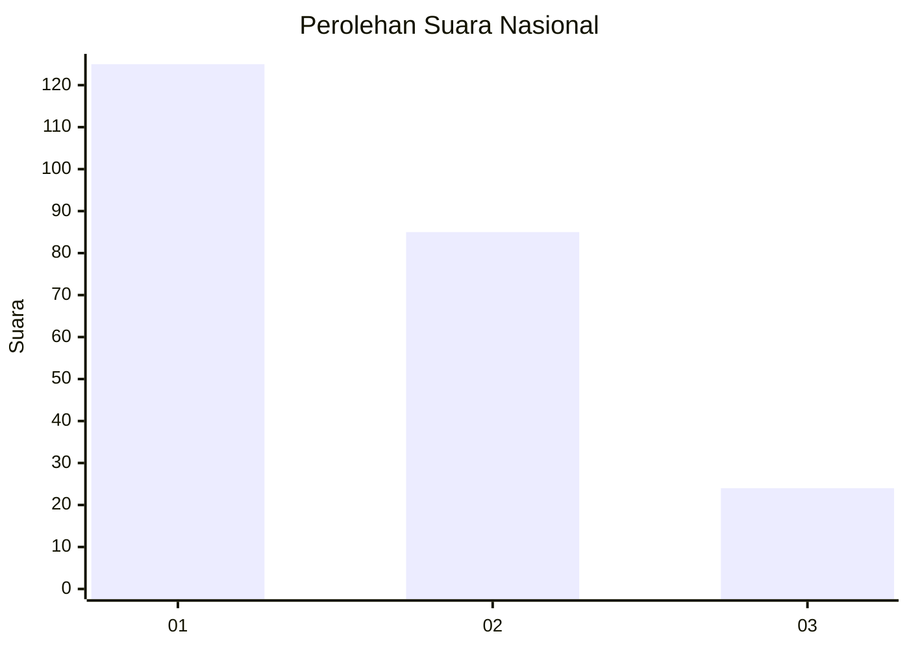
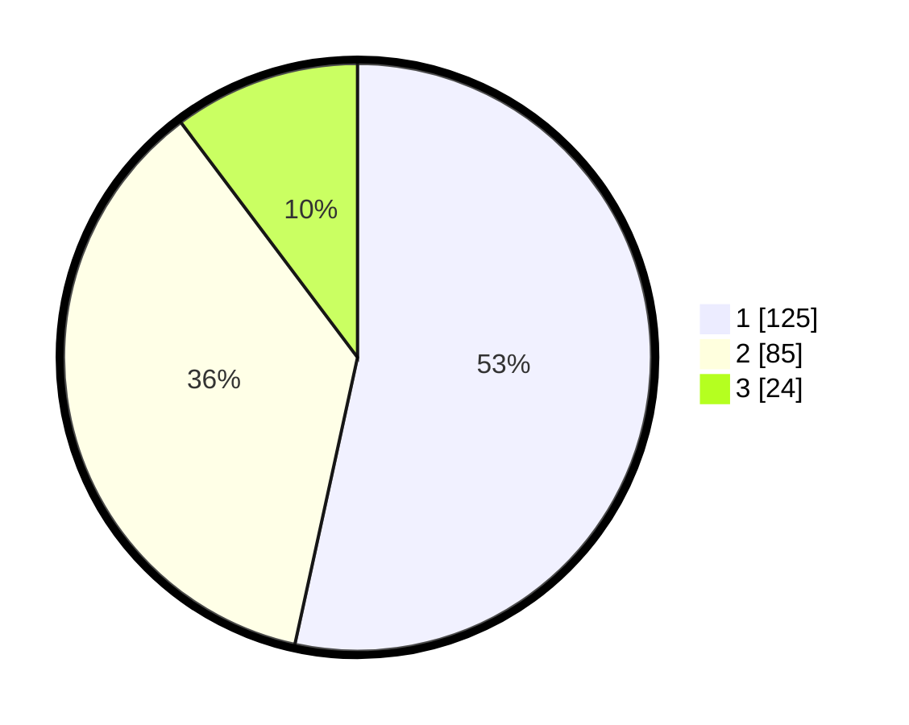

# Hasil

## Grafik

## Tabel

| No.    | Nama Paslon    | Suara | Suara (raw) | Persentase |
|:------ |:-------------- | -----:| -----------:| ----------:|
| 100025 | ANIES MUHAIMIN | 125   | [125][p-1]  | 53,42      |
| 100026 | PRABOWO GIBRAN | 85    | [85][p-2]   | 36,32      |
| 100027 | GANJAR MAHFUD  | 24    | [24][p-3]   | 10,26      |

[p-1]: https://github.com/gigit-pemilu/pemilu-2024/blob/main/pilpres/hitung-suara/sub/31-dki-jakarta/sub/74-jakarta-selatan/sub/09-jagakarsa/sub/1003-ciganjur/sub/071-tps/sub/paslon-1.txt
[p-2]: https://github.com/gigit-pemilu/pemilu-2024/blob/main/pilpres/hitung-suara/sub/31-dki-jakarta/sub/74-jakarta-selatan/sub/09-jagakarsa/sub/1003-ciganjur/sub/071-tps/sub/paslon-2.txt
[p-3]: https://github.com/gigit-pemilu/pemilu-2024/blob/main/pilpres/hitung-suara/sub/31-dki-jakarta/sub/74-jakarta-selatan/sub/09-jagakarsa/sub/1003-ciganjur/sub/071-tps/sub/paslon-3.txt

## Foto C Plano

https://sirekap-obj-formc.kpu.go.id/6ce2/pemilu/ppwp/31/74/09/10/03/3174091003071-20240214-215836--6b2ff0ad-8db4-4d2e-9a91-8f9b18643f81.jpg

https://sirekap-obj-formc.kpu.go.id/6ce2/pemilu/ppwp/31/74/09/10/03/3174091003071-20240214-225011--a487bc3b-4583-4657-9623-35edd275e926.jpg

https://sirekap-obj-formc.kpu.go.id/6ce2/pemilu/ppwp/31/74/09/10/03/3174091003071-20240214-220006--36a97caf-c9b6-479c-93a0-f1b62de6177a.jpg

## Metadata

| Key        | Value               |
| ---------- | ------------------- |
| Time Stamp | 2024-02-24 22:31:28 |

