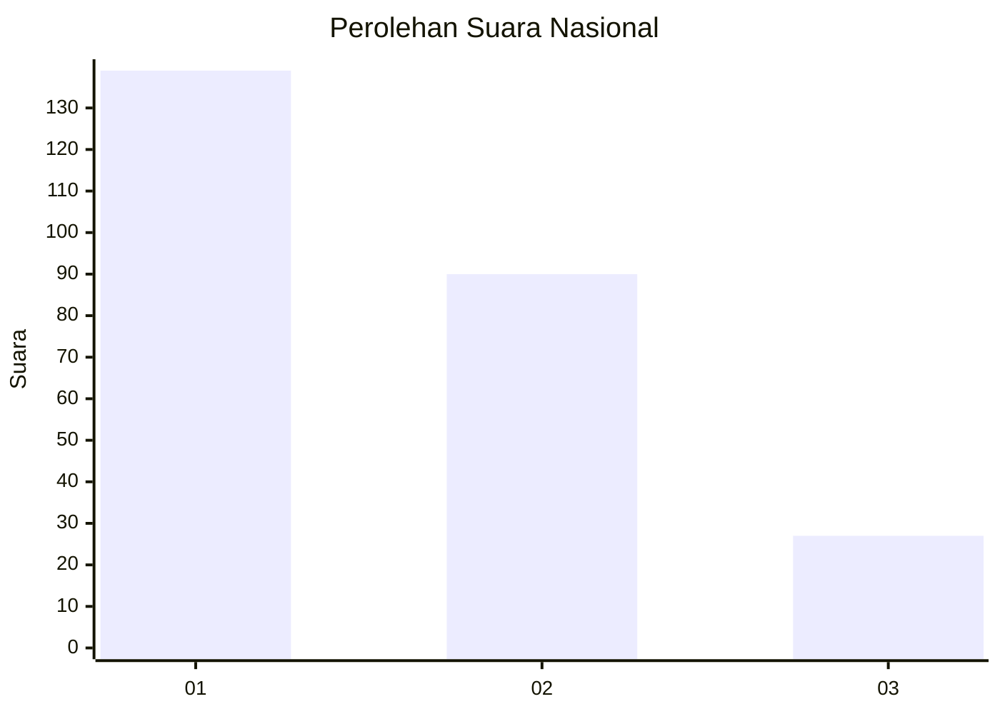
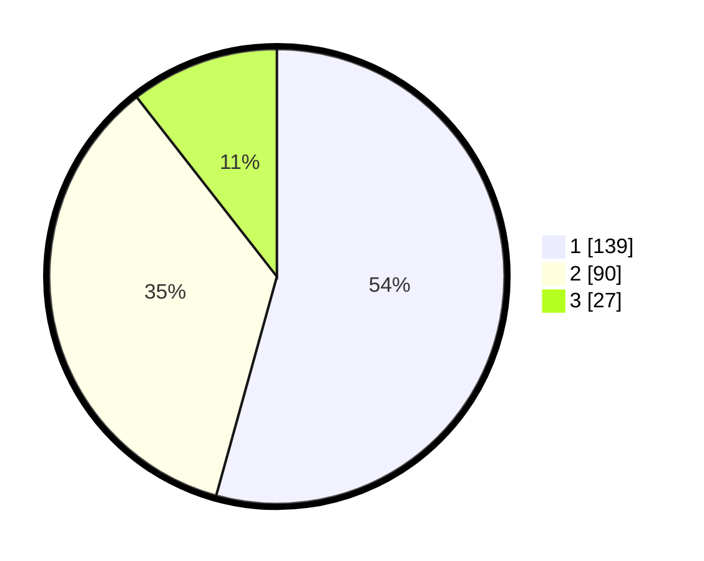

# Hasil

## Grafik

## Tabel

| No.    | Nama Paslon    | Suara | Suara (raw) | Persentase |
|:------ |:-------------- | -----:| -----------:| ----------:|
| 100025 | ANIES MUHAIMIN | 139   | [139][p-1]  | 54,30      |
| 100026 | PRABOWO GIBRAN | 90    | [90][p-2]   | 35,16      |
| 100027 | GANJAR MAHFUD  | 27    | [27][p-3]   | 10,55      |

[p-1]: https://github.com/gigit-pemilu/pemilu-2024/blob/main/pilpres/hitung-suara/sub/31-dki-jakarta/sub/74-jakarta-selatan/sub/09-jagakarsa/sub/1003-ciganjur/sub/072-tps/sub/paslon-1.txt
[p-2]: https://github.com/gigit-pemilu/pemilu-2024/blob/main/pilpres/hitung-suara/sub/31-dki-jakarta/sub/74-jakarta-selatan/sub/09-jagakarsa/sub/1003-ciganjur/sub/072-tps/sub/paslon-2.txt
[p-3]: https://github.com/gigit-pemilu/pemilu-2024/blob/main/pilpres/hitung-suara/sub/31-dki-jakarta/sub/74-jakarta-selatan/sub/09-jagakarsa/sub/1003-ciganjur/sub/072-tps/sub/paslon-3.txt

## Foto C Plano

https://sirekap-obj-formc.kpu.go.id/ed87/pemilu/ppwp/31/74/09/10/03/3174091003072-20240215-001631--c3032c17-c23d-4e01-b6f5-4a873913092c.jpg

https://sirekap-obj-formc.kpu.go.id/ed87/pemilu/ppwp/31/74/09/10/03/3174091003072-20240214-223051--1805dde2-512c-4271-9f84-ef0628e3ceaf.jpg

https://sirekap-obj-formc.kpu.go.id/ed87/pemilu/ppwp/31/74/09/10/03/3174091003072-20240215-004951--4f2a9633-3116-4646-baf6-63a385f30629.jpg

## Metadata

| Key        | Value               |
| ---------- | ------------------- |
| Time Stamp | 2024-02-24 22:31:28 |

