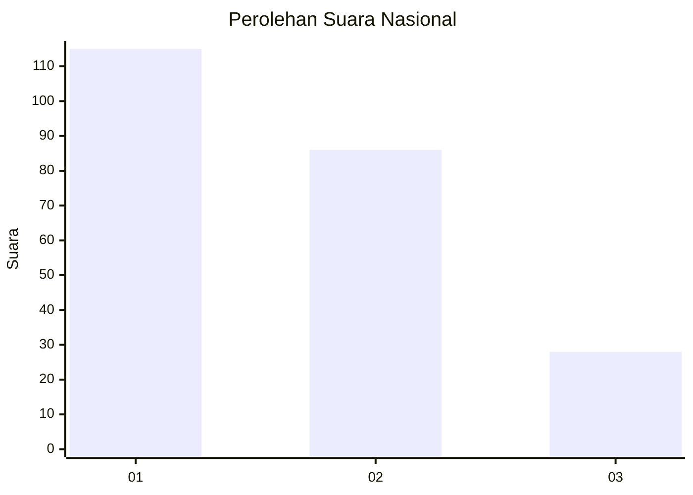
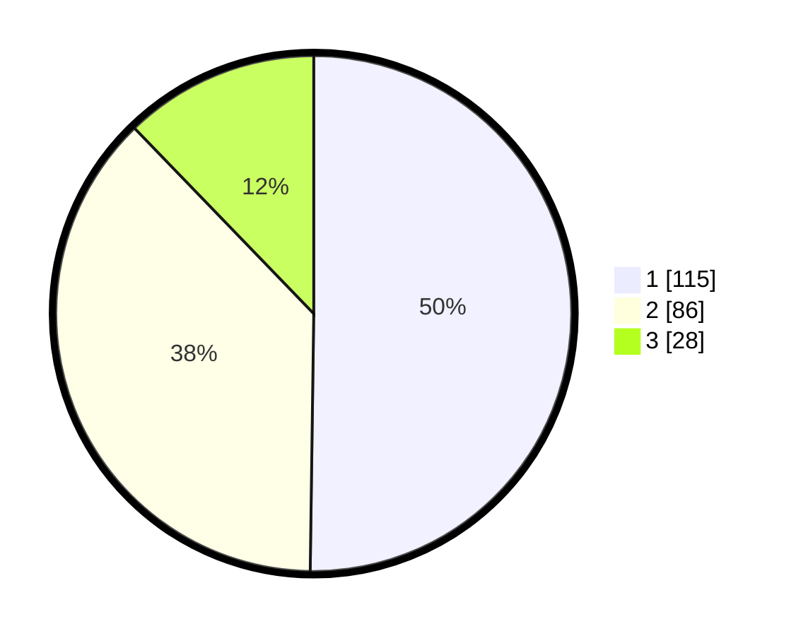

# Hasil

## Grafik

## Tabel

| No.    | Nama Paslon    | Suara | Suara (raw) | Persentase |
|:------ |:-------------- | -----:| -----------:| ----------:|
| 100025 | ANIES MUHAIMIN | 115   | [115][p-1]  | 50,22      |
| 100026 | PRABOWO GIBRAN | 86    | [86][p-2]   | 37,55      |
| 100027 | GANJAR MAHFUD  | 28    | [28][p-3]   | 12,23      |

[p-1]: https://github.com/gigit-pemilu/pemilu-2024/blob/main/pilpres/hitung-suara/sub/31-dki-jakarta/sub/74-jakarta-selatan/sub/09-jagakarsa/sub/1003-ciganjur/sub/076-tps/sub/paslon-1.txt
[p-2]: https://github.com/gigit-pemilu/pemilu-2024/blob/main/pilpres/hitung-suara/sub/31-dki-jakarta/sub/74-jakarta-selatan/sub/09-jagakarsa/sub/1003-ciganjur/sub/076-tps/sub/paslon-2.txt
[p-3]: https://github.com/gigit-pemilu/pemilu-2024/blob/main/pilpres/hitung-suara/sub/31-dki-jakarta/sub/74-jakarta-selatan/sub/09-jagakarsa/sub/1003-ciganjur/sub/076-tps/sub/paslon-3.txt

## Foto C Plano

https://sirekap-obj-formc.kpu.go.id/cbf9/pemilu/ppwp/31/74/09/10/03/3174091003076-20240214-213707--a595a18f-4bf5-41e1-ac19-f0cd66792126.jpg

https://sirekap-obj-formc.kpu.go.id/cbf9/pemilu/ppwp/31/74/09/10/03/3174091003076-20240214-234100--bd4e9764-192c-4908-97e2-fd9cc08bb218.jpg

https://sirekap-obj-formc.kpu.go.id/cbf9/pemilu/ppwp/31/74/09/10/03/3174091003076-20240214-233904--39dd69bb-4e4b-4c3c-968f-54a1622502f4.jpg

## Metadata

| Key        | Value               |
| ---------- | ------------------- |
| Time Stamp | 2024-02-15 20:30:46 |

