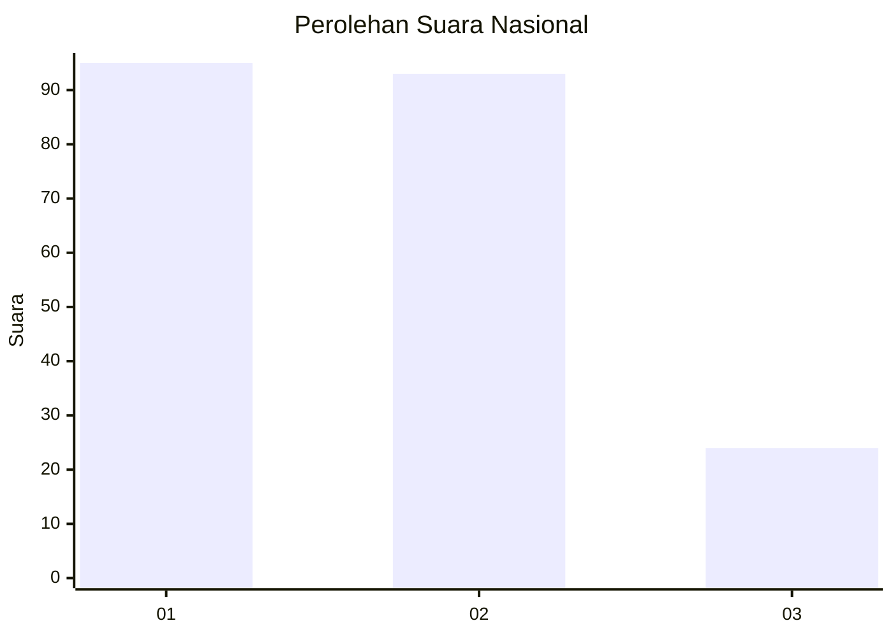
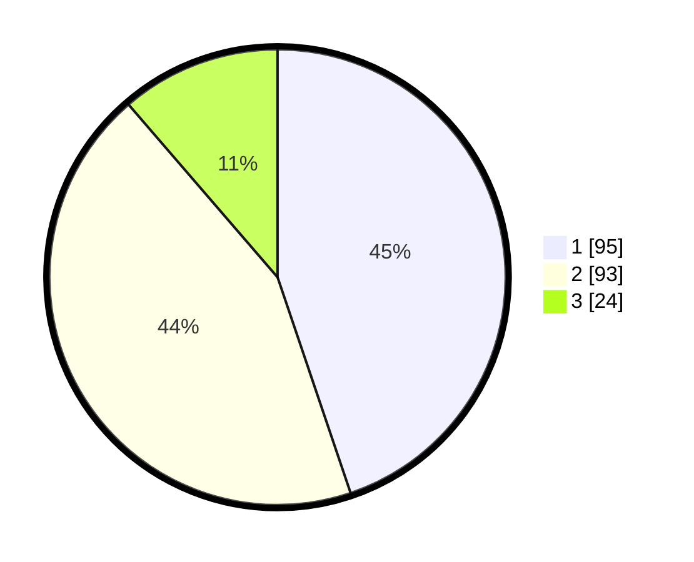

# Hasil

## Grafik

## Tabel

| No.    | Nama Paslon    | Suara | Suara (raw) | Persentase |
|:------ |:-------------- | -----:| -----------:| ----------:|
| 100025 | ANIES MUHAIMIN | 95    | [95][p-1]   | 44,81      |
| 100026 | PRABOWO GIBRAN | 93    | [93][p-2]   | 43,87      |
| 100027 | GANJAR MAHFUD  | 24    | [24][p-3]   | 11,32      |

[p-1]: https://github.com/gigit-pemilu/pemilu-2024/blob/main/pilpres/hitung-suara/sub/31-dki-jakarta/sub/74-jakarta-selatan/sub/09-jagakarsa/sub/1003-ciganjur/sub/078-tps/sub/paslon-1.txt
[p-2]: https://github.com/gigit-pemilu/pemilu-2024/blob/main/pilpres/hitung-suara/sub/31-dki-jakarta/sub/74-jakarta-selatan/sub/09-jagakarsa/sub/1003-ciganjur/sub/078-tps/sub/paslon-2.txt
[p-3]: https://github.com/gigit-pemilu/pemilu-2024/blob/main/pilpres/hitung-suara/sub/31-dki-jakarta/sub/74-jakarta-selatan/sub/09-jagakarsa/sub/1003-ciganjur/sub/078-tps/sub/paslon-3.txt

## Foto C Plano

https://sirekap-obj-formc.kpu.go.id/802c/pemilu/ppwp/31/74/09/10/03/3174091003078-20240214-221431--e9cb2b46-e3b5-48aa-8bdb-6cafb5328ed7.jpg

https://sirekap-obj-formc.kpu.go.id/802c/pemilu/ppwp/31/74/09/10/03/3174091003078-20240214-141004--aabac431-365f-4a5e-afca-3fdf58b1c0e5.jpg

https://sirekap-obj-formc.kpu.go.id/802c/pemilu/ppwp/31/74/09/10/03/3174091003078-20240214-221222--687ee903-f7ae-4121-9801-1b8d96c49def.jpg

## Metadata

| Key        | Value               |
| ---------- | ------------------- |
| Time Stamp | 2024-02-15 00:41:44 |

