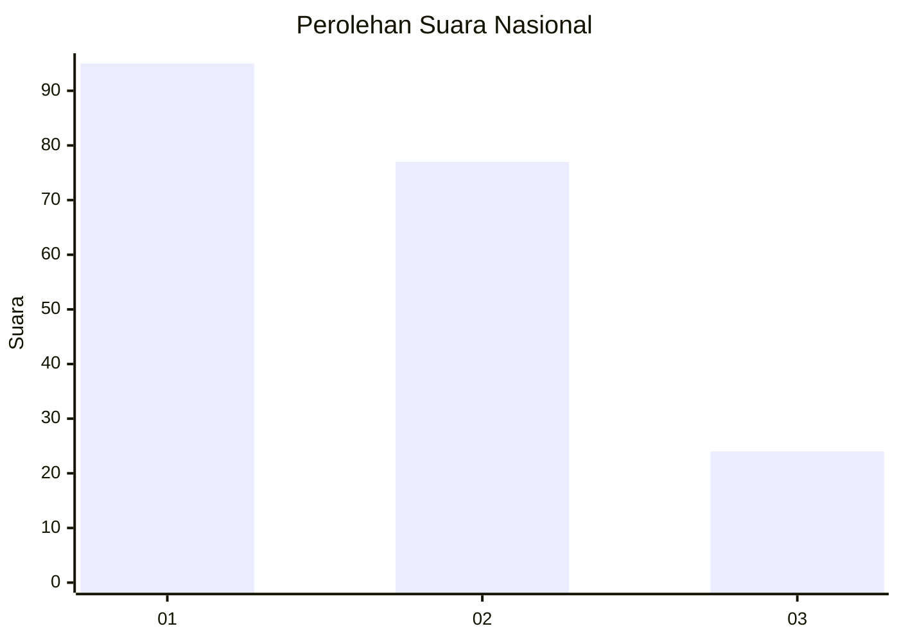
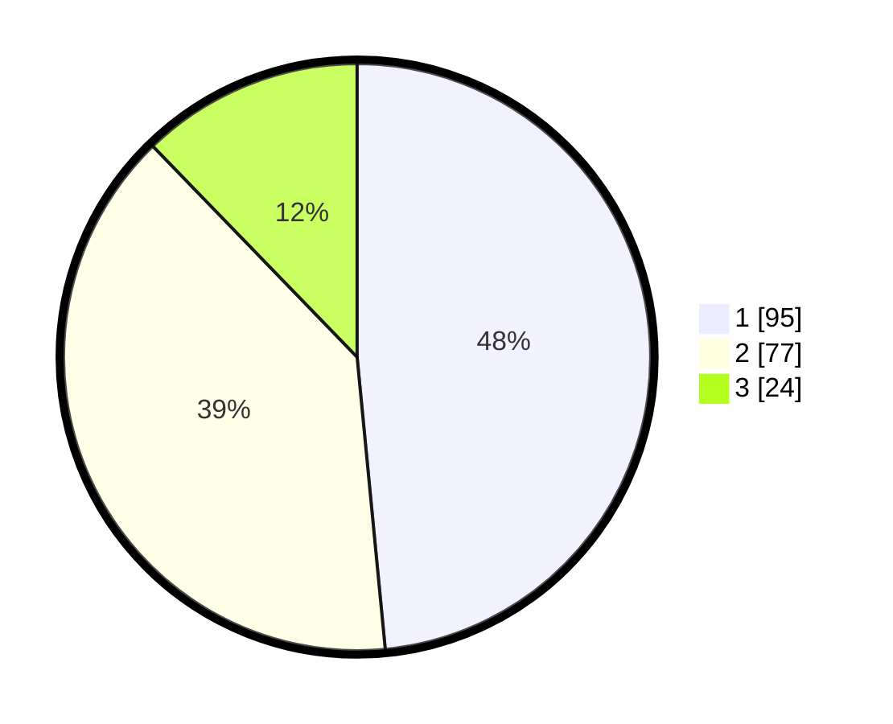

# Hasil

## Grafik

## Tabel

| No.    | Nama Paslon    | Suara | Suara (raw) | Persentase |
|:------ |:-------------- | -----:| -----------:| ----------:|
| 100025 | ANIES MUHAIMIN | 95    | [95][p-1]   | 48,47      |
| 100026 | PRABOWO GIBRAN | 77    | [77][p-2]   | 39,29      |
| 100027 | GANJAR MAHFUD  | 24    | [24][p-3]   | 12,24      |

[p-1]: https://github.com/gigit-pemilu/pemilu-2024/blob/main/pilpres/hitung-suara/sub/31-dki-jakarta/sub/74-jakarta-selatan/sub/09-jagakarsa/sub/1003-ciganjur/sub/079-tps/sub/paslon-1.txt
[p-2]: https://github.com/gigit-pemilu/pemilu-2024/blob/main/pilpres/hitung-suara/sub/31-dki-jakarta/sub/74-jakarta-selatan/sub/09-jagakarsa/sub/1003-ciganjur/sub/079-tps/sub/paslon-2.txt
[p-3]: https://github.com/gigit-pemilu/pemilu-2024/blob/main/pilpres/hitung-suara/sub/31-dki-jakarta/sub/74-jakarta-selatan/sub/09-jagakarsa/sub/1003-ciganjur/sub/079-tps/sub/paslon-3.txt

## Foto C Plano

https://sirekap-obj-formc.kpu.go.id/aff6/pemilu/ppwp/31/74/09/10/03/3174091003079-20240214-214405--32e745e3-c90c-44c3-9ad4-5d47a815fcbe.jpg

https://sirekap-obj-formc.kpu.go.id/aff6/pemilu/ppwp/31/74/09/10/03/3174091003079-20240214-214408--aeef1ed9-84ab-4448-9851-788c34d04590.jpg

https://sirekap-obj-formc.kpu.go.id/aff6/pemilu/ppwp/31/74/09/10/03/3174091003079-20240214-214419--9de92a96-914b-4c01-8580-6c45b4844348.jpg

## Metadata

| Key        | Value               |
| ---------- | ------------------- |
| Time Stamp | 2024-02-24 22:31:28 |

