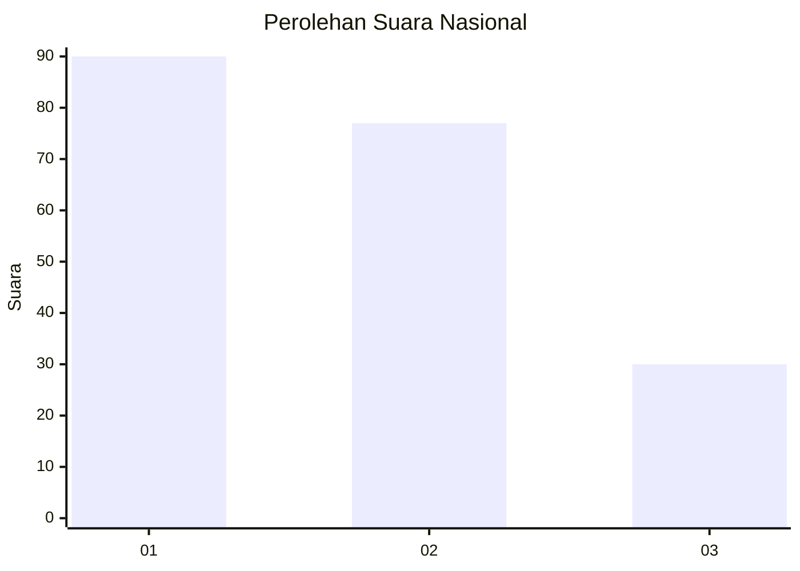
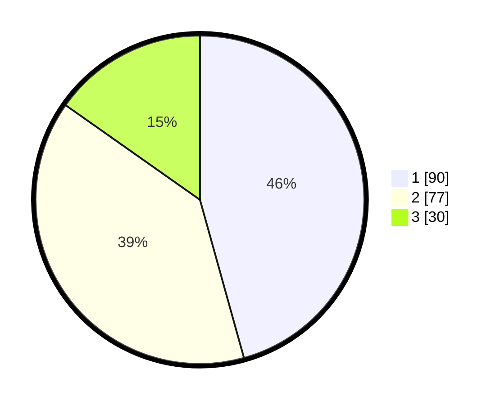

# Hasil

## Grafik

## Tabel

| No.    | Nama Paslon    | Suara | Suara (raw) | Persentase |
|:------ |:-------------- | -----:| -----------:| ----------:|
| 100025 | ANIES MUHAIMIN | 90    | [90][p-1]   | 45,69      |
| 100026 | PRABOWO GIBRAN | 77    | [77][p-2]   | 39,09      |
| 100027 | GANJAR MAHFUD  | 30    | [30][p-3]   | 15,23      |

[p-1]: https://github.com/gigit-pemilu/pemilu-2024/blob/main/pilpres/hitung-suara/sub/31-dki-jakarta/sub/74-jakarta-selatan/sub/09-jagakarsa/sub/1003-ciganjur/sub/081-tps/sub/paslon-1.txt
[p-2]: https://github.com/gigit-pemilu/pemilu-2024/blob/main/pilpres/hitung-suara/sub/31-dki-jakarta/sub/74-jakarta-selatan/sub/09-jagakarsa/sub/1003-ciganjur/sub/081-tps/sub/paslon-2.txt
[p-3]: https://github.com/gigit-pemilu/pemilu-2024/blob/main/pilpres/hitung-suara/sub/31-dki-jakarta/sub/74-jakarta-selatan/sub/09-jagakarsa/sub/1003-ciganjur/sub/081-tps/sub/paslon-3.txt

## Foto C Plano

https://sirekap-obj-formc.kpu.go.id/3f9d/pemilu/ppwp/31/74/09/10/03/3174091003081-20240214-191329--5d6b9035-bacc-4adf-a4b6-c54a83e8508b.jpg

https://sirekap-obj-formc.kpu.go.id/3f9d/pemilu/ppwp/31/74/09/10/03/3174091003081-20240215-000017--a490bc28-841e-4306-baca-4320f792da03.jpg

https://sirekap-obj-formc.kpu.go.id/3f9d/pemilu/ppwp/31/74/09/10/03/3174091003081-20240214-235624--2c69c9b9-a89f-4b01-9adf-1f59352de61f.jpg

## Metadata

| Key        | Value               |
| ---------- | ------------------- |
| Time Stamp | 2024-02-25 15:00:00 |

