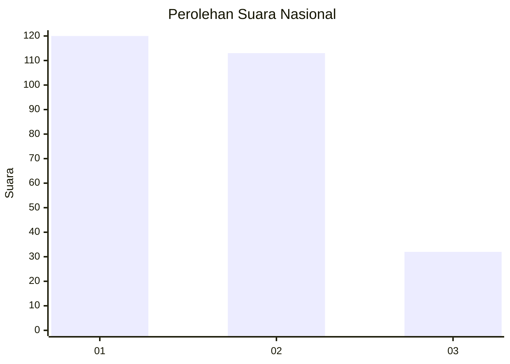
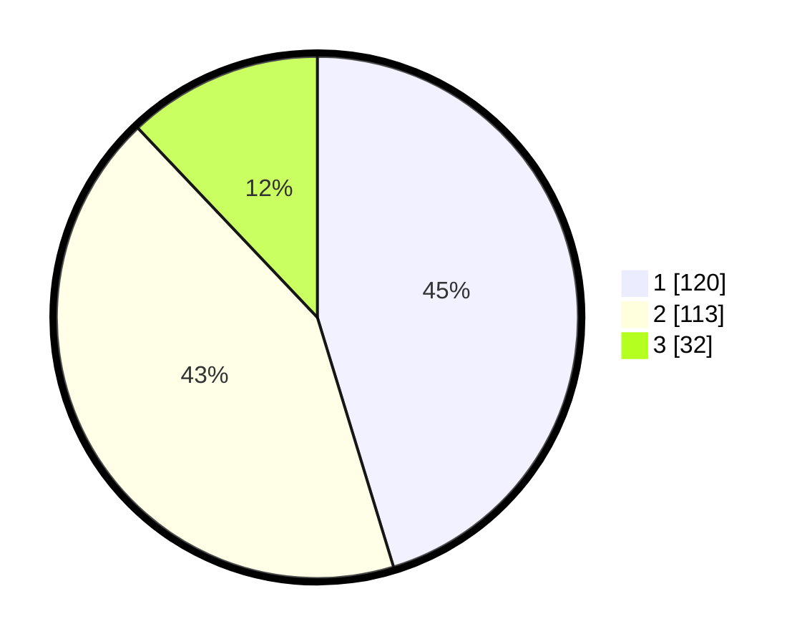

# Hasil

## Grafik

## Tabel

| No.    | Nama Paslon    | Suara | Suara (raw) | Persentase |
|:------ |:-------------- | -----:| -----------:| ----------:|
| 100025 | ANIES MUHAIMIN | 120   | [120][p-1]  | 45,28      |
| 100026 | PRABOWO GIBRAN | 113   | [113][p-2]  | 42,64      |
| 100027 | GANJAR MAHFUD  | 32    | [32][p-3]   | 12,08      |

[p-1]: https://github.com/gigit-pemilu/pemilu-2024/blob/main/pilpres/hitung-suara/sub/31-dki-jakarta/sub/74-jakarta-selatan/sub/09-jagakarsa/sub/1003-ciganjur/sub/085-tps/sub/paslon-1.txt
[p-2]: https://github.com/gigit-pemilu/pemilu-2024/blob/main/pilpres/hitung-suara/sub/31-dki-jakarta/sub/74-jakarta-selatan/sub/09-jagakarsa/sub/1003-ciganjur/sub/085-tps/sub/paslon-2.txt
[p-3]: https://github.com/gigit-pemilu/pemilu-2024/blob/main/pilpres/hitung-suara/sub/31-dki-jakarta/sub/74-jakarta-selatan/sub/09-jagakarsa/sub/1003-ciganjur/sub/085-tps/sub/paslon-3.txt

## Foto C Plano

https://sirekap-obj-formc.kpu.go.id/8275/pemilu/ppwp/31/74/09/10/03/3174091003085-20240215-115144--2b7dcd00-a5c8-41e0-8d8c-cba5a3c704e4.jpg

https://sirekap-obj-formc.kpu.go.id/8275/pemilu/ppwp/31/74/09/10/03/3174091003085-20240215-115147--261d6b4b-0443-400c-83d4-26978e82b084.jpg

https://sirekap-obj-formc.kpu.go.id/8275/pemilu/ppwp/31/74/09/10/03/3174091003085-20240215-115150--e2c97144-892f-47eb-8ee1-971b820c6ce0.jpg

## Metadata

| Key        | Value               |
| ---------- | ------------------- |
| Time Stamp | 2024-02-24 22:31:28 |

