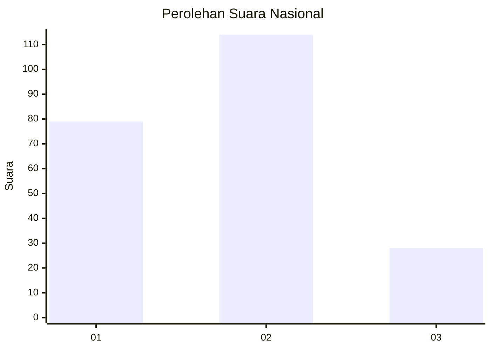
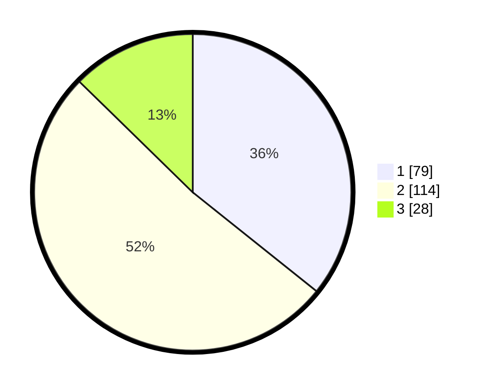

# Hasil

## Grafik

## Tabel

| No.    | Nama Paslon    | Suara | Suara (raw) | Persentase |
|:------ |:-------------- | -----:| -----------:| ----------:|
| 100025 | ANIES MUHAIMIN | 79    | [79][p-1]   | 35,75      |
| 100026 | PRABOWO GIBRAN | 114   | [114][p-2]  | 51,58      |
| 100027 | GANJAR MAHFUD  | 28    | [28][p-3]   | 12,67      |

[p-1]: https://github.com/gigit-pemilu/pemilu-2024/blob/main/pilpres/hitung-suara/sub/31-dki-jakarta/sub/74-jakarta-selatan/sub/09-jagakarsa/sub/1003-ciganjur/sub/090-tps/sub/paslon-1.txt
[p-2]: https://github.com/gigit-pemilu/pemilu-2024/blob/main/pilpres/hitung-suara/sub/31-dki-jakarta/sub/74-jakarta-selatan/sub/09-jagakarsa/sub/1003-ciganjur/sub/090-tps/sub/paslon-2.txt
[p-3]: https://github.com/gigit-pemilu/pemilu-2024/blob/main/pilpres/hitung-suara/sub/31-dki-jakarta/sub/74-jakarta-selatan/sub/09-jagakarsa/sub/1003-ciganjur/sub/090-tps/sub/paslon-3.txt

## Foto C Plano

https://sirekap-obj-formc.kpu.go.id/806c/pemilu/ppwp/31/74/09/10/03/3174091003090-20240214-201156--3c70717b-648f-4e56-b245-ef0489a96de8.jpg

https://sirekap-obj-formc.kpu.go.id/806c/pemilu/ppwp/31/74/09/10/03/3174091003090-20240214-201413--d3b01cfa-902f-409b-804a-d739b0497502.jpg

https://sirekap-obj-formc.kpu.go.id/806c/pemilu/ppwp/31/74/09/10/03/3174091003090-20240214-201612--c592bfc4-90f2-43e8-8422-0cd8ea3d0ef9.jpg

## Metadata

| Key        | Value               |
| ---------- | ------------------- |
| Time Stamp | 2024-02-24 22:31:28 |

