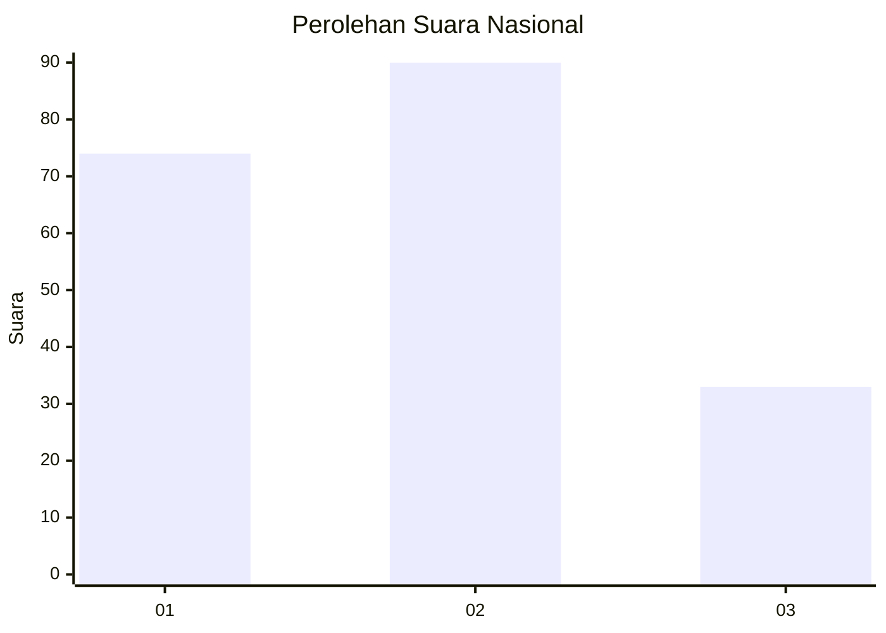
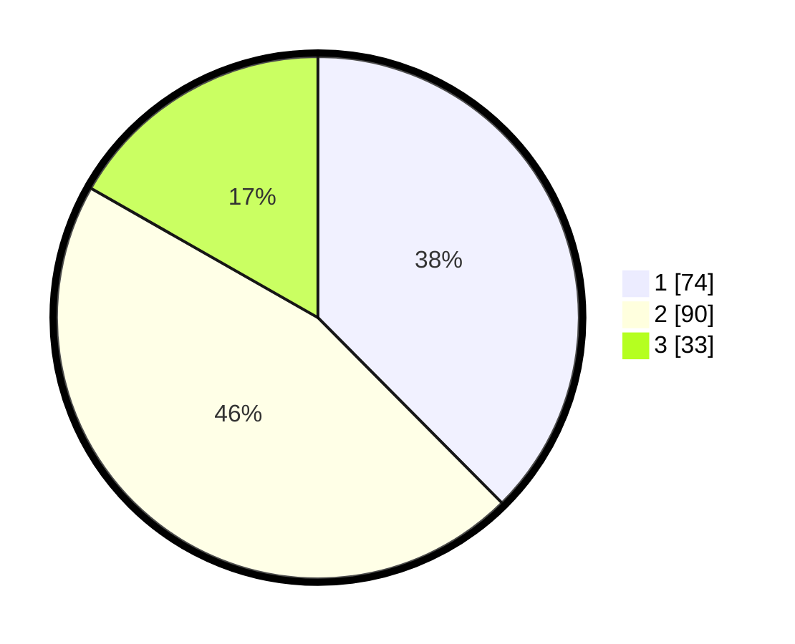

# Hasil

## Grafik

## Tabel

| No.    | Nama Paslon    | Suara | Suara (raw) | Persentase |
|:------ |:-------------- | -----:| -----------:| ----------:|
| 100025 | ANIES MUHAIMIN | 74    | [74][p-1]   | 37,56      |
| 100026 | PRABOWO GIBRAN | 90    | [90][p-2]   | 45,69      |
| 100027 | GANJAR MAHFUD  | 33    | [33][p-3]   | 16,75      |

[p-1]: https://github.com/gigit-pemilu/pemilu-2024/blob/main/pilpres/hitung-suara/sub/31-dki-jakarta/sub/74-jakarta-selatan/sub/09-jagakarsa/sub/1003-ciganjur/sub/101-tps/sub/paslon-1.txt
[p-2]: https://github.com/gigit-pemilu/pemilu-2024/blob/main/pilpres/hitung-suara/sub/31-dki-jakarta/sub/74-jakarta-selatan/sub/09-jagakarsa/sub/1003-ciganjur/sub/101-tps/sub/paslon-2.txt
[p-3]: https://github.com/gigit-pemilu/pemilu-2024/blob/main/pilpres/hitung-suara/sub/31-dki-jakarta/sub/74-jakarta-selatan/sub/09-jagakarsa/sub/1003-ciganjur/sub/101-tps/sub/paslon-3.txt

## Foto C Plano

https://sirekap-obj-formc.kpu.go.id/1f08/pemilu/ppwp/31/74/09/10/03/3174091003101-20240215-023037--d4fa7894-6e92-442d-93be-156440c1d193.jpg

https://sirekap-obj-formc.kpu.go.id/1f08/pemilu/ppwp/31/74/09/10/03/3174091003101-20240214-231113--ad27704e-8ac6-41a8-98e1-2c99f462a69a.jpg

https://sirekap-obj-formc.kpu.go.id/1f08/pemilu/ppwp/31/74/09/10/03/3174091003101-20240214-231210--b0d88d93-932e-4fb3-beb1-a0cc98a55072.jpg

## Metadata

| Key        | Value               |
| ---------- | ------------------- |
| Time Stamp | 2024-02-24 22:31:28 |

