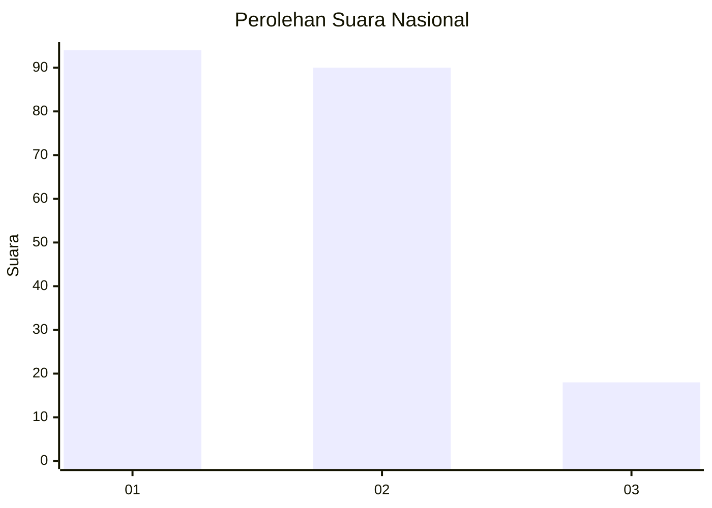
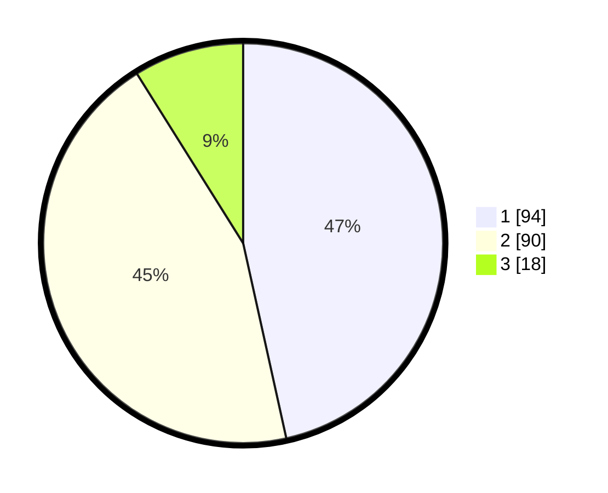

# Hasil

## Grafik

## Tabel

| No.    | Nama Paslon    | Suara | Suara (raw) | Persentase |
|:------ |:-------------- | -----:| -----------:| ----------:|
| 100025 | ANIES MUHAIMIN | 94    | [94][p-1]   | 46,53      |
| 100026 | PRABOWO GIBRAN | 90    | [90][p-2]   | 44,55      |
| 100027 | GANJAR MAHFUD  | 18    | [18][p-3]   | 8,91       |

[p-1]: https://github.com/gigit-pemilu/pemilu-2024/blob/main/pilpres/hitung-suara/sub/31-dki-jakarta/sub/74-jakarta-selatan/sub/09-jagakarsa/sub/1003-ciganjur/sub/102-tps/sub/paslon-1.txt
[p-2]: https://github.com/gigit-pemilu/pemilu-2024/blob/main/pilpres/hitung-suara/sub/31-dki-jakarta/sub/74-jakarta-selatan/sub/09-jagakarsa/sub/1003-ciganjur/sub/102-tps/sub/paslon-2.txt
[p-3]: https://github.com/gigit-pemilu/pemilu-2024/blob/main/pilpres/hitung-suara/sub/31-dki-jakarta/sub/74-jakarta-selatan/sub/09-jagakarsa/sub/1003-ciganjur/sub/102-tps/sub/paslon-3.txt

## Foto C Plano

https://sirekap-obj-formc.kpu.go.id/eb1e/pemilu/ppwp/31/74/09/10/03/3174091003102-20240215-015640--b61d3368-3fdd-4a54-ae87-e63436711076.jpg

https://sirekap-obj-formc.kpu.go.id/eb1e/pemilu/ppwp/31/74/09/10/03/3174091003102-20240215-015756--a5edb11e-41b0-4880-83b0-5e7344b764a1.jpg

https://sirekap-obj-formc.kpu.go.id/eb1e/pemilu/ppwp/31/74/09/10/03/3174091003102-20240215-015920--eff9546e-c28b-473a-bbb8-4fe8881dc4de.jpg

## Metadata

| Key        | Value               |
| ---------- | ------------------- |
| Time Stamp | 2024-02-25 10:00:00 |

