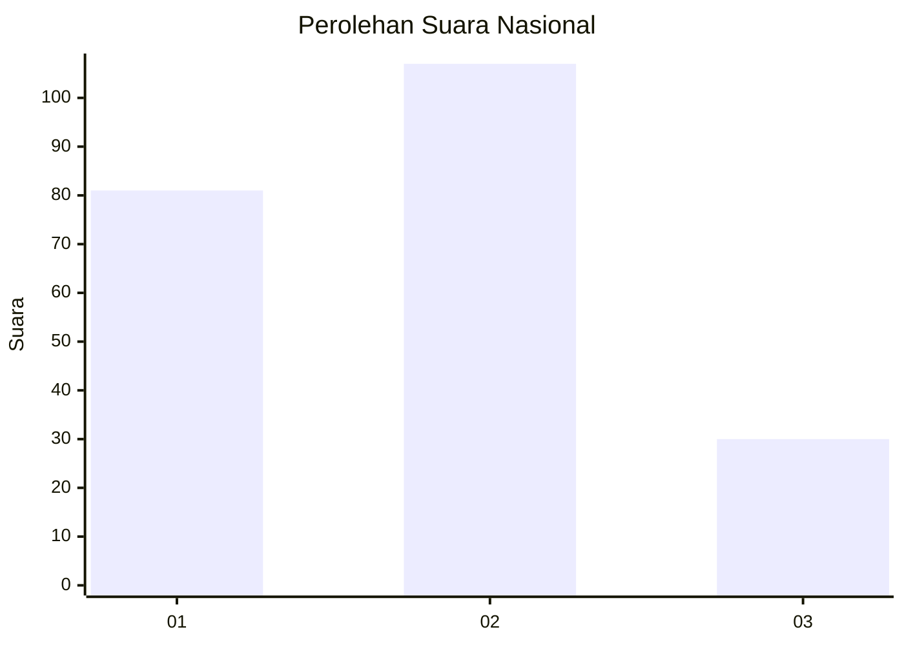
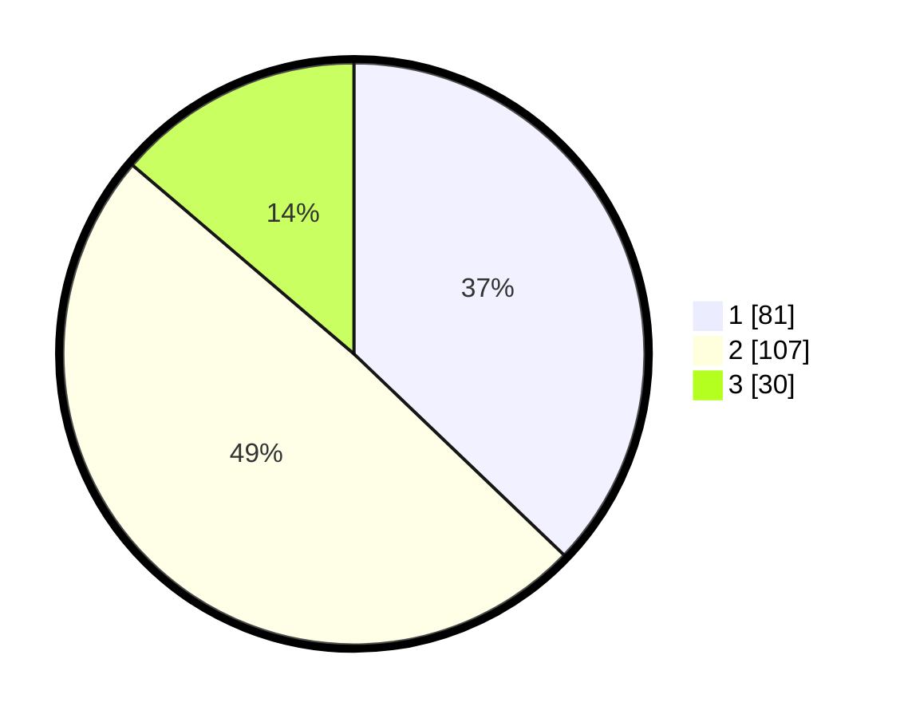

# Hasil

## Grafik

## Tabel

| No.    | Nama Paslon    | Suara | Suara (raw) | Persentase |
|:------ |:-------------- | -----:| -----------:| ----------:|
| 100025 | ANIES MUHAIMIN | 81    | [81][p-1]   | 37,16      |
| 100026 | PRABOWO GIBRAN | 107   | [107][p-2]  | 49,08      |
| 100027 | GANJAR MAHFUD  | 30    | [30][p-3]   | 13,76      |

[p-1]: https://github.com/gigit-pemilu/pemilu-2024/blob/main/pilpres/hitung-suara/sub/31-dki-jakarta/sub/74-jakarta-selatan/sub/09-jagakarsa/sub/1003-ciganjur/sub/104-tps/sub/paslon-1.txt
[p-2]: https://github.com/gigit-pemilu/pemilu-2024/blob/main/pilpres/hitung-suara/sub/31-dki-jakarta/sub/74-jakarta-selatan/sub/09-jagakarsa/sub/1003-ciganjur/sub/104-tps/sub/paslon-2.txt
[p-3]: https://github.com/gigit-pemilu/pemilu-2024/blob/main/pilpres/hitung-suara/sub/31-dki-jakarta/sub/74-jakarta-selatan/sub/09-jagakarsa/sub/1003-ciganjur/sub/104-tps/sub/paslon-3.txt

## Foto C Plano

https://sirekap-obj-formc.kpu.go.id/598a/pemilu/ppwp/31/74/09/10/03/3174091003104-20240214-220101--8fbfa428-a286-4ba9-8334-abc484ae8e95.jpg

https://sirekap-obj-formc.kpu.go.id/598a/pemilu/ppwp/31/74/09/10/03/3174091003104-20240214-223951--ce8e28c5-55ae-4efc-a6b8-673a18b73cbc.jpg

https://sirekap-obj-formc.kpu.go.id/598a/pemilu/ppwp/31/74/09/10/03/3174091003104-20240214-220758--fe4c2bc7-446b-4914-a3a2-c62ee3dd5aa8.jpg

## Metadata

| Key        | Value               |
| ---------- | ------------------- |
| Time Stamp | 2024-02-24 22:31:28 |

