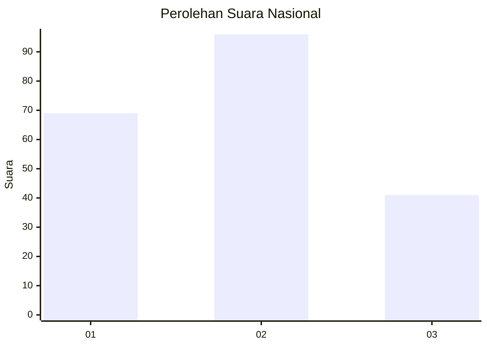
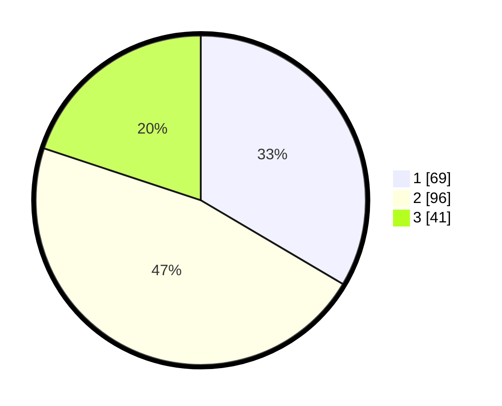

# Hasil

## Grafik

## Tabel

| No.    | Nama Paslon    | Suara | Suara (raw) | Persentase |
|:------ |:-------------- | -----:| -----------:| ----------:|
| 100025 | ANIES MUHAIMIN | 69    | [69][p-1]   | 33,50      |
| 100026 | PRABOWO GIBRAN | 96    | [96][p-2]   | 46,60      |
| 100027 | GANJAR MAHFUD  | 41    | [41][p-3]   | 19,90      |

[p-1]: https://github.com/gigit-pemilu/pemilu-2024/blob/main/pilpres/hitung-suara/sub/31-dki-jakarta/sub/74-jakarta-selatan/sub/09-jagakarsa/sub/1003-ciganjur/sub/105-tps/sub/paslon-1.txt
[p-2]: https://github.com/gigit-pemilu/pemilu-2024/blob/main/pilpres/hitung-suara/sub/31-dki-jakarta/sub/74-jakarta-selatan/sub/09-jagakarsa/sub/1003-ciganjur/sub/105-tps/sub/paslon-2.txt
[p-3]: https://github.com/gigit-pemilu/pemilu-2024/blob/main/pilpres/hitung-suara/sub/31-dki-jakarta/sub/74-jakarta-selatan/sub/09-jagakarsa/sub/1003-ciganjur/sub/105-tps/sub/paslon-3.txt

## Foto C Plano

https://sirekap-obj-formc.kpu.go.id/effd/pemilu/ppwp/31/74/09/10/03/3174091003105-20240215-021408--f1a7fb2f-727c-43b4-bfe2-c299bfe8c836.jpg

https://sirekap-obj-formc.kpu.go.id/effd/pemilu/ppwp/31/74/09/10/03/3174091003105-20240215-021451--e5bf6091-c092-4a24-a777-96c8238541de.jpg

https://sirekap-obj-formc.kpu.go.id/effd/pemilu/ppwp/31/74/09/10/03/3174091003105-20240215-021609--622b53b7-0544-45c8-8088-2a28a01250ed.jpg

## Metadata

| Key        | Value               |
| ---------- | ------------------- |
| Time Stamp | 2024-02-25 11:00:00 |

