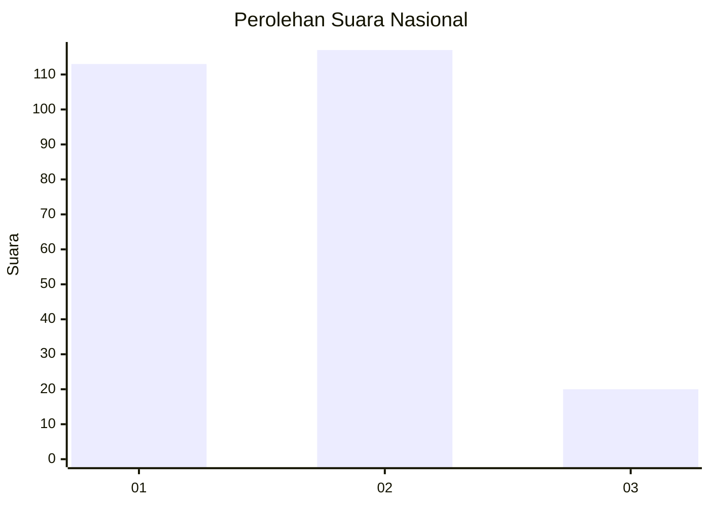
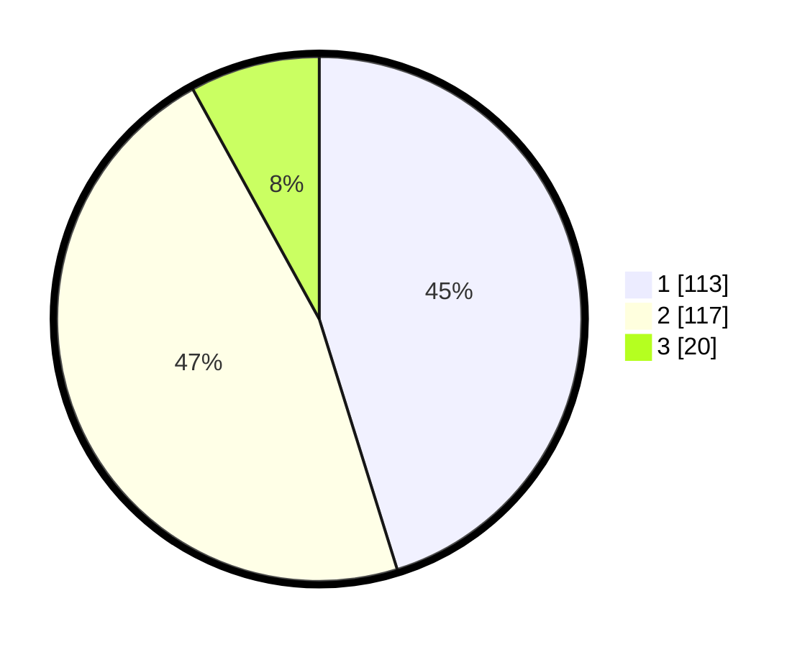

# Hasil

## Grafik

## Tabel

| No.    | Nama Paslon    | Suara | Suara (raw) | Persentase |
|:------ |:-------------- | -----:| -----------:| ----------:|
| 100025 | ANIES MUHAIMIN | 113   | [113][p-1]  | 45,20      |
| 100026 | PRABOWO GIBRAN | 117   | [117][p-2]  | 46,80      |
| 100027 | GANJAR MAHFUD  | 20    | [20][p-3]   | 8,00       |

[p-1]: https://github.com/gigit-pemilu/pemilu-2024/blob/main/pilpres/hitung-suara/sub/31-dki-jakarta/sub/74-jakarta-selatan/sub/09-jagakarsa/sub/1003-ciganjur/sub/110-tps/sub/paslon-1.txt
[p-2]: https://github.com/gigit-pemilu/pemilu-2024/blob/main/pilpres/hitung-suara/sub/31-dki-jakarta/sub/74-jakarta-selatan/sub/09-jagakarsa/sub/1003-ciganjur/sub/110-tps/sub/paslon-2.txt
[p-3]: https://github.com/gigit-pemilu/pemilu-2024/blob/main/pilpres/hitung-suara/sub/31-dki-jakarta/sub/74-jakarta-selatan/sub/09-jagakarsa/sub/1003-ciganjur/sub/110-tps/sub/paslon-3.txt

## Foto C Plano

https://sirekap-obj-formc.kpu.go.id/814c/pemilu/ppwp/31/74/09/10/03/3174091003110-20240215-010737--3c2f23f4-c101-4e66-9c88-348502eb1a8c.jpg

https://sirekap-obj-formc.kpu.go.id/814c/pemilu/ppwp/31/74/09/10/03/3174091003110-20240215-010803--a0760de2-249f-4728-90a0-b7b260baa8c5.jpg

https://sirekap-obj-formc.kpu.go.id/814c/pemilu/ppwp/31/74/09/10/03/3174091003110-20240215-011832--08c05a20-e660-4345-8d6e-fe39fd0d830c.jpg

## Metadata

| Key        | Value               |
| ---------- | ------------------- |
| Time Stamp | 2024-02-24 22:31:28 |

