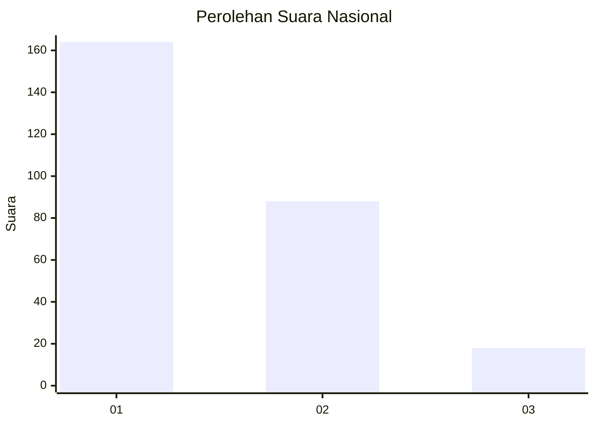
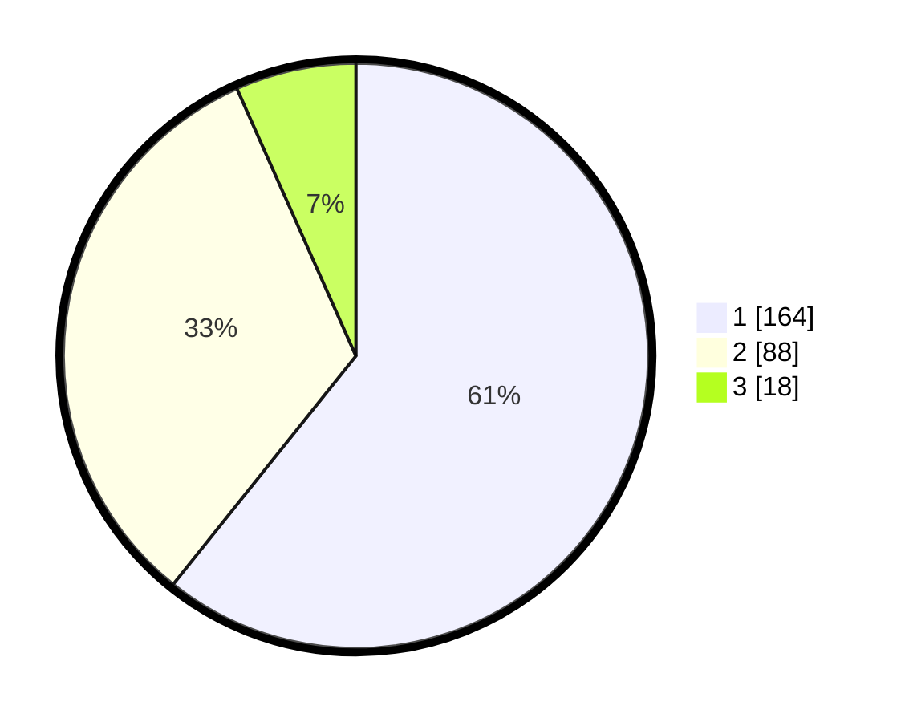

# Hasil

## Grafik

## Tabel

| No. | Nama Paslon    | Suara | Suara (raw) | Persentase |
|:--- |:-------------- | -----:| -----------:| ----------:|
| 1   | ANIES MUHAIMIN | 164   | [164][p-1]  | 60,74      |
| 2   | PRABOWO GIBRAN | 88    | [88][p-2]   | 32,59      |
| 3   | GANJAR MAHFUD  | 18    | [18][p-3]   | 6,67       |

[p-1]: https://github.com/gigit-pemilu/pemilu-2024/blob/main/pilpres/hitung-suara/sub/31-dki-jakarta/sub/74-jakarta-selatan/sub/09-jagakarsa/sub/1003-ciganjur/sub/113-tps/sub/paslon-1.txt
[p-2]: https://github.com/gigit-pemilu/pemilu-2024/blob/main/pilpres/hitung-suara/sub/31-dki-jakarta/sub/74-jakarta-selatan/sub/09-jagakarsa/sub/1003-ciganjur/sub/113-tps/sub/paslon-2.txt
[p-3]: https://github.com/gigit-pemilu/pemilu-2024/blob/main/pilpres/hitung-suara/sub/31-dki-jakarta/sub/74-jakarta-selatan/sub/09-jagakarsa/sub/1003-ciganjur/sub/113-tps/sub/paslon-3.txt

## Foto C Plano

https://sirekap-obj-formc.kpu.go.id/2d34/pemilu/ppwp/31/74/09/10/03/3174091003113-20240214-231140--141ffa97-2e0f-4a2a-9cdc-2e698d39343f.jpg

https://sirekap-obj-formc.kpu.go.id/2d34/pemilu/ppwp/31/74/09/10/03/3174091003113-20240214-231224--538a3dba-5c16-4e94-b7fb-d2e0db6a439f.jpg

https://sirekap-obj-formc.kpu.go.id/2d34/pemilu/ppwp/31/74/09/10/03/3174091003113-20240214-231406--ed15f66b-843b-40cf-bcf0-80016c58417e.jpg

## Metadata

| Key        | Value               |
| ---------- | ------------------- |
| Time Stamp | 2024-02-24 22:31:28 |

