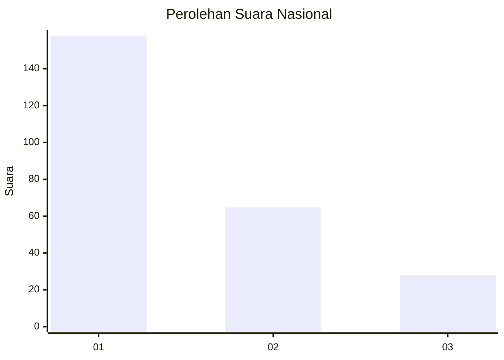
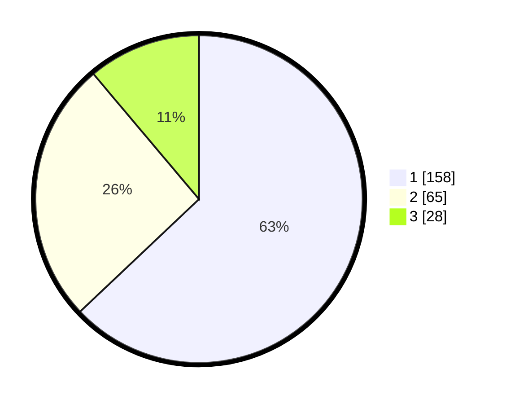

# Hasil

## Grafik

## Tabel

| No.    | Nama Paslon    | Suara | Suara (raw) | Persentase |
|:------ |:-------------- | -----:| -----------:| ----------:|
| 100025 | ANIES MUHAIMIN | 158   | [158][p-1]  | 62,95      |
| 100026 | PRABOWO GIBRAN | 65    | [65][p-2]   | 25,90      |
| 100027 | GANJAR MAHFUD  | 28    | [28][p-3]   | 11,16      |

[p-1]: https://github.com/gigit-pemilu/pemilu-2024/blob/main/pilpres/hitung-suara/sub/31-dki-jakarta/sub/74-jakarta-selatan/sub/09-jagakarsa/sub/1003-ciganjur/sub/116-tps/sub/paslon-1.txt
[p-2]: https://github.com/gigit-pemilu/pemilu-2024/blob/main/pilpres/hitung-suara/sub/31-dki-jakarta/sub/74-jakarta-selatan/sub/09-jagakarsa/sub/1003-ciganjur/sub/116-tps/sub/paslon-2.txt
[p-3]: https://github.com/gigit-pemilu/pemilu-2024/blob/main/pilpres/hitung-suara/sub/31-dki-jakarta/sub/74-jakarta-selatan/sub/09-jagakarsa/sub/1003-ciganjur/sub/116-tps/sub/paslon-3.txt

## Foto C Plano

https://sirekap-obj-formc.kpu.go.id/a7f5/pemilu/ppwp/31/74/09/10/03/3174091003116-20240215-003417--e995a173-032f-424f-9a8c-6f5410d011ff.jpg

https://sirekap-obj-formc.kpu.go.id/a7f5/pemilu/ppwp/31/74/09/10/03/3174091003116-20240214-201200--d7acdd22-43ac-429d-bb79-c9e71656e9dd.jpg

https://sirekap-obj-formc.kpu.go.id/a7f5/pemilu/ppwp/31/74/09/10/03/3174091003116-20240214-213307--44640fc5-88de-4061-8159-24e2f3d3f524.jpg

## Metadata

| Key        | Value               |
| ---------- | ------------------- |
| Time Stamp | 2024-02-15 19:30:26 |

