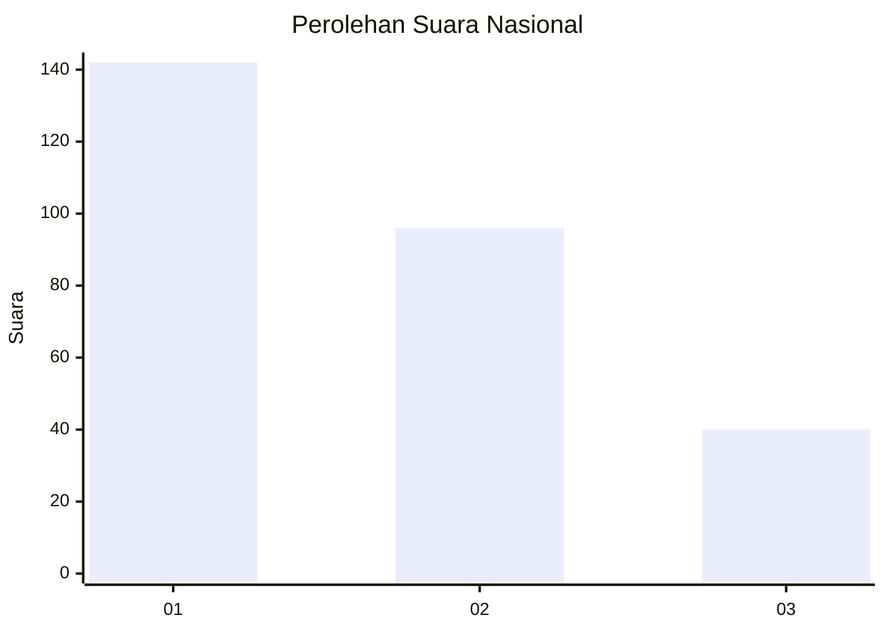
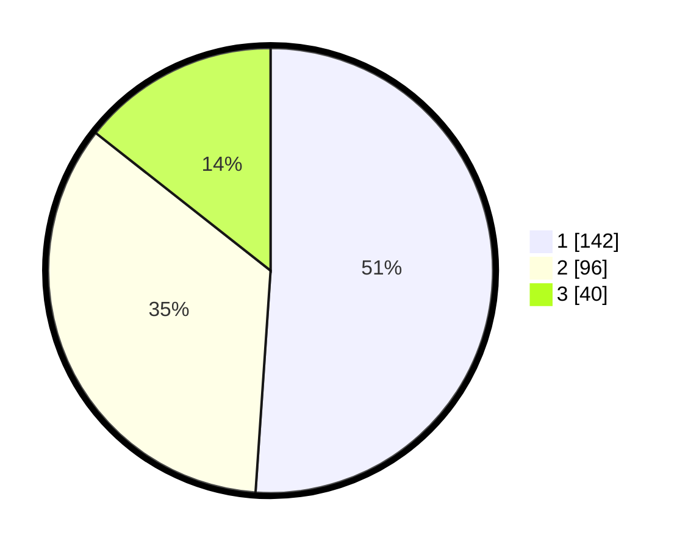

# Hasil

## Grafik

## Tabel

| No.    | Nama Paslon    | Suara | Suara (raw) | Persentase |
|:------ |:-------------- | -----:| -----------:| ----------:|
| 100025 | ANIES MUHAIMIN | 142   | [142][p-1]  | 51,08      |
| 100026 | PRABOWO GIBRAN | 96    | [96][p-2]   | 34,53      |
| 100027 | GANJAR MAHFUD  | 40    | [40][p-3]   | 14,39      |

[p-1]: https://github.com/gigit-pemilu/pemilu-2024/blob/main/pilpres/hitung-suara/sub/31-dki-jakarta/sub/74-jakarta-selatan/sub/09-jagakarsa/sub/1003-ciganjur/sub/119-tps/sub/paslon-1.txt
[p-2]: https://github.com/gigit-pemilu/pemilu-2024/blob/main/pilpres/hitung-suara/sub/31-dki-jakarta/sub/74-jakarta-selatan/sub/09-jagakarsa/sub/1003-ciganjur/sub/119-tps/sub/paslon-2.txt
[p-3]: https://github.com/gigit-pemilu/pemilu-2024/blob/main/pilpres/hitung-suara/sub/31-dki-jakarta/sub/74-jakarta-selatan/sub/09-jagakarsa/sub/1003-ciganjur/sub/119-tps/sub/paslon-3.txt

## Foto C Plano

https://sirekap-obj-formc.kpu.go.id/e5eb/pemilu/ppwp/31/74/09/10/03/3174091003119-20240215-000919--f2b1c011-d5b8-4143-aa0d-f6f9fccf5808.jpg

https://sirekap-obj-formc.kpu.go.id/e5eb/pemilu/ppwp/31/74/09/10/03/3174091003119-20240215-001325--30b7c3d1-9acb-4b8d-a05f-ce6e66dcce97.jpg

https://sirekap-obj-formc.kpu.go.id/e5eb/pemilu/ppwp/31/74/09/10/03/3174091003119-20240215-001254--371c078c-d035-4265-b287-a3f0567fb087.jpg

## Metadata

| Key        | Value               |
| ---------- | ------------------- |
| Time Stamp | 2024-02-24 22:31:28 |

