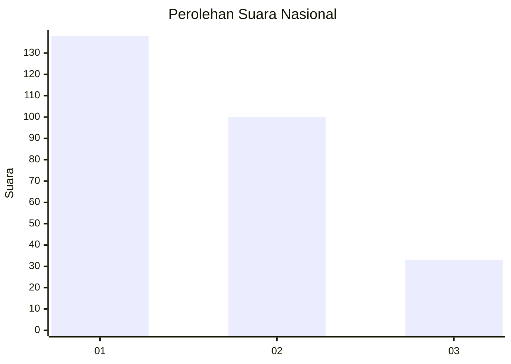
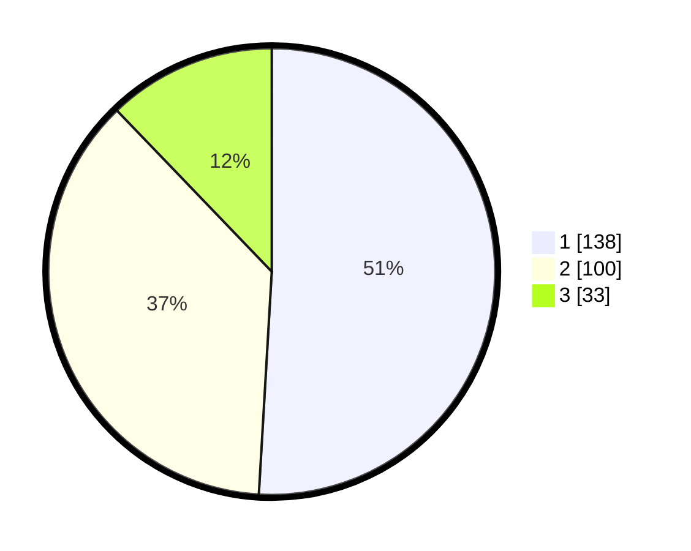

# Hasil

## Grafik

## Tabel

| No. | Nama Paslon    | Suara | Suara (raw) | Persentase |
|:--- |:-------------- | -----:| -----------:| ----------:|
| 1   | ANIES MUHAIMIN | 138   | [138][p-1]  | 50,92      |
| 2   | PRABOWO GIBRAN | 100   | [100][p-2]  | 36,90      |
| 3   | GANJAR MAHFUD  | 33    | [33][p-3]   | 12,18      |

[p-1]: https://github.com/gigit-pemilu/pemilu-2024/blob/main/pilpres/hitung-suara/sub/31-dki-jakarta/sub/74-jakarta-selatan/sub/09-jagakarsa/sub/1003-ciganjur/sub/120-tps/sub/paslon-1.txt
[p-2]: https://github.com/gigit-pemilu/pemilu-2024/blob/main/pilpres/hitung-suara/sub/31-dki-jakarta/sub/74-jakarta-selatan/sub/09-jagakarsa/sub/1003-ciganjur/sub/120-tps/sub/paslon-2.txt
[p-3]: https://github.com/gigit-pemilu/pemilu-2024/blob/main/pilpres/hitung-suara/sub/31-dki-jakarta/sub/74-jakarta-selatan/sub/09-jagakarsa/sub/1003-ciganjur/sub/120-tps/sub/paslon-3.txt

## Foto C Plano

https://sirekap-obj-formc.kpu.go.id/5e1d/pemilu/ppwp/31/74/09/10/03/3174091003120-20240214-222402--068f1dbc-f372-490f-8403-79ce7172900a.jpg

https://sirekap-obj-formc.kpu.go.id/5e1d/pemilu/ppwp/31/74/09/10/03/3174091003120-20240214-222528--893bac8c-cd48-4b35-8ee3-ab2d11628121.jpg

https://sirekap-obj-formc.kpu.go.id/5e1d/pemilu/ppwp/31/74/09/10/03/3174091003120-20240214-222621--8ced11b3-2c40-4ca0-8e42-f365ccb6d3a6.jpg

## Metadata

| Key        | Value               |
| ---------- | ------------------- |
| Time Stamp | 2024-02-24 22:31:28 |

