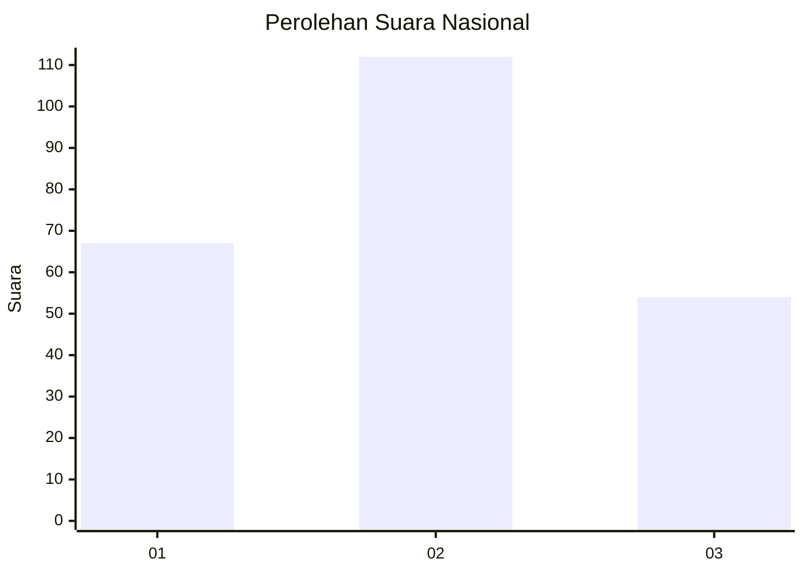
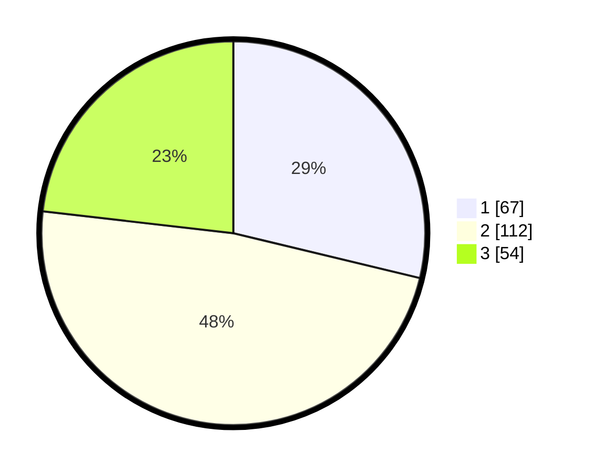

# Hasil

## Grafik

## Tabel

| No.    | Nama Paslon    | Suara | Suara (raw) | Persentase |
|:------ |:-------------- | -----:| -----------:| ----------:|
| 100025 | ANIES MUHAIMIN | 67    | [67][p-1]   | 28,76      |
| 100026 | PRABOWO GIBRAN | 112   | [112][p-2]  | 48,07      |
| 100027 | GANJAR MAHFUD  | 54    | [54][p-3]   | 23,18      |

[p-1]: https://github.com/gigit-pemilu/pemilu-2024/blob/main/pilpres/hitung-suara/sub/31-dki-jakarta/sub/74-jakarta-selatan/sub/09-jagakarsa/sub/1003-ciganjur/sub/128-tps/sub/paslon-1.txt
[p-2]: https://github.com/gigit-pemilu/pemilu-2024/blob/main/pilpres/hitung-suara/sub/31-dki-jakarta/sub/74-jakarta-selatan/sub/09-jagakarsa/sub/1003-ciganjur/sub/128-tps/sub/paslon-2.txt
[p-3]: https://github.com/gigit-pemilu/pemilu-2024/blob/main/pilpres/hitung-suara/sub/31-dki-jakarta/sub/74-jakarta-selatan/sub/09-jagakarsa/sub/1003-ciganjur/sub/128-tps/sub/paslon-3.txt

## Foto C Plano

https://sirekap-obj-formc.kpu.go.id/46e1/pemilu/ppwp/31/74/09/10/03/3174091003128-20240215-001004--a85429ea-0455-49d0-b31f-0da99202e598.jpg

https://sirekap-obj-formc.kpu.go.id/46e1/pemilu/ppwp/31/74/09/10/03/3174091003128-20240214-224548--b3c10a32-1ff2-44e1-a3ec-544920f3dbf5.jpg

https://sirekap-obj-formc.kpu.go.id/46e1/pemilu/ppwp/31/74/09/10/03/3174091003128-20240214-202358--0e315bf6-b19f-497a-a196-4952c2c39565.jpg

## Metadata

| Key        | Value               |
| ---------- | ------------------- |
| Time Stamp | 2024-03-01 14:00:00 |

