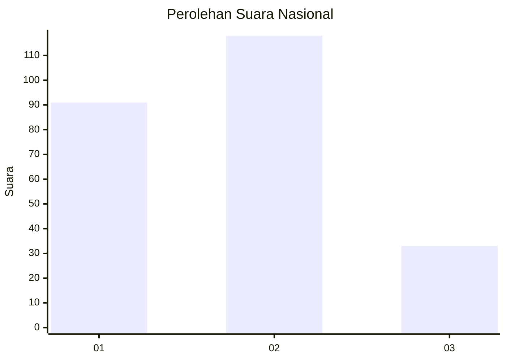
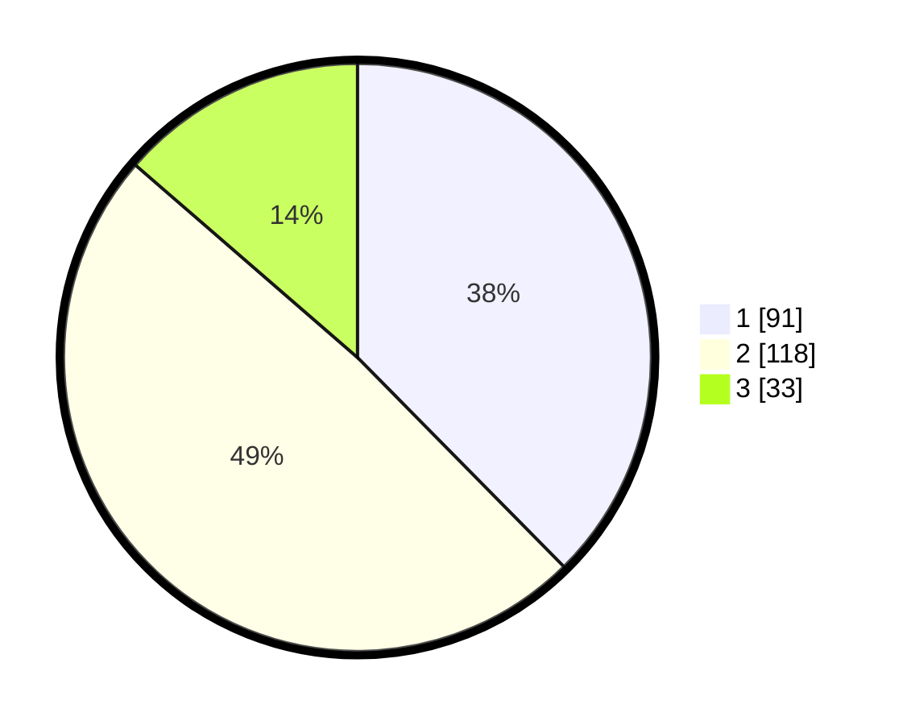

# Hasil

## Grafik

## Tabel

| No.    | Nama Paslon    | Suara | Suara (raw) | Persentase |
|:------ |:-------------- | -----:| -----------:| ----------:|
| 100025 | ANIES MUHAIMIN | 91    | [91][p-1]   | 37,60      |
| 100026 | PRABOWO GIBRAN | 118   | [118][p-2]  | 48,76      |
| 100027 | GANJAR MAHFUD  | 33    | [33][p-3]   | 13,64      |

[p-1]: https://github.com/gigit-pemilu/pemilu-2024/blob/main/pilpres/hitung-suara/sub/31-dki-jakarta/sub/74-jakarta-selatan/sub/09-jagakarsa/sub/1003-ciganjur/sub/129-tps/sub/paslon-1.txt
[p-2]: https://github.com/gigit-pemilu/pemilu-2024/blob/main/pilpres/hitung-suara/sub/31-dki-jakarta/sub/74-jakarta-selatan/sub/09-jagakarsa/sub/1003-ciganjur/sub/129-tps/sub/paslon-2.txt
[p-3]: https://github.com/gigit-pemilu/pemilu-2024/blob/main/pilpres/hitung-suara/sub/31-dki-jakarta/sub/74-jakarta-selatan/sub/09-jagakarsa/sub/1003-ciganjur/sub/129-tps/sub/paslon-3.txt

## Foto C Plano

https://sirekap-obj-formc.kpu.go.id/e06c/pemilu/ppwp/31/74/09/10/03/3174091003129-20240214-234210--462aaca1-266a-439f-b7f6-11c47954dffe.jpg

https://sirekap-obj-formc.kpu.go.id/e06c/pemilu/ppwp/31/74/09/10/03/3174091003129-20240214-234242--fbbcc3e3-700a-430e-ac4c-248085bf34b0.jpg

https://sirekap-obj-formc.kpu.go.id/e06c/pemilu/ppwp/31/74/09/10/03/3174091003129-20240214-234250--afbf6024-61a7-4751-bb3f-77ff4eb577ab.jpg

## Metadata

| Key        | Value               |
| ---------- | ------------------- |
| Time Stamp | 2024-02-24 22:31:28 |

