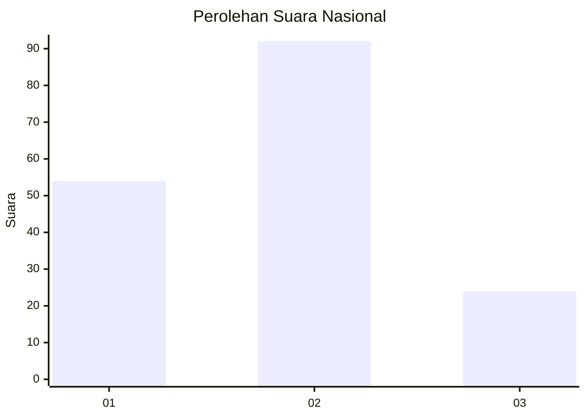
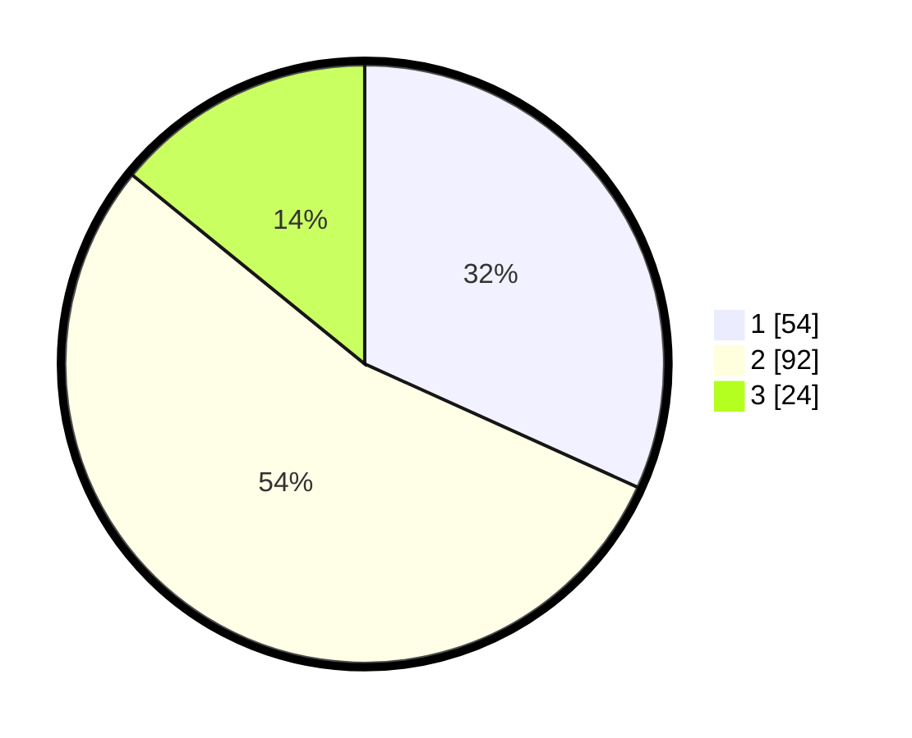

# Hasil

## Grafik

## Tabel

| No.    | Nama Paslon    | Suara | Suara (raw) | Persentase |
|:------ |:-------------- | -----:| -----------:| ----------:|
| 100025 | ANIES MUHAIMIN | 54    | [54][p-1]   | 31,76      |
| 100026 | PRABOWO GIBRAN | 92    | [92][p-2]   | 54,12      |
| 100027 | GANJAR MAHFUD  | 24    | [24][p-3]   | 14,12      |

[p-1]: https://github.com/gigit-pemilu/pemilu-2024/blob/main/pilpres/hitung-suara/sub/31-dki-jakarta/sub/74-jakarta-selatan/sub/09-jagakarsa/sub/1004-lenteng-agung/sub/009-tps/sub/paslon-1.txt
[p-2]: https://github.com/gigit-pemilu/pemilu-2024/blob/main/pilpres/hitung-suara/sub/31-dki-jakarta/sub/74-jakarta-selatan/sub/09-jagakarsa/sub/1004-lenteng-agung/sub/009-tps/sub/paslon-2.txt
[p-3]: https://github.com/gigit-pemilu/pemilu-2024/blob/main/pilpres/hitung-suara/sub/31-dki-jakarta/sub/74-jakarta-selatan/sub/09-jagakarsa/sub/1004-lenteng-agung/sub/009-tps/sub/paslon-3.txt

## Foto C Plano

https://sirekap-obj-formc.kpu.go.id/4056/pemilu/ppwp/31/74/09/10/04/3174091004009-20240214-195628--f8f37e41-37d0-411e-92a5-c5bb656438c9.jpg

https://sirekap-obj-formc.kpu.go.id/4056/pemilu/ppwp/31/74/09/10/04/3174091004009-20240214-195753--87438940-9fa2-40ff-a58e-7a0f3d05dd5e.jpg

https://sirekap-obj-formc.kpu.go.id/4056/pemilu/ppwp/31/74/09/10/04/3174091004009-20240214-195756--04abec26-0c4d-480f-99cb-fd2a02b3593a.jpg

## Metadata

| Key        | Value               |
| ---------- | ------------------- |
| Time Stamp | 2024-02-25 15:00:00 |

