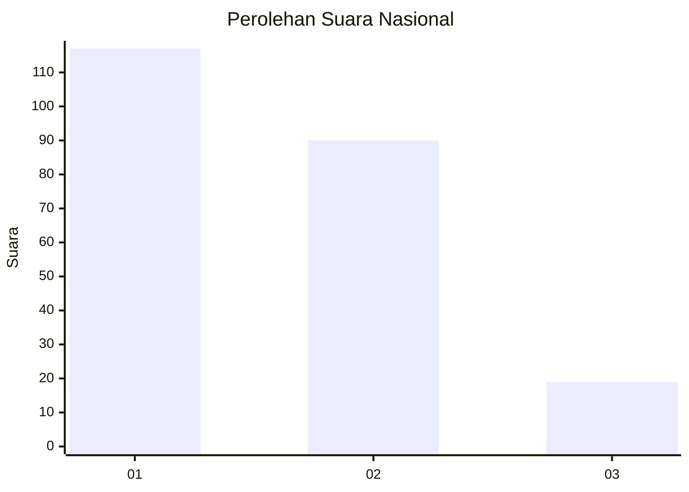
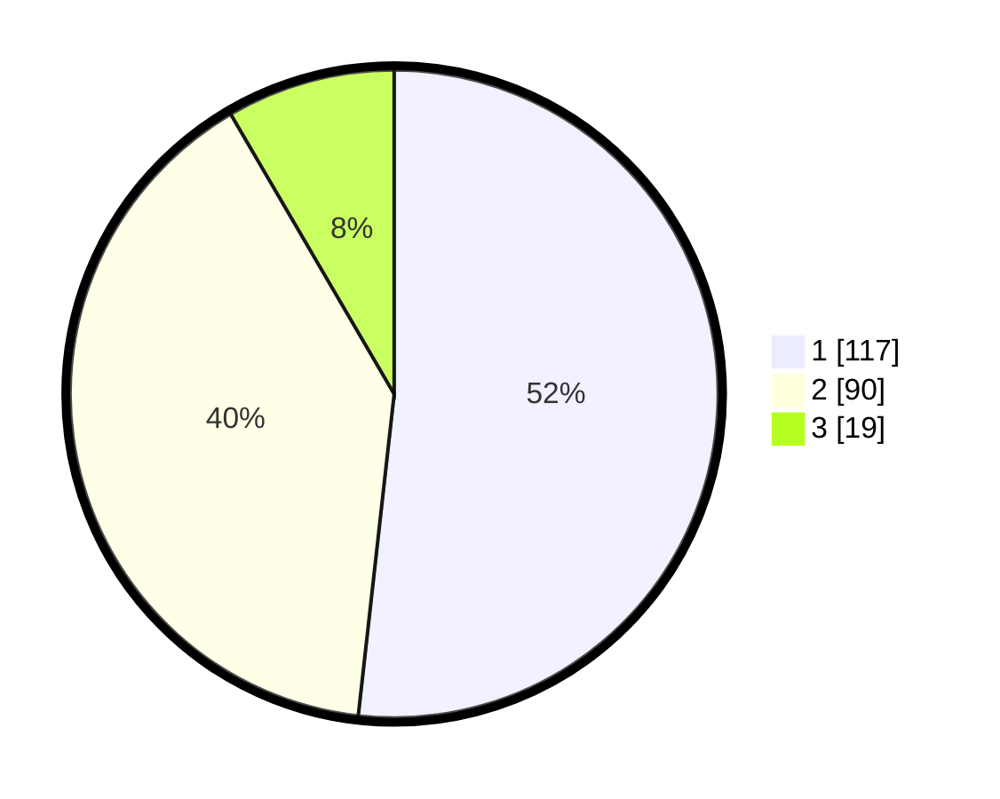

# Hasil

## Grafik

## Tabel

| No.    | Nama Paslon    | Suara | Suara (raw) | Persentase |
|:------ |:-------------- | -----:| -----------:| ----------:|
| 100025 | ANIES MUHAIMIN | 117   | [117][p-1]  | 51,77      |
| 100026 | PRABOWO GIBRAN | 90    | [90][p-2]   | 39,82      |
| 100027 | GANJAR MAHFUD  | 19    | [19][p-3]   | 8,41       |

[p-1]: https://github.com/gigit-pemilu/pemilu-2024/blob/main/pilpres/hitung-suara/sub/31-dki-jakarta/sub/74-jakarta-selatan/sub/09-jagakarsa/sub/1004-lenteng-agung/sub/043-tps/sub/paslon-1.txt
[p-2]: https://github.com/gigit-pemilu/pemilu-2024/blob/main/pilpres/hitung-suara/sub/31-dki-jakarta/sub/74-jakarta-selatan/sub/09-jagakarsa/sub/1004-lenteng-agung/sub/043-tps/sub/paslon-2.txt
[p-3]: https://github.com/gigit-pemilu/pemilu-2024/blob/main/pilpres/hitung-suara/sub/31-dki-jakarta/sub/74-jakarta-selatan/sub/09-jagakarsa/sub/1004-lenteng-agung/sub/043-tps/sub/paslon-3.txt

## Foto C Plano

https://sirekap-obj-formc.kpu.go.id/018e/pemilu/ppwp/31/74/09/10/04/3174091004043-20240215-050923--b3e9bbe9-9e26-4e2c-8e17-1ee223c12d06.jpg

https://sirekap-obj-formc.kpu.go.id/018e/pemilu/ppwp/31/74/09/10/04/3174091004043-20240215-051015--9412659f-86a3-4ac1-bbfb-1b69bd7d1e8f.jpg

https://sirekap-obj-formc.kpu.go.id/018e/pemilu/ppwp/31/74/09/10/04/3174091004043-20240215-051101--92ff5513-a51c-4a19-8e9b-b48d47d23ddc.jpg

## Metadata

| Key        | Value               |
| ---------- | ------------------- |
| Time Stamp | 2024-02-24 22:31:28 |

