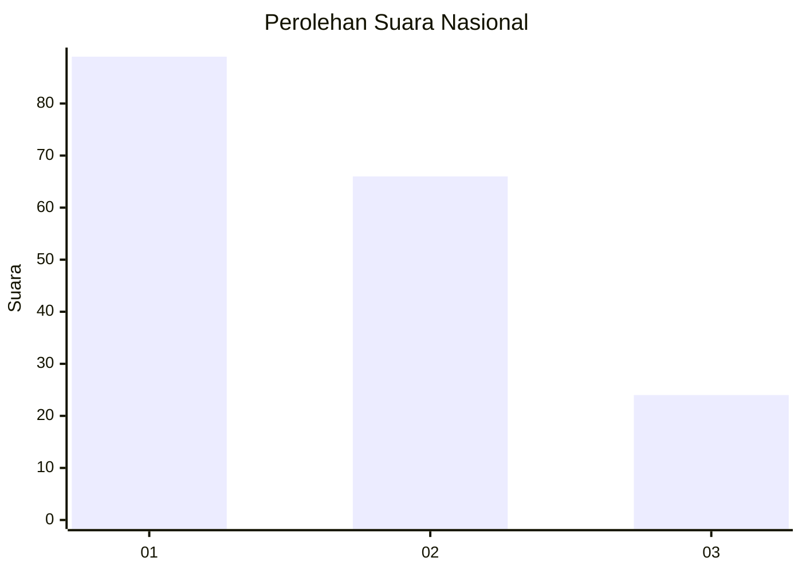
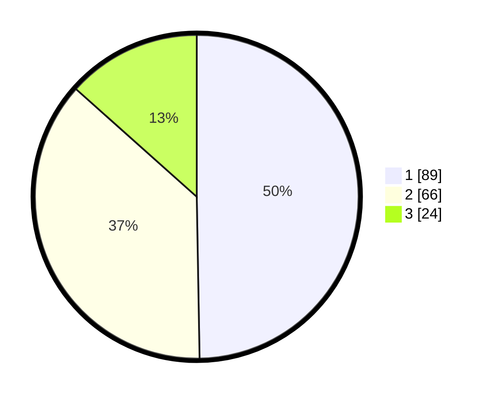

# Hasil

## Grafik

## Tabel

| No.    | Nama Paslon    | Suara | Suara (raw) | Persentase |
|:------ |:-------------- | -----:| -----------:| ----------:|
| 100025 | ANIES MUHAIMIN | 89    | [89][p-1]   | 49,72      |
| 100026 | PRABOWO GIBRAN | 66    | [66][p-2]   | 36,87      |
| 100027 | GANJAR MAHFUD  | 24    | [24][p-3]   | 13,41      |

[p-1]: https://github.com/gigit-pemilu/pemilu-2024/blob/main/pilpres/hitung-suara/sub/31-dki-jakarta/sub/74-jakarta-selatan/sub/09-jagakarsa/sub/1004-lenteng-agung/sub/051-tps/sub/paslon-1.txt
[p-2]: https://github.com/gigit-pemilu/pemilu-2024/blob/main/pilpres/hitung-suara/sub/31-dki-jakarta/sub/74-jakarta-selatan/sub/09-jagakarsa/sub/1004-lenteng-agung/sub/051-tps/sub/paslon-2.txt
[p-3]: https://github.com/gigit-pemilu/pemilu-2024/blob/main/pilpres/hitung-suara/sub/31-dki-jakarta/sub/74-jakarta-selatan/sub/09-jagakarsa/sub/1004-lenteng-agung/sub/051-tps/sub/paslon-3.txt

## Foto C Plano

https://sirekap-obj-formc.kpu.go.id/ac92/pemilu/ppwp/31/74/09/10/04/3174091004051-20240214-230504--8681c7fe-5c94-41d3-91bc-d6e7d1148605.jpg

https://sirekap-obj-formc.kpu.go.id/ac92/pemilu/ppwp/31/74/09/10/04/3174091004051-20240214-230627--516b73a3-0bda-45cb-aab3-1d4500de13b0.jpg

https://sirekap-obj-formc.kpu.go.id/ac92/pemilu/ppwp/31/74/09/10/04/3174091004051-20240214-230736--20872556-9358-4d9f-8eb7-e512e8fd96d9.jpg

## Metadata

| Key        | Value               |
| ---------- | ------------------- |
| Time Stamp | 2024-02-24 22:31:28 |

