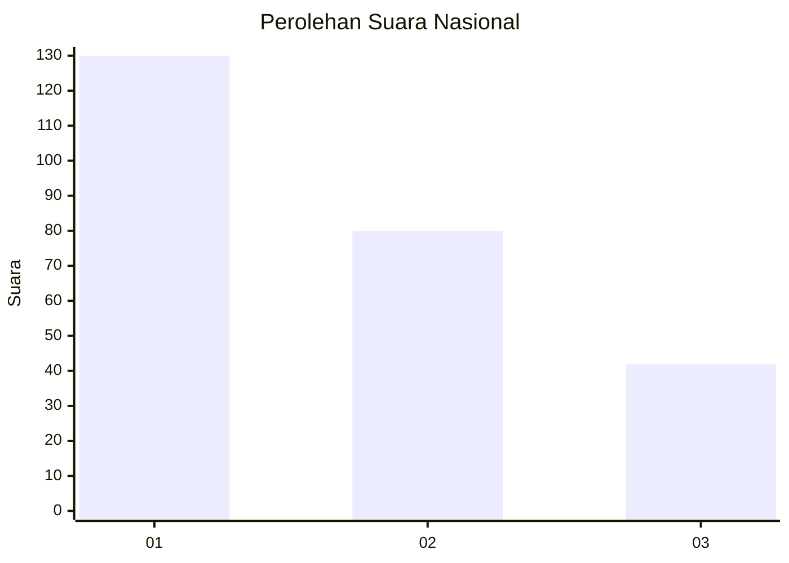
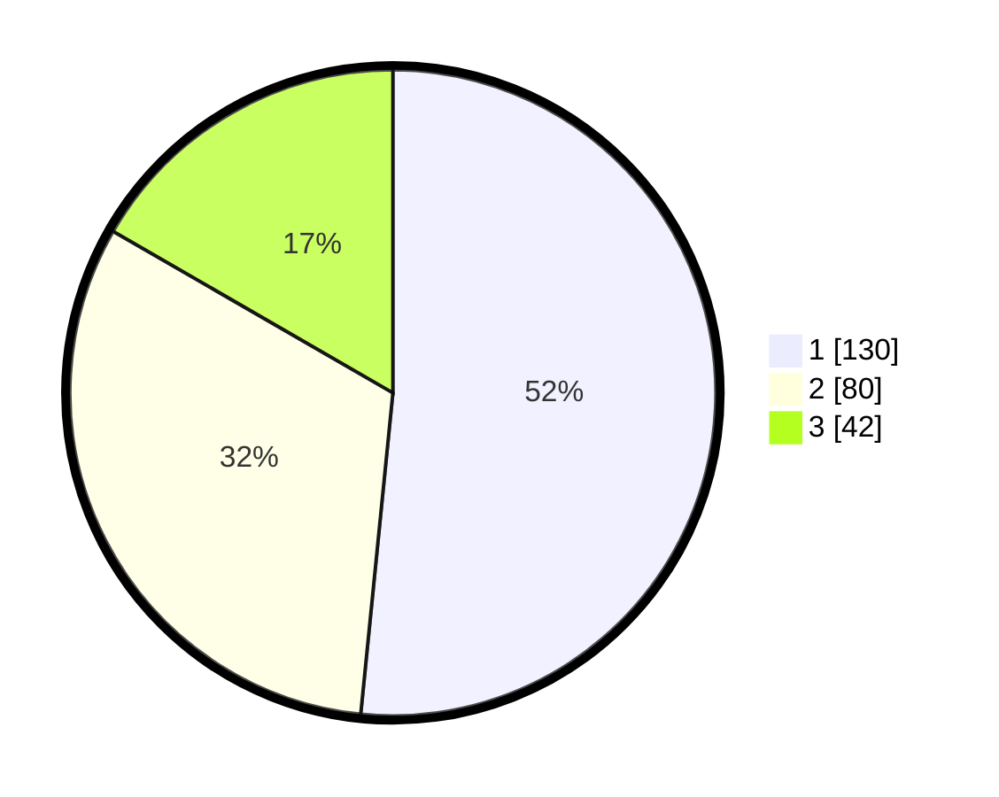

# Hasil

## Grafik

## Tabel

| No.    | Nama Paslon    | Suara | Suara (raw) | Persentase |
|:------ |:-------------- | -----:| -----------:| ----------:|
| 100025 | ANIES MUHAIMIN | 130   | [130][p-1]  | 51,59      |
| 100026 | PRABOWO GIBRAN | 80    | [80][p-2]   | 31,75      |
| 100027 | GANJAR MAHFUD  | 42    | [42][p-3]   | 16,67      |

[p-1]: https://github.com/gigit-pemilu/pemilu-2024/blob/main/pilpres/hitung-suara/sub/31-dki-jakarta/sub/74-jakarta-selatan/sub/09-jagakarsa/sub/1004-lenteng-agung/sub/060-tps/sub/paslon-1.txt
[p-2]: https://github.com/gigit-pemilu/pemilu-2024/blob/main/pilpres/hitung-suara/sub/31-dki-jakarta/sub/74-jakarta-selatan/sub/09-jagakarsa/sub/1004-lenteng-agung/sub/060-tps/sub/paslon-2.txt
[p-3]: https://github.com/gigit-pemilu/pemilu-2024/blob/main/pilpres/hitung-suara/sub/31-dki-jakarta/sub/74-jakarta-selatan/sub/09-jagakarsa/sub/1004-lenteng-agung/sub/060-tps/sub/paslon-3.txt

## Foto C Plano

https://sirekap-obj-formc.kpu.go.id/0af3/pemilu/ppwp/31/74/09/10/04/3174091004060-20240215-020859--9f8c4d37-f1a3-419a-81aa-59f50c9cb1dd.jpg

https://sirekap-obj-formc.kpu.go.id/0af3/pemilu/ppwp/31/74/09/10/04/3174091004060-20240215-021036--9bbb727c-b481-4828-930b-426e8228e268.jpg

https://sirekap-obj-formc.kpu.go.id/0af3/pemilu/ppwp/31/74/09/10/04/3174091004060-20240215-021209--ece2ae25-251c-4f59-a144-7544205953ab.jpg

## Metadata

| Key        | Value               |
| ---------- | ------------------- |
| Time Stamp | 2024-02-24 22:31:28 |

