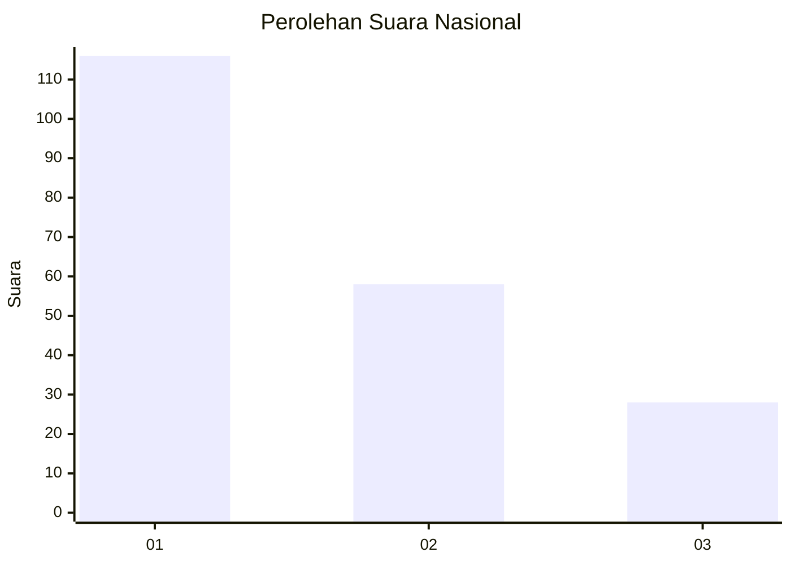
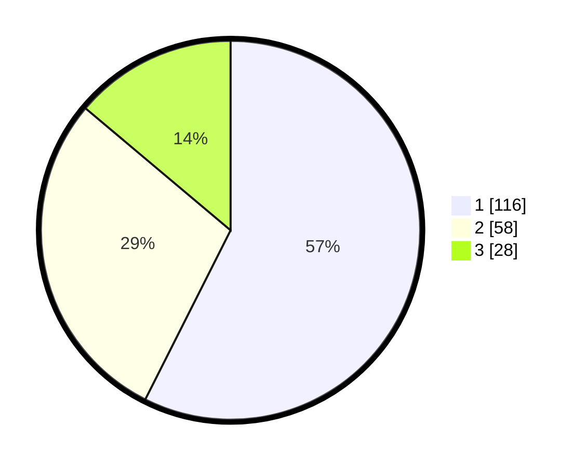

# Hasil

## Grafik

## Tabel

| No.    | Nama Paslon    | Suara | Suara (raw) | Persentase |
|:------ |:-------------- | -----:| -----------:| ----------:|
| 100025 | ANIES MUHAIMIN | 116   | [116][p-1]  | 57,43      |
| 100026 | PRABOWO GIBRAN | 58    | [58][p-2]   | 28,71      |
| 100027 | GANJAR MAHFUD  | 28    | [28][p-3]   | 13,86      |

[p-1]: https://github.com/gigit-pemilu/pemilu-2024/blob/main/pilpres/hitung-suara/sub/31-dki-jakarta/sub/74-jakarta-selatan/sub/09-jagakarsa/sub/1004-lenteng-agung/sub/063-tps/sub/paslon-1.txt
[p-2]: https://github.com/gigit-pemilu/pemilu-2024/blob/main/pilpres/hitung-suara/sub/31-dki-jakarta/sub/74-jakarta-selatan/sub/09-jagakarsa/sub/1004-lenteng-agung/sub/063-tps/sub/paslon-2.txt
[p-3]: https://github.com/gigit-pemilu/pemilu-2024/blob/main/pilpres/hitung-suara/sub/31-dki-jakarta/sub/74-jakarta-selatan/sub/09-jagakarsa/sub/1004-lenteng-agung/sub/063-tps/sub/paslon-3.txt

## Foto C Plano

https://sirekap-obj-formc.kpu.go.id/caf3/pemilu/ppwp/31/74/09/10/04/3174091004063-20240215-145227--39457516-b0a6-426c-a20c-9053760bf339.jpg

https://sirekap-obj-formc.kpu.go.id/caf3/pemilu/ppwp/31/74/09/10/04/3174091004063-20240215-145304--3c13e7ec-8b44-43c8-b2d3-c015fe7802aa.jpg

https://sirekap-obj-formc.kpu.go.id/caf3/pemilu/ppwp/31/74/09/10/04/3174091004063-20240215-145321--af088378-459f-4a2e-9a23-dc9163bac634.jpg

## Metadata

| Key        | Value               |
| ---------- | ------------------- |
| Time Stamp | 2024-02-25 10:00:00 |

