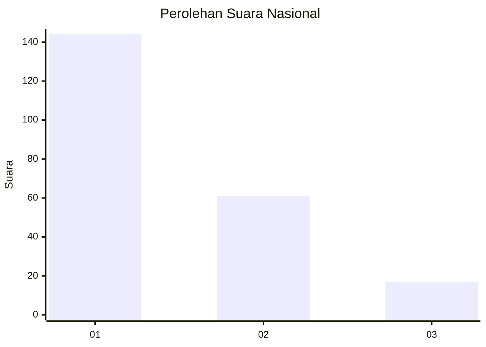
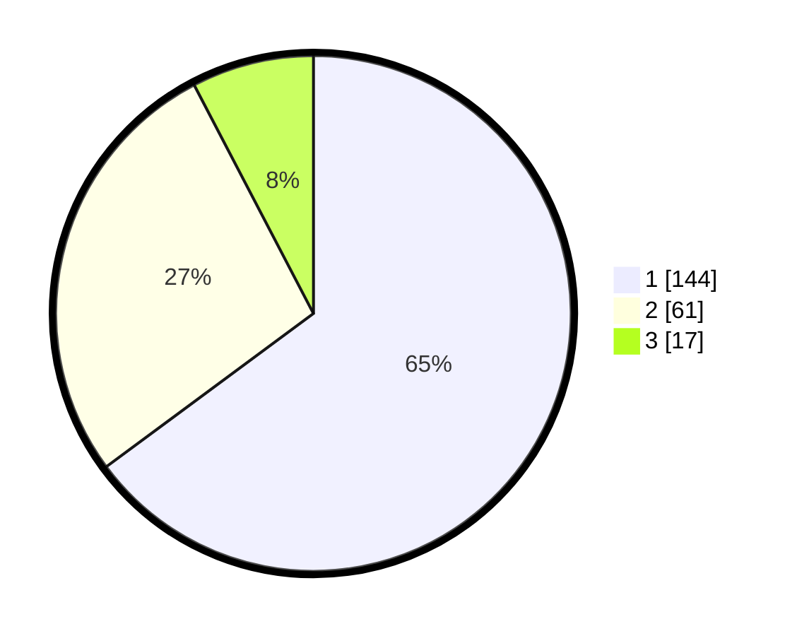

# Hasil

## Grafik

## Tabel

| No.    | Nama Paslon    | Suara | Suara (raw) | Persentase |
|:------ |:-------------- | -----:| -----------:| ----------:|
| 100025 | ANIES MUHAIMIN | 144   | [144][p-1]  | 64,86      |
| 100026 | PRABOWO GIBRAN | 61    | [61][p-2]   | 27,48      |
| 100027 | GANJAR MAHFUD  | 17    | [17][p-3]   | 7,66       |

[p-1]: https://github.com/gigit-pemilu/pemilu-2024/blob/main/pilpres/hitung-suara/sub/31-dki-jakarta/sub/74-jakarta-selatan/sub/09-jagakarsa/sub/1004-lenteng-agung/sub/064-tps/sub/paslon-1.txt
[p-2]: https://github.com/gigit-pemilu/pemilu-2024/blob/main/pilpres/hitung-suara/sub/31-dki-jakarta/sub/74-jakarta-selatan/sub/09-jagakarsa/sub/1004-lenteng-agung/sub/064-tps/sub/paslon-2.txt
[p-3]: https://github.com/gigit-pemilu/pemilu-2024/blob/main/pilpres/hitung-suara/sub/31-dki-jakarta/sub/74-jakarta-selatan/sub/09-jagakarsa/sub/1004-lenteng-agung/sub/064-tps/sub/paslon-3.txt

## Foto C Plano

https://sirekap-obj-formc.kpu.go.id/c306/pemilu/ppwp/31/74/09/10/04/3174091004064-20240220-121116--375a1784-fe6a-48be-9103-96f83feaa2fe.jpg

https://sirekap-obj-formc.kpu.go.id/c306/pemilu/ppwp/31/74/09/10/04/3174091004064-20240214-160128--4542c580-e120-4f14-acd4-2a22536bd03e.jpg

https://sirekap-obj-formc.kpu.go.id/c306/pemilu/ppwp/31/74/09/10/04/3174091004064-20240215-032650--2927e3dc-a58e-43d3-8133-7272c57de778.jpg

## Metadata

| Key        | Value               |
| ---------- | ------------------- |
| Time Stamp | 2024-02-20 13:00:00 |

