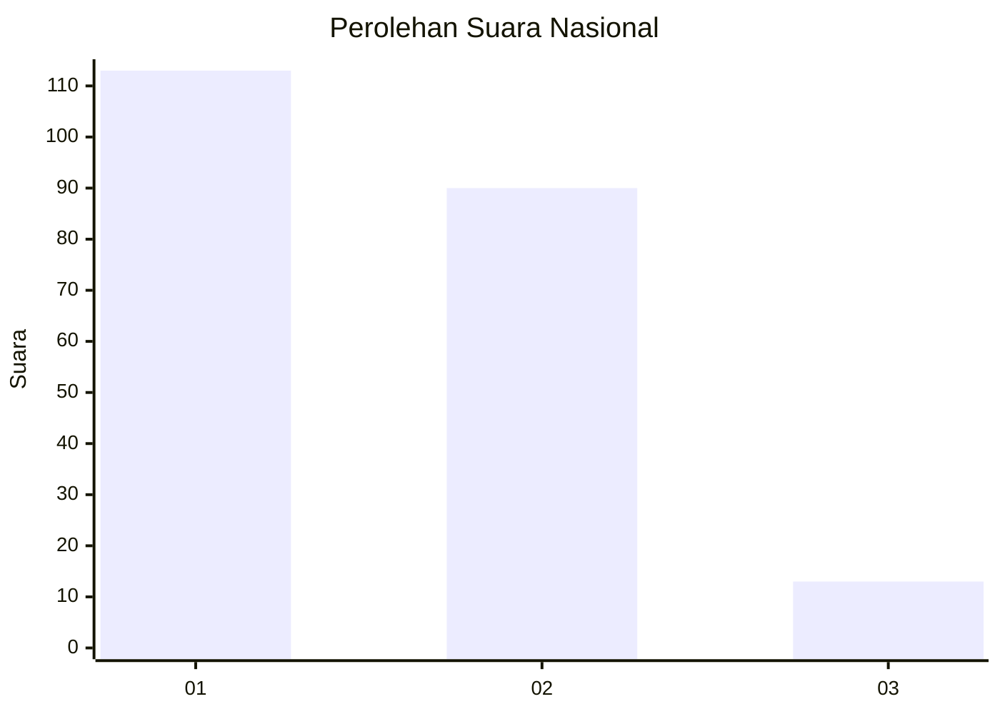
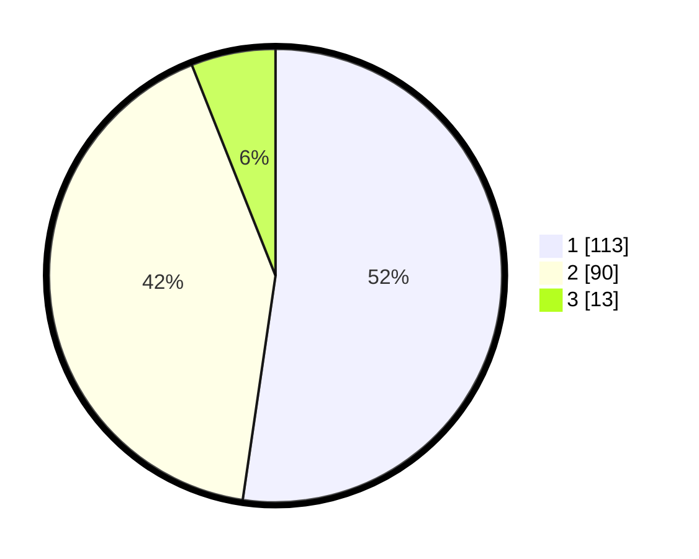

# Hasil

## Grafik

## Tabel

| No.    | Nama Paslon    | Suara | Suara (raw) | Persentase |
|:------ |:-------------- | -----:| -----------:| ----------:|
| 100025 | ANIES MUHAIMIN | 113   | [113][p-1]  | 52,31      |
| 100026 | PRABOWO GIBRAN | 90    | [90][p-2]   | 41,67      |
| 100027 | GANJAR MAHFUD  | 13    | [13][p-3]   | 6,02       |

[p-1]: https://github.com/gigit-pemilu/pemilu-2024/blob/main/pilpres/hitung-suara/sub/31-dki-jakarta/sub/74-jakarta-selatan/sub/09-jagakarsa/sub/1004-lenteng-agung/sub/065-tps/sub/paslon-1.txt
[p-2]: https://github.com/gigit-pemilu/pemilu-2024/blob/main/pilpres/hitung-suara/sub/31-dki-jakarta/sub/74-jakarta-selatan/sub/09-jagakarsa/sub/1004-lenteng-agung/sub/065-tps/sub/paslon-2.txt
[p-3]: https://github.com/gigit-pemilu/pemilu-2024/blob/main/pilpres/hitung-suara/sub/31-dki-jakarta/sub/74-jakarta-selatan/sub/09-jagakarsa/sub/1004-lenteng-agung/sub/065-tps/sub/paslon-3.txt

## Foto C Plano

https://sirekap-obj-formc.kpu.go.id/1d69/pemilu/ppwp/31/74/09/10/04/3174091004065-20240221-142438--c9215423-97a7-49df-93f2-707105345b3e.jpg

https://sirekap-obj-formc.kpu.go.id/1d69/pemilu/ppwp/31/74/09/10/04/3174091004065-20240214-214922--57245475-90c9-426c-861d-3a8705d54e3f.jpg

https://sirekap-obj-formc.kpu.go.id/1d69/pemilu/ppwp/31/74/09/10/04/3174091004065-20240214-215003--dc2280c6-0374-4f43-b792-d658dc568d07.jpg

## Metadata

| Key        | Value               |
| ---------- | ------------------- |
| Time Stamp | 2024-02-24 22:31:28 |

