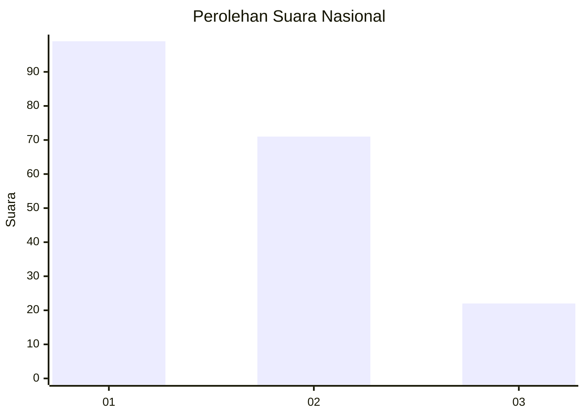
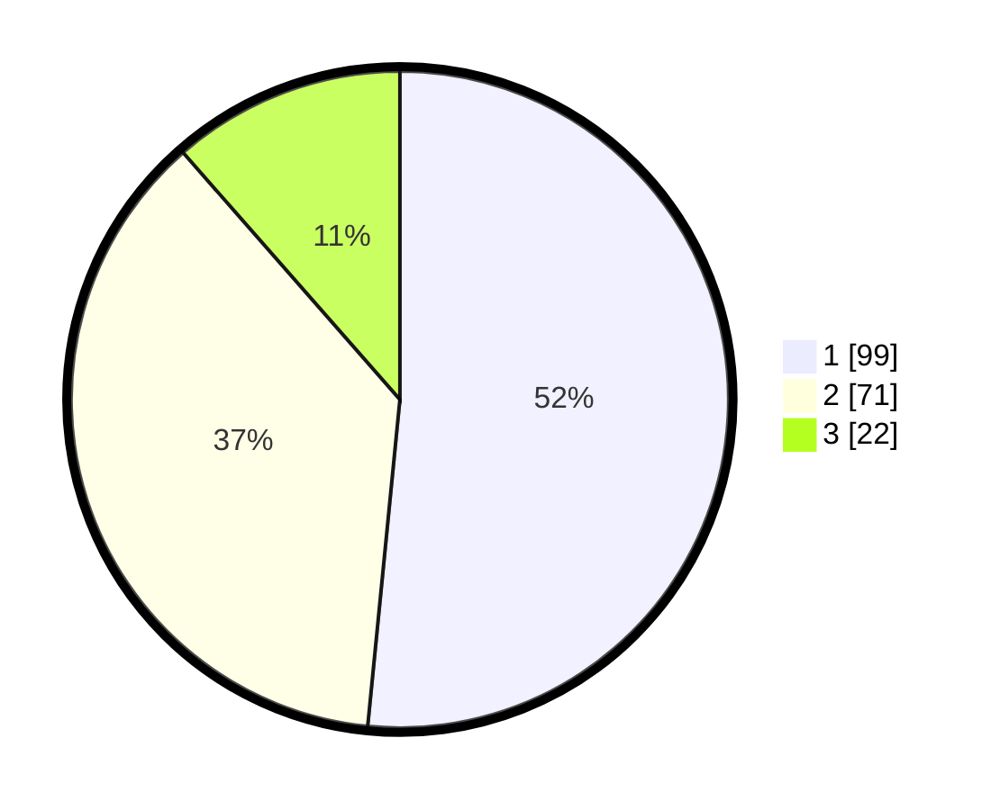

# Hasil

## Grafik

## Tabel

| No.    | Nama Paslon    | Suara | Suara (raw) | Persentase |
|:------ |:-------------- | -----:| -----------:| ----------:|
| 100025 | ANIES MUHAIMIN | 99    | [99][p-1]   | 51,56      |
| 100026 | PRABOWO GIBRAN | 71    | [71][p-2]   | 36,98      |
| 100027 | GANJAR MAHFUD  | 22    | [22][p-3]   | 11,46      |

[p-1]: https://github.com/gigit-pemilu/pemilu-2024/blob/main/pilpres/hitung-suara/sub/31-dki-jakarta/sub/74-jakarta-selatan/sub/09-jagakarsa/sub/1004-lenteng-agung/sub/067-tps/sub/paslon-1.txt
[p-2]: https://github.com/gigit-pemilu/pemilu-2024/blob/main/pilpres/hitung-suara/sub/31-dki-jakarta/sub/74-jakarta-selatan/sub/09-jagakarsa/sub/1004-lenteng-agung/sub/067-tps/sub/paslon-2.txt
[p-3]: https://github.com/gigit-pemilu/pemilu-2024/blob/main/pilpres/hitung-suara/sub/31-dki-jakarta/sub/74-jakarta-selatan/sub/09-jagakarsa/sub/1004-lenteng-agung/sub/067-tps/sub/paslon-3.txt

## Foto C Plano

https://sirekap-obj-formc.kpu.go.id/aca0/pemilu/ppwp/31/74/09/10/04/3174091004067-20240214-192530--752c92ef-b954-42fd-9d7b-2448542361b1.jpg

https://sirekap-obj-formc.kpu.go.id/aca0/pemilu/ppwp/31/74/09/10/04/3174091004067-20240214-192535--d32d15da-1cb9-420f-85ef-b15a6816a47b.jpg

https://sirekap-obj-formc.kpu.go.id/aca0/pemilu/ppwp/31/74/09/10/04/3174091004067-20240214-192540--3767c973-add9-477a-9ac2-2907f25c972d.jpg

## Metadata

| Key        | Value               |
| ---------- | ------------------- |
| Time Stamp | 2024-02-24 22:31:28 |

