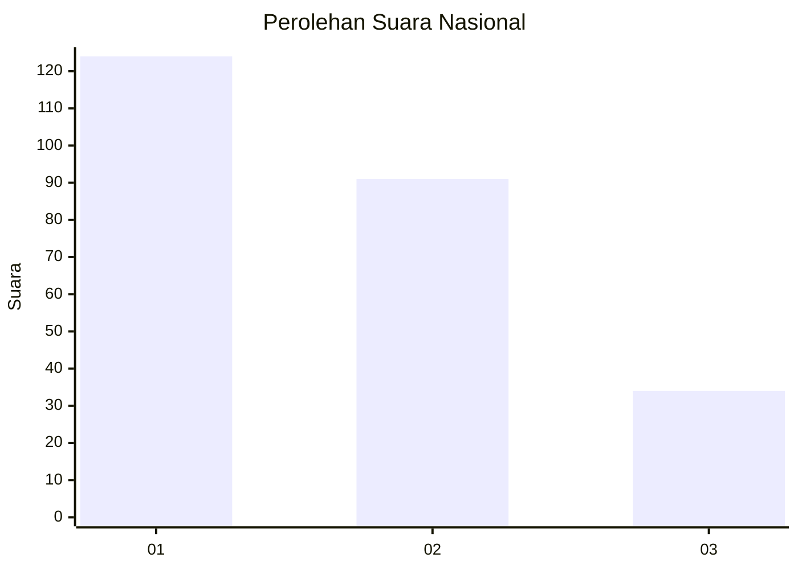
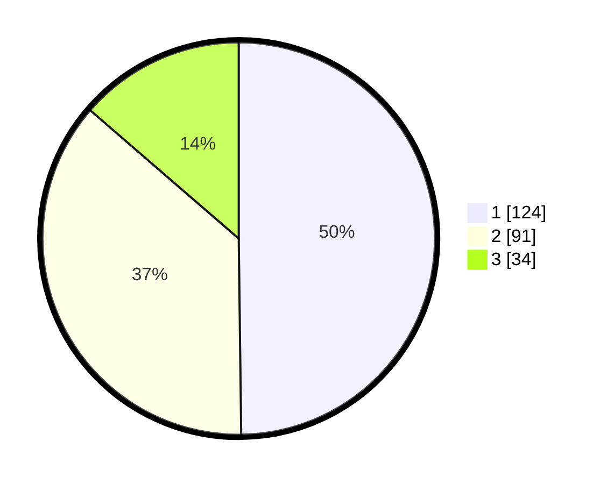

# Hasil

## Grafik

## Tabel

| No.    | Nama Paslon    | Suara | Suara (raw) | Persentase |
|:------ |:-------------- | -----:| -----------:| ----------:|
| 100025 | ANIES MUHAIMIN | 124   | [124][p-1]  | 49,80      |
| 100026 | PRABOWO GIBRAN | 91    | [91][p-2]   | 36,55      |
| 100027 | GANJAR MAHFUD  | 34    | [34][p-3]   | 13,65      |

[p-1]: https://github.com/gigit-pemilu/pemilu-2024/blob/main/pilpres/hitung-suara/sub/31-dki-jakarta/sub/74-jakarta-selatan/sub/09-jagakarsa/sub/1004-lenteng-agung/sub/070-tps/sub/paslon-1.txt
[p-2]: https://github.com/gigit-pemilu/pemilu-2024/blob/main/pilpres/hitung-suara/sub/31-dki-jakarta/sub/74-jakarta-selatan/sub/09-jagakarsa/sub/1004-lenteng-agung/sub/070-tps/sub/paslon-2.txt
[p-3]: https://github.com/gigit-pemilu/pemilu-2024/blob/main/pilpres/hitung-suara/sub/31-dki-jakarta/sub/74-jakarta-selatan/sub/09-jagakarsa/sub/1004-lenteng-agung/sub/070-tps/sub/paslon-3.txt

## Foto C Plano

https://sirekap-obj-formc.kpu.go.id/2bb8/pemilu/ppwp/31/74/09/10/04/3174091004070-20240215-052149--370b11e6-426f-472b-a0d1-c6c2a1a0c913.jpg

https://sirekap-obj-formc.kpu.go.id/2bb8/pemilu/ppwp/31/74/09/10/04/3174091004070-20240215-052402--f9e877f0-a798-4668-96e3-b32b2b4a9fe4.jpg

https://sirekap-obj-formc.kpu.go.id/2bb8/pemilu/ppwp/31/74/09/10/04/3174091004070-20240215-052549--92edb17a-e609-46de-8186-7aebb98cf930.jpg

## Metadata

| Key        | Value               |
| ---------- | ------------------- |
| Time Stamp | 2024-02-19 15:00:00 |

