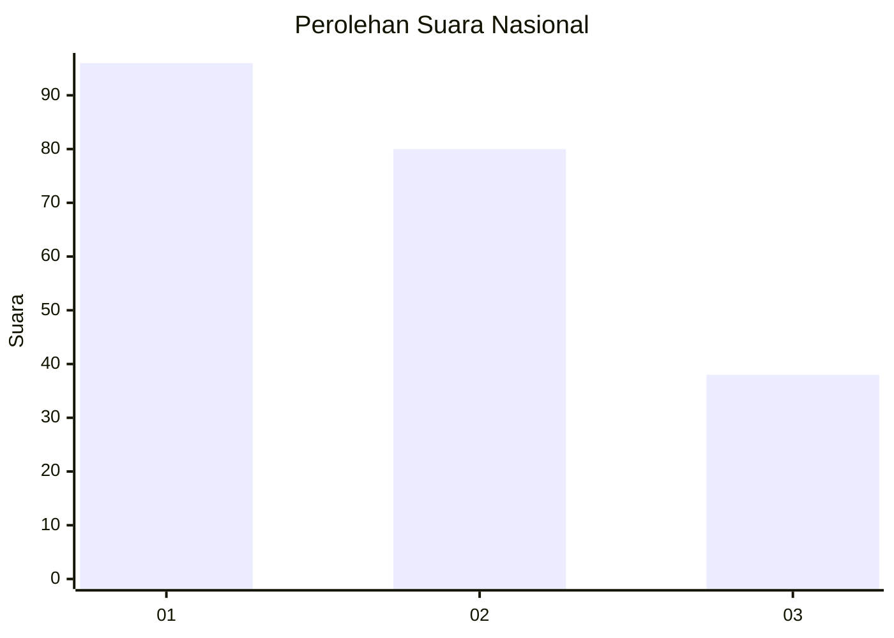
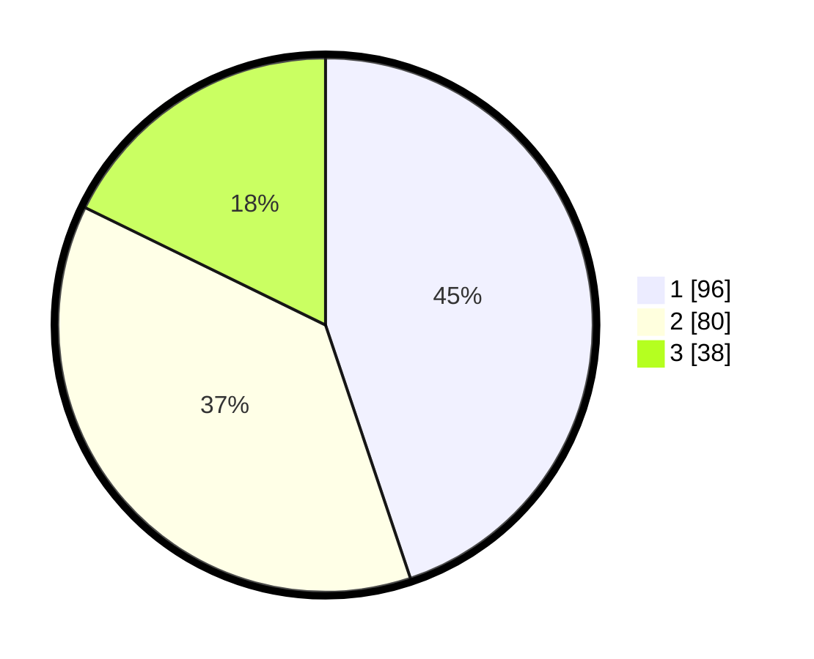

# Hasil

## Grafik

## Tabel

| No.    | Nama Paslon    | Suara | Suara (raw) | Persentase |
|:------ |:-------------- | -----:| -----------:| ----------:|
| 100025 | ANIES MUHAIMIN | 96    | [96][p-1]   | 44,86      |
| 100026 | PRABOWO GIBRAN | 80    | [80][p-2]   | 37,38      |
| 100027 | GANJAR MAHFUD  | 38    | [38][p-3]   | 17,76      |

[p-1]: https://github.com/gigit-pemilu/pemilu-2024/blob/main/pilpres/hitung-suara/sub/31-dki-jakarta/sub/74-jakarta-selatan/sub/09-jagakarsa/sub/1004-lenteng-agung/sub/104-tps/sub/paslon-1.txt
[p-2]: https://github.com/gigit-pemilu/pemilu-2024/blob/main/pilpres/hitung-suara/sub/31-dki-jakarta/sub/74-jakarta-selatan/sub/09-jagakarsa/sub/1004-lenteng-agung/sub/104-tps/sub/paslon-2.txt
[p-3]: https://github.com/gigit-pemilu/pemilu-2024/blob/main/pilpres/hitung-suara/sub/31-dki-jakarta/sub/74-jakarta-selatan/sub/09-jagakarsa/sub/1004-lenteng-agung/sub/104-tps/sub/paslon-3.txt

## Foto C Plano

https://sirekap-obj-formc.kpu.go.id/4c38/pemilu/ppwp/31/74/09/10/04/3174091004104-20240214-230243--37e4705f-5508-4b6e-b5c7-b97ae6c8c4e0.jpg

https://sirekap-obj-formc.kpu.go.id/4c38/pemilu/ppwp/31/74/09/10/04/3174091004104-20240214-230452--08247bb3-1890-4807-8949-daaa72ece18b.jpg

https://sirekap-obj-formc.kpu.go.id/4c38/pemilu/ppwp/31/74/09/10/04/3174091004104-20240214-230603--54dee8ad-d76c-4d46-9381-fffecd2744ec.jpg

## Metadata

| Key        | Value               |
| ---------- | ------------------- |
| Time Stamp | 2024-02-24 22:31:28 |

