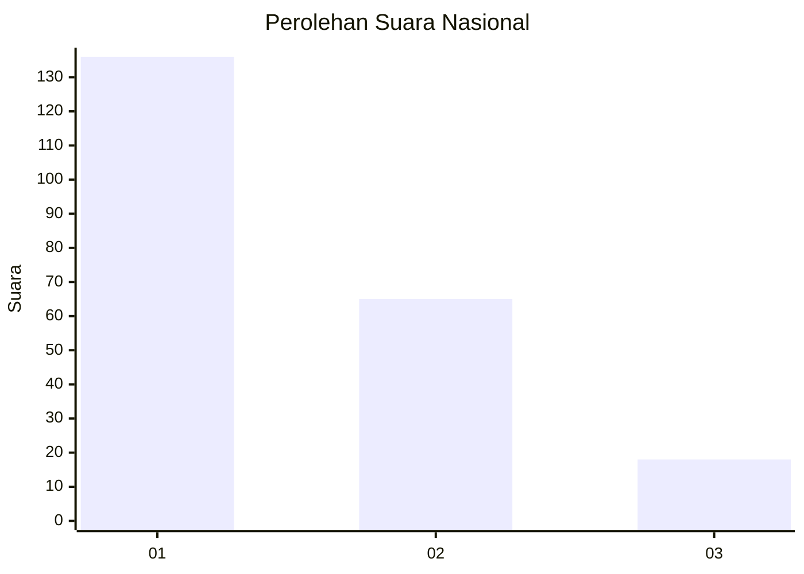
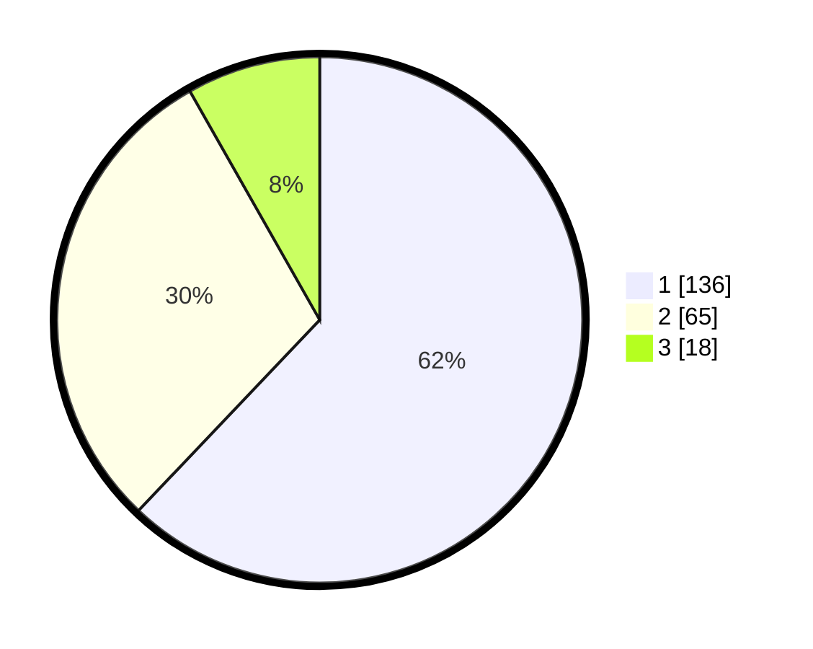

# Hasil

## Grafik

## Tabel

| No.    | Nama Paslon    | Suara | Suara (raw) | Persentase |
|:------ |:-------------- | -----:| -----------:| ----------:|
| 100025 | ANIES MUHAIMIN | 136   | [136][p-1]  | 62,10      |
| 100026 | PRABOWO GIBRAN | 65    | [65][p-2]   | 29,68      |
| 100027 | GANJAR MAHFUD  | 18    | [18][p-3]   | 8,22       |

[p-1]: https://github.com/gigit-pemilu/pemilu-2024/blob/main/pilpres/hitung-suara/sub/31-dki-jakarta/sub/74-jakarta-selatan/sub/09-jagakarsa/sub/1004-lenteng-agung/sub/111-tps/sub/paslon-1.txt
[p-2]: https://github.com/gigit-pemilu/pemilu-2024/blob/main/pilpres/hitung-suara/sub/31-dki-jakarta/sub/74-jakarta-selatan/sub/09-jagakarsa/sub/1004-lenteng-agung/sub/111-tps/sub/paslon-2.txt
[p-3]: https://github.com/gigit-pemilu/pemilu-2024/blob/main/pilpres/hitung-suara/sub/31-dki-jakarta/sub/74-jakarta-selatan/sub/09-jagakarsa/sub/1004-lenteng-agung/sub/111-tps/sub/paslon-3.txt

## Foto C Plano

https://sirekap-obj-formc.kpu.go.id/04b4/pemilu/ppwp/31/74/09/10/04/3174091004111-20240226-195954--89185095-dd66-4317-ba58-b04fb30917e8.jpg

https://sirekap-obj-formc.kpu.go.id/04b4/pemilu/ppwp/31/74/09/10/04/3174091004111-20240219-160656--28f43557-4d22-41e8-b26b-942ac9870526.jpg

https://sirekap-obj-formc.kpu.go.id/04b4/pemilu/ppwp/31/74/09/10/04/3174091004111-20240215-041339--835d837f-670f-4384-a2ee-c7e54ea3642d.jpg

## Metadata

| Key        | Value               |
| ---------- | ------------------- |
| Time Stamp | 2024-02-26 20:00:00 |

