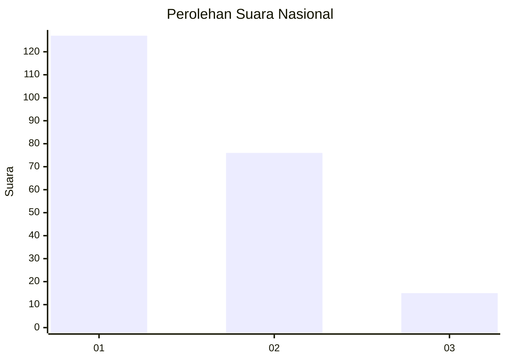
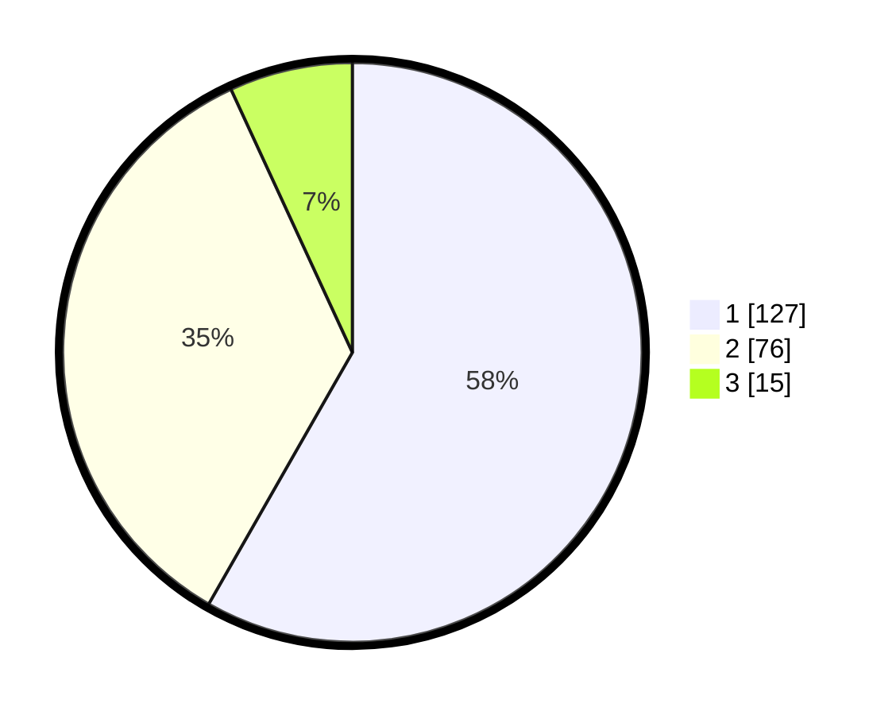

# Hasil

## Grafik

## Tabel

| No.    | Nama Paslon    | Suara | Suara (raw) | Persentase |
|:------ |:-------------- | -----:| -----------:| ----------:|
| 100025 | ANIES MUHAIMIN | 127   | [127][p-1]  | 58,26      |
| 100026 | PRABOWO GIBRAN | 76    | [76][p-2]   | 34,86      |
| 100027 | GANJAR MAHFUD  | 15    | [15][p-3]   | 6,88       |

[p-1]: https://github.com/gigit-pemilu/pemilu-2024/blob/main/pilpres/hitung-suara/sub/31-dki-jakarta/sub/74-jakarta-selatan/sub/09-jagakarsa/sub/1004-lenteng-agung/sub/112-tps/sub/paslon-1.txt
[p-2]: https://github.com/gigit-pemilu/pemilu-2024/blob/main/pilpres/hitung-suara/sub/31-dki-jakarta/sub/74-jakarta-selatan/sub/09-jagakarsa/sub/1004-lenteng-agung/sub/112-tps/sub/paslon-2.txt
[p-3]: https://github.com/gigit-pemilu/pemilu-2024/blob/main/pilpres/hitung-suara/sub/31-dki-jakarta/sub/74-jakarta-selatan/sub/09-jagakarsa/sub/1004-lenteng-agung/sub/112-tps/sub/paslon-3.txt

## Foto C Plano

https://sirekap-obj-formc.kpu.go.id/75b4/pemilu/ppwp/31/74/09/10/04/3174091004112-20240215-004246--2c664264-869d-4e7f-96ea-fa6f4e7cad39.jpg

https://sirekap-obj-formc.kpu.go.id/75b4/pemilu/ppwp/31/74/09/10/04/3174091004112-20240215-004328--892aa09f-f93f-4ac5-a0c4-3bed79fb3a8f.jpg

https://sirekap-obj-formc.kpu.go.id/75b4/pemilu/ppwp/31/74/09/10/04/3174091004112-20240215-004426--556cd9ee-6c4c-4571-9400-add9baeb0662.jpg

## Metadata

| Key        | Value               |
| ---------- | ------------------- |
| Time Stamp | 2024-02-24 22:31:28 |

