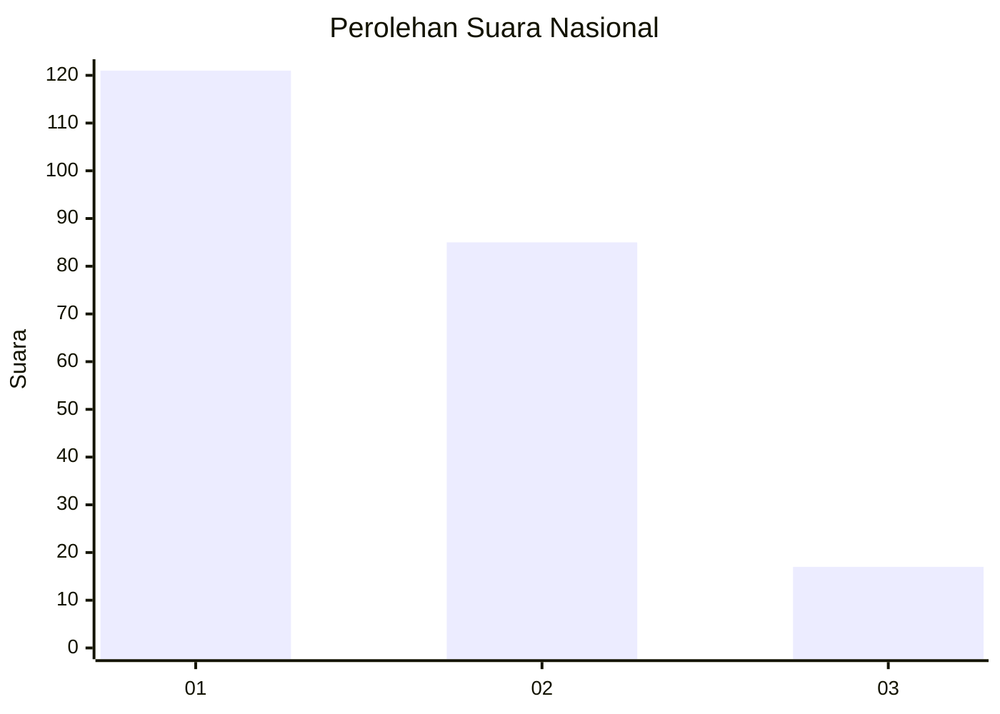
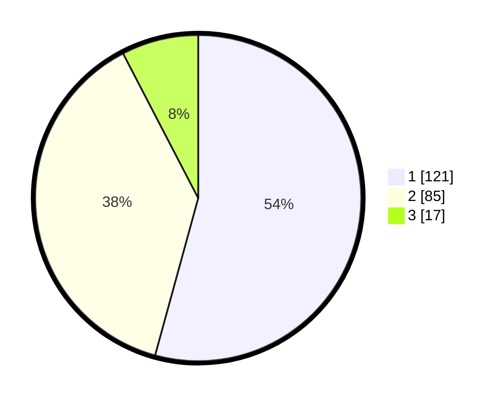

# Hasil

## Grafik

## Tabel

| No.    | Nama Paslon    | Suara | Suara (raw) | Persentase |
|:------ |:-------------- | -----:| -----------:| ----------:|
| 100025 | ANIES MUHAIMIN | 121   | [121][p-1]  | 54,26      |
| 100026 | PRABOWO GIBRAN | 85    | [85][p-2]   | 38,12      |
| 100027 | GANJAR MAHFUD  | 17    | [17][p-3]   | 7,62       |

[p-1]: https://github.com/gigit-pemilu/pemilu-2024/blob/main/pilpres/hitung-suara/sub/31-dki-jakarta/sub/74-jakarta-selatan/sub/09-jagakarsa/sub/1004-lenteng-agung/sub/122-tps/sub/paslon-1.txt
[p-2]: https://github.com/gigit-pemilu/pemilu-2024/blob/main/pilpres/hitung-suara/sub/31-dki-jakarta/sub/74-jakarta-selatan/sub/09-jagakarsa/sub/1004-lenteng-agung/sub/122-tps/sub/paslon-2.txt
[p-3]: https://github.com/gigit-pemilu/pemilu-2024/blob/main/pilpres/hitung-suara/sub/31-dki-jakarta/sub/74-jakarta-selatan/sub/09-jagakarsa/sub/1004-lenteng-agung/sub/122-tps/sub/paslon-3.txt

## Foto C Plano

https://sirekap-obj-formc.kpu.go.id/cd3e/pemilu/ppwp/31/74/09/10/04/3174091004122-20240215-005625--e483a6f8-bd61-486a-9204-5b5903661d53.jpg

https://sirekap-obj-formc.kpu.go.id/cd3e/pemilu/ppwp/31/74/09/10/04/3174091004122-20240214-233910--83aaae64-8422-4cef-b1fb-cac5cfee61ae.jpg

https://sirekap-obj-formc.kpu.go.id/cd3e/pemilu/ppwp/31/74/09/10/04/3174091004122-20240215-005729--56c41aa0-3ba5-4cfc-99c1-92ad53e50309.jpg

## Metadata

| Key        | Value               |
| ---------- | ------------------- |
| Time Stamp | 2024-02-19 12:00:00 |

