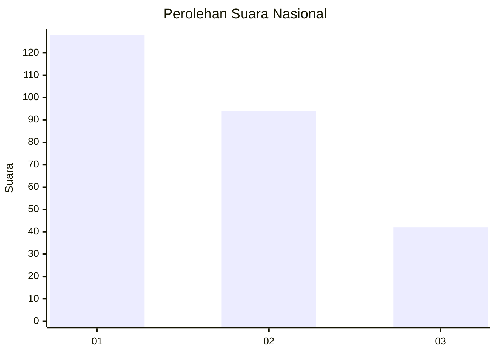
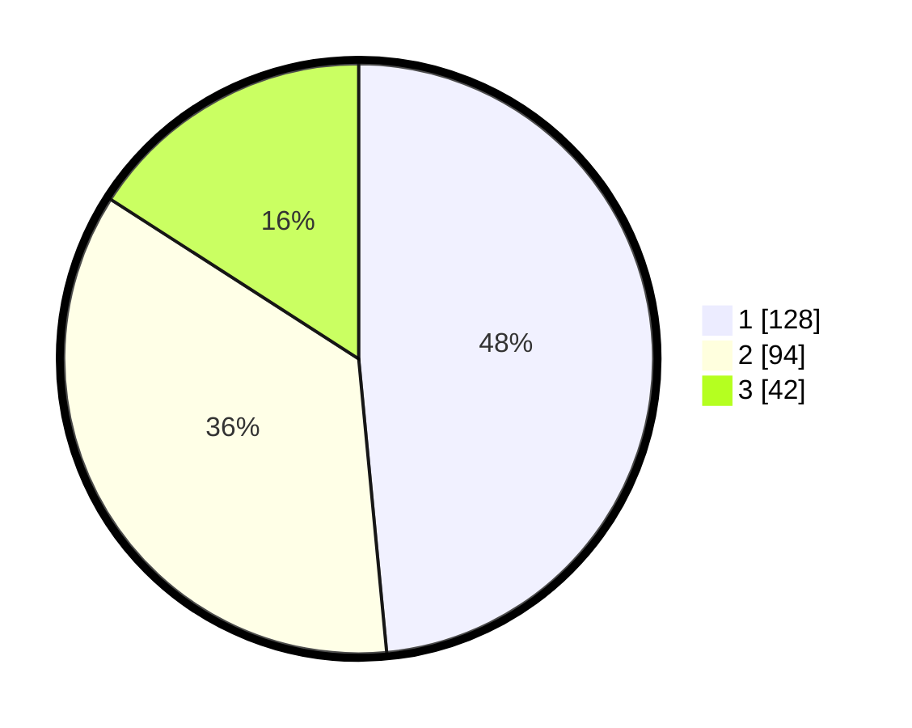

# Hasil

## Grafik

## Tabel

| No. | Nama Paslon    | Suara | Suara (raw) | Persentase |
|:--- |:-------------- | -----:| -----------:| ----------:|
| 1   | ANIES MUHAIMIN | 128   | [128][p-1]  | 48,48      |
| 2   | PRABOWO GIBRAN | 94    | [94][p-2]   | 35,61      |
| 3   | GANJAR MAHFUD  | 42    | [42][p-3]   | 15,91      |

[p-1]: https://github.com/gigit-pemilu/pemilu-2024/blob/main/pilpres/hitung-suara/sub/31-dki-jakarta/sub/74-jakarta-selatan/sub/09-jagakarsa/sub/1004-lenteng-agung/sub/142-tps/sub/paslon-1.txt
[p-2]: https://github.com/gigit-pemilu/pemilu-2024/blob/main/pilpres/hitung-suara/sub/31-dki-jakarta/sub/74-jakarta-selatan/sub/09-jagakarsa/sub/1004-lenteng-agung/sub/142-tps/sub/paslon-2.txt
[p-3]: https://github.com/gigit-pemilu/pemilu-2024/blob/main/pilpres/hitung-suara/sub/31-dki-jakarta/sub/74-jakarta-selatan/sub/09-jagakarsa/sub/1004-lenteng-agung/sub/142-tps/sub/paslon-3.txt

## Foto C Plano

https://sirekap-obj-formc.kpu.go.id/66fc/pemilu/ppwp/31/74/09/10/04/3174091004142-20240216-175036--6286affe-9c47-46d8-b69b-302144559fd2.jpg

https://sirekap-obj-formc.kpu.go.id/66fc/pemilu/ppwp/31/74/09/10/04/3174091004142-20240214-232700--2ba4dc59-6b2a-4349-bbf9-cf95c802e435.jpg

https://sirekap-obj-formc.kpu.go.id/66fc/pemilu/ppwp/31/74/09/10/04/3174091004142-20240214-232741--5806a713-61ca-469b-bbfa-257eb7fa1350.jpg

## Metadata

| Key        | Value               |
| ---------- | ------------------- |
| Time Stamp | 2024-02-26 12:00:00 |

