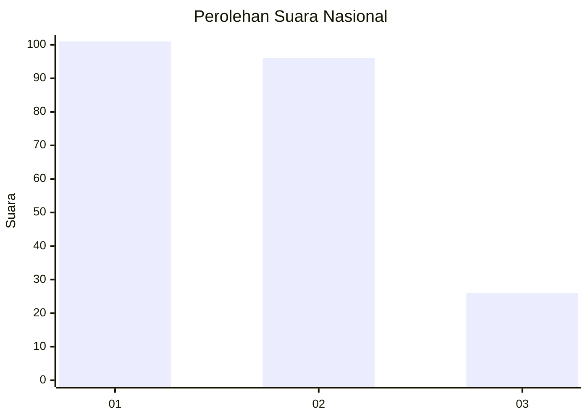
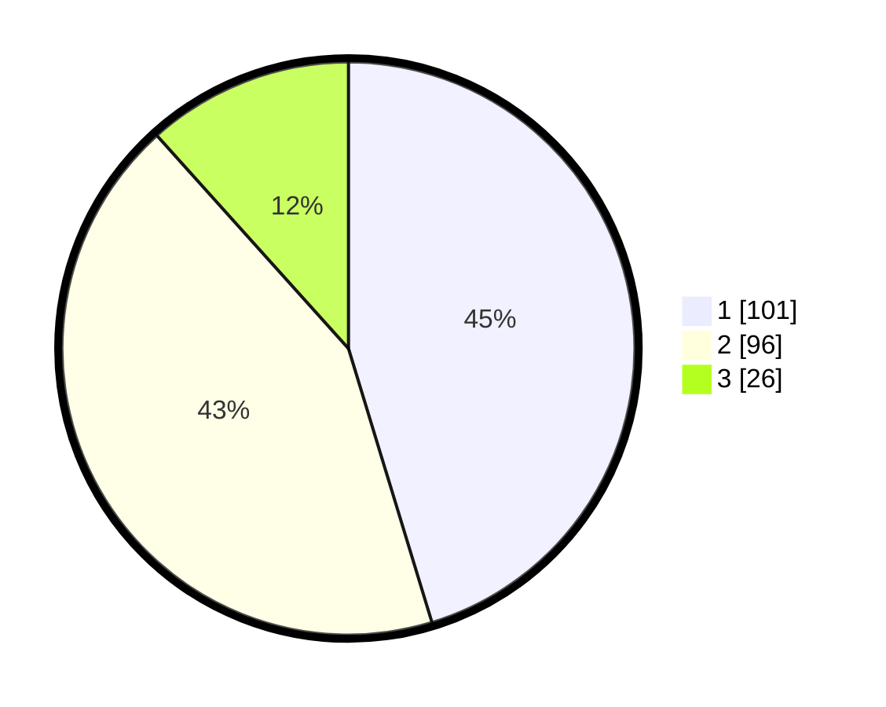

# Hasil

## Grafik

## Tabel

| No.    | Nama Paslon    | Suara | Suara (raw) | Persentase |
|:------ |:-------------- | -----:| -----------:| ----------:|
| 100025 | ANIES MUHAIMIN | 101   | [101][p-1]  | 45,29      |
| 100026 | PRABOWO GIBRAN | 96    | [96][p-2]   | 43,05      |
| 100027 | GANJAR MAHFUD  | 26    | [26][p-3]   | 11,66      |

[p-1]: https://github.com/gigit-pemilu/pemilu-2024/blob/main/pilpres/hitung-suara/sub/31-dki-jakarta/sub/74-jakarta-selatan/sub/09-jagakarsa/sub/1004-lenteng-agung/sub/148-tps/sub/paslon-1.txt
[p-2]: https://github.com/gigit-pemilu/pemilu-2024/blob/main/pilpres/hitung-suara/sub/31-dki-jakarta/sub/74-jakarta-selatan/sub/09-jagakarsa/sub/1004-lenteng-agung/sub/148-tps/sub/paslon-2.txt
[p-3]: https://github.com/gigit-pemilu/pemilu-2024/blob/main/pilpres/hitung-suara/sub/31-dki-jakarta/sub/74-jakarta-selatan/sub/09-jagakarsa/sub/1004-lenteng-agung/sub/148-tps/sub/paslon-3.txt

## Foto C Plano

https://sirekap-obj-formc.kpu.go.id/b506/pemilu/ppwp/31/74/09/10/04/3174091004148-20240214-155800--8478783c-d0f0-4ec4-a4cf-a510cf30e8c6.jpg

https://sirekap-obj-formc.kpu.go.id/b506/pemilu/ppwp/31/74/09/10/04/3174091004148-20240214-200819--395cc58e-b9dd-4368-880c-77c99b46efc9.jpg

https://sirekap-obj-formc.kpu.go.id/b506/pemilu/ppwp/31/74/09/10/04/3174091004148-20240214-200830--93f57fbc-4135-4c33-87dc-2f86a045e001.jpg

## Metadata

| Key        | Value               |
| ---------- | ------------------- |
| Time Stamp | 2024-02-24 22:31:28 |

