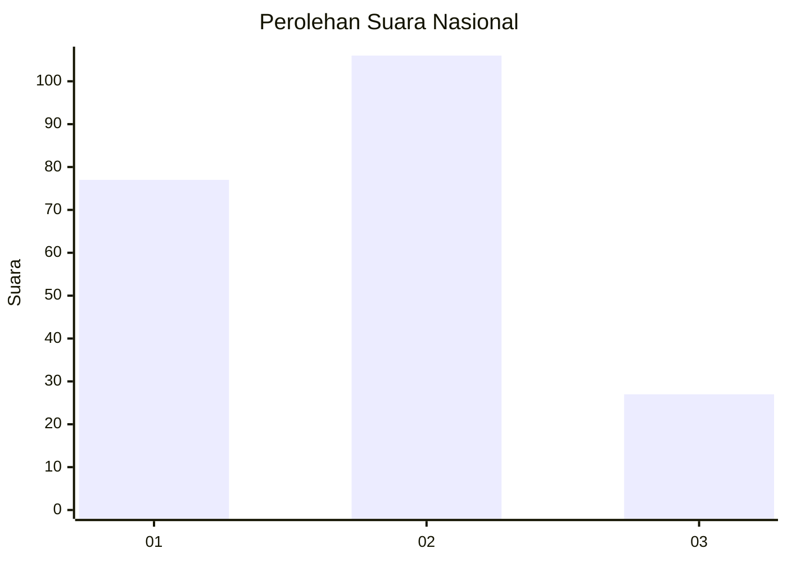
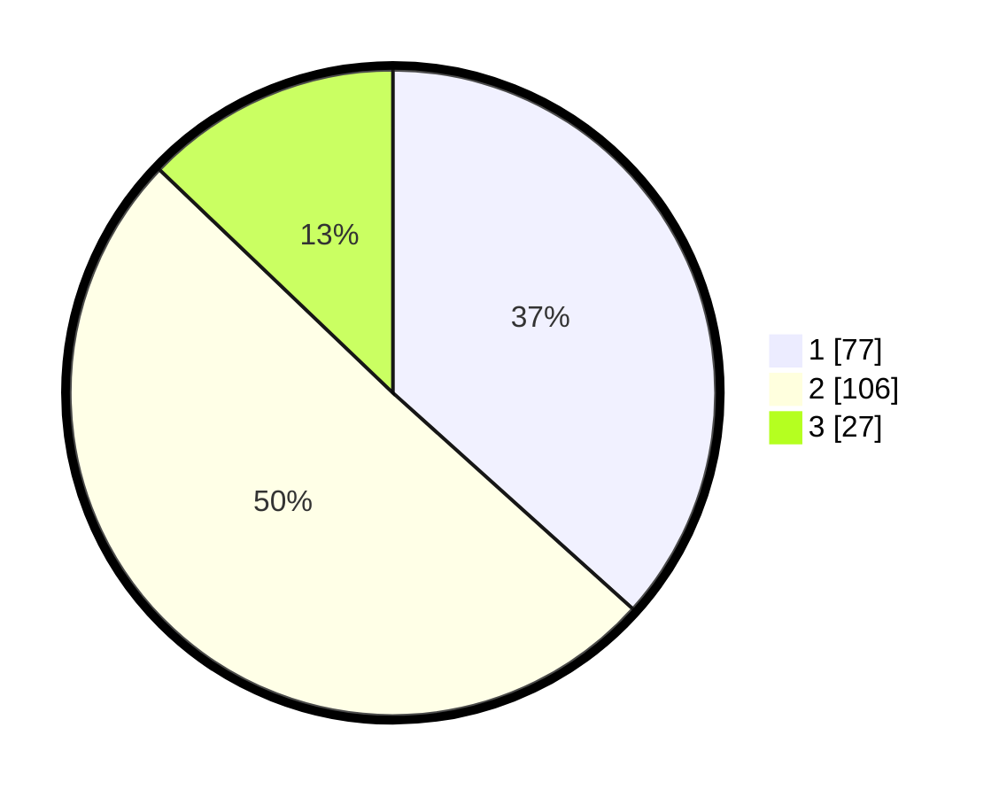

# Hasil

## Grafik

## Tabel

| No.    | Nama Paslon    | Suara | Suara (raw) | Persentase |
|:------ |:-------------- | -----:| -----------:| ----------:|
| 100025 | ANIES MUHAIMIN | 77    | [77][p-1]   | 36,67      |
| 100026 | PRABOWO GIBRAN | 106   | [106][p-2]  | 50,48      |
| 100027 | GANJAR MAHFUD  | 27    | [27][p-3]   | 12,86      |

[p-1]: https://github.com/gigit-pemilu/pemilu-2024/blob/main/pilpres/hitung-suara/sub/31-dki-jakarta/sub/74-jakarta-selatan/sub/09-jagakarsa/sub/1004-lenteng-agung/sub/149-tps/sub/paslon-1.txt
[p-2]: https://github.com/gigit-pemilu/pemilu-2024/blob/main/pilpres/hitung-suara/sub/31-dki-jakarta/sub/74-jakarta-selatan/sub/09-jagakarsa/sub/1004-lenteng-agung/sub/149-tps/sub/paslon-2.txt
[p-3]: https://github.com/gigit-pemilu/pemilu-2024/blob/main/pilpres/hitung-suara/sub/31-dki-jakarta/sub/74-jakarta-selatan/sub/09-jagakarsa/sub/1004-lenteng-agung/sub/149-tps/sub/paslon-3.txt

## Foto C Plano

https://sirekap-obj-formc.kpu.go.id/fd80/pemilu/ppwp/31/74/09/10/04/3174091004149-20240214-212448--cf7d3889-f284-469c-9d30-78c4dfd55248.jpg

https://sirekap-obj-formc.kpu.go.id/fd80/pemilu/ppwp/31/74/09/10/04/3174091004149-20240214-212606--bf5d5f90-f395-4f96-9054-aeadf8b2d819.jpg

https://sirekap-obj-formc.kpu.go.id/fd80/pemilu/ppwp/31/74/09/10/04/3174091004149-20240214-212644--6a3d8645-ed26-4352-af2a-61a5e0f6338d.jpg

## Metadata

| Key        | Value               |
| ---------- | ------------------- |
| Time Stamp | 2024-02-24 22:31:28 |

