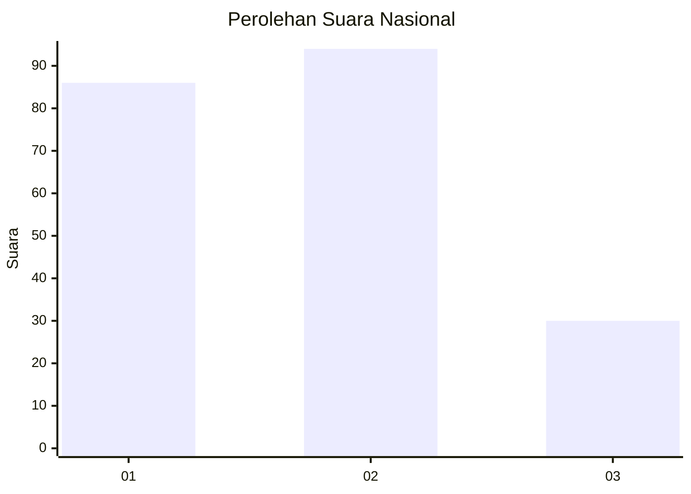
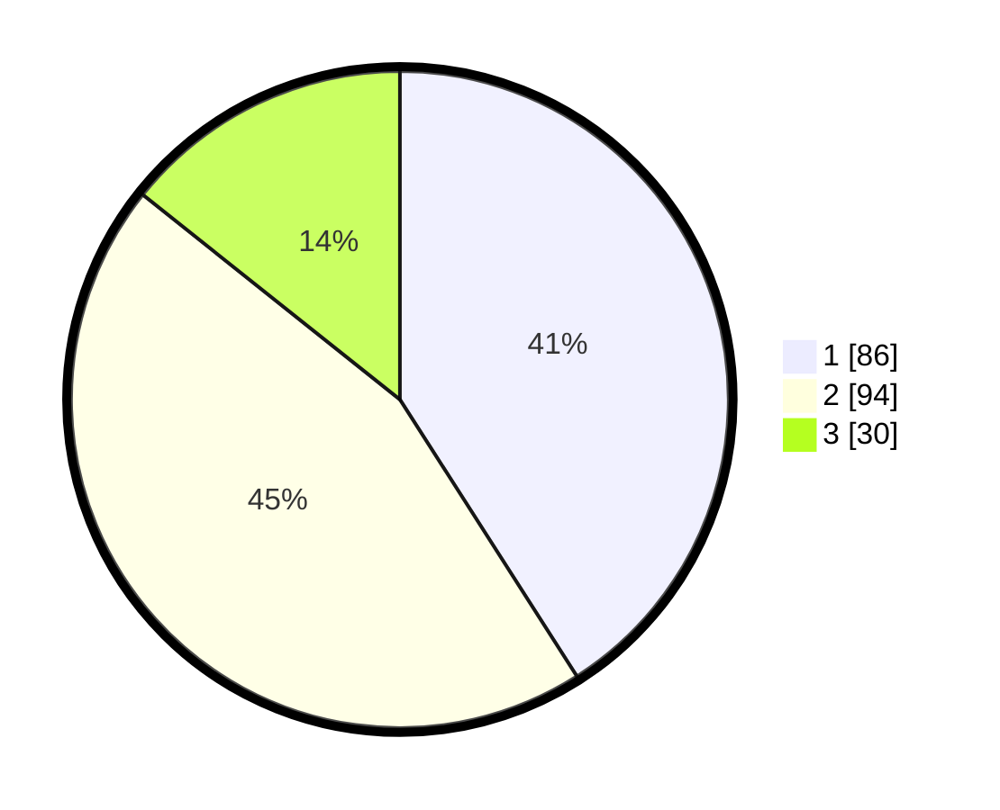

# Hasil

## Grafik

## Tabel

| No.    | Nama Paslon    | Suara | Suara (raw) | Persentase |
|:------ |:-------------- | -----:| -----------:| ----------:|
| 100025 | ANIES MUHAIMIN | 86    | [86][p-1]   | 40,95      |
| 100026 | PRABOWO GIBRAN | 94    | [94][p-2]   | 44,76      |
| 100027 | GANJAR MAHFUD  | 30    | [30][p-3]   | 14,29      |

[p-1]: https://github.com/gigit-pemilu/pemilu-2024/blob/main/pilpres/hitung-suara/sub/31-dki-jakarta/sub/74-jakarta-selatan/sub/09-jagakarsa/sub/1004-lenteng-agung/sub/163-tps/sub/paslon-1.txt
[p-2]: https://github.com/gigit-pemilu/pemilu-2024/blob/main/pilpres/hitung-suara/sub/31-dki-jakarta/sub/74-jakarta-selatan/sub/09-jagakarsa/sub/1004-lenteng-agung/sub/163-tps/sub/paslon-2.txt
[p-3]: https://github.com/gigit-pemilu/pemilu-2024/blob/main/pilpres/hitung-suara/sub/31-dki-jakarta/sub/74-jakarta-selatan/sub/09-jagakarsa/sub/1004-lenteng-agung/sub/163-tps/sub/paslon-3.txt

## Foto C Plano

https://sirekap-obj-formc.kpu.go.id/fb7c/pemilu/ppwp/31/74/09/10/04/3174091004163-20240214-225534--ec05fd87-1ce6-4196-addb-ac28ced70da1.jpg

https://sirekap-obj-formc.kpu.go.id/fb7c/pemilu/ppwp/31/74/09/10/04/3174091004163-20240214-225601--d739c4a6-c369-4810-ac66-fb9765be991e.jpg

https://sirekap-obj-formc.kpu.go.id/fb7c/pemilu/ppwp/31/74/09/10/04/3174091004163-20240214-225639--b8bf8135-fc06-42ab-9a51-bcca77d38c68.jpg

## Metadata

| Key        | Value               |
| ---------- | ------------------- |
| Time Stamp | 2024-02-25 12:00:00 |

